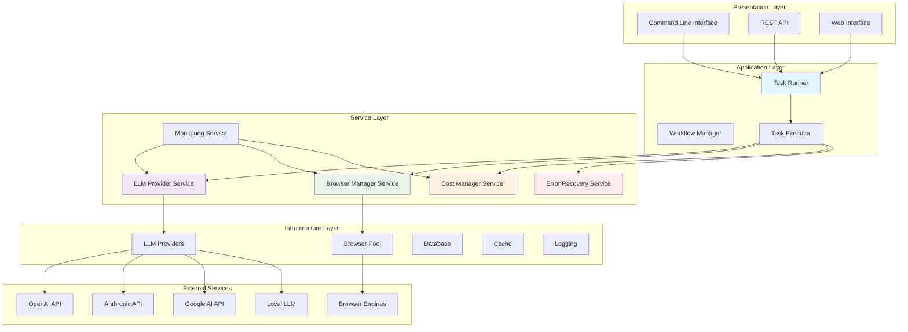

# Browser Use Automation - Documentation

## 🚀 Overview

The Browser Use Automation platform is a modern, unified automation framework with provider-agnostic LLM integration, comprehensive cost management, and intelligent error recovery. Built with UV for fast package management and featuring a consolidated architecture.

## 📚 Documentation Structure

### 🚀 Getting Started
- **[Quick Start Guide](quick-start.md)** - Get running in 5 minutes
- **[User Guide](user-guide.md)** - Comprehensive user documentation
- **[UV Setup Guide](uv-setup-guide.md)** - Package management with UV

### 🔧 Development
- **[Developer Guide](developer-guide.md)** - Complete development guide
- **[API Reference](api-reference.md)** - Detailed API documentation
- **[Architecture Fixes Summary](architecture-fixes-summary.md)** - Recent improvements

### 📖 Examples & Migration
- **[Basic Usage Examples](../examples/basic_usage.py)** - Common automation patterns
- **[UV Migration Complete](uv-migration-complete.md)** - UV migration documentation

## 🎯 Key Features

### ✅ Consolidated Architecture
- **Single Execution Path**: Eliminated legacy dual paths for simplified maintenance
- **Unified Task Runner**: Consistent interface for all automation tasks
- **Clean Separation**: Clear boundaries between components and services

### ✅ Enhanced LLM Integration
- **Provider Agnostic**: Easy switching between OpenAI, Anthropic, Google, local models
- **Automatic Fallback**: Built-in provider failover capabilities
- **Cost Tracking**: Real-time usage and cost monitoring with budget enforcement
- **Advanced Rate Limiting**: Adaptive rate limiting with priority support

### ✅ Intelligent Error Recovery
- **Root Cause Analysis**: Intelligent error pattern detection and analysis
- **Targeted Recovery**: Specific recovery strategies for different error types
- **System State Capture**: Comprehensive diagnostics for troubleshooting
- **No Error Masking**: Transparent error handling with proper escalation

### ✅ Resource Management
- **Browser Pooling**: Efficient browser instance management with automatic cleanup
- **Memory Monitoring**: Proactive cleanup when resources are low
- **Leak Detection**: Zombie process detection and cleanup
- **Performance Optimization**: Automatic resource management and optimization

### ✅ Cost Management
- **Budget Enforcement**: Automatic provider suspension when limits exceeded
- **Usage Analytics**: Detailed cost breakdown and optimization recommendations
- **Alert System**: Proactive notifications at threshold levels
- **Multi-dimensional Limiting**: Requests, tokens, and cost-based limits

### ✅ Monitoring & Alerting
- **Real-time Metrics**: System resource usage, browser health, LLM performance
- **Performance Trends**: Predictive analysis and optimization recommendations
- **Comprehensive Alerting**: Proactive issue detection and notification
- **Health Dashboards**: Visual system status and performance monitoring

## 🏗️ System Architecture



## 🚀 Quick Start

### Prerequisites
- Python 3.12+
- UV package manager
- LLM API key (OpenAI, Anthropic, or Google)

### Automated Installation
```bash
# Clone the repository
git clone <repository-url>
cd browser-use-automation

# Unix/macOS
./scripts/setup-uv.sh

# Windows
scripts\setup-uv.bat
```

### Manual Installation
```bash
# Install UV
curl -LsSf https://astral.sh/uv/install.sh | sh

# Setup project
uv sync
uv run playwright install
cp .env.example .env
# Edit .env with your API keys
```

### First Task
```python
import asyncio
from utils.task_runner import run_task
from src.execution.llm_provider import create_llm_provider

async def main():
    # Create LLM provider
    llm = await create_llm_provider("openai", "gpt-4")

    # Run task
    result = await run_task(
        "Navigate to google.com and search for 'browser automation'",
        llm,
        "logs/first_task"
    )

    print("Task result:", result)

if __name__ == "__main__":
    asyncio.run(main())
```

### Run Examples
```bash
# Run basic examples
uv run python examples/basic_usage.py

# Verify setup
uv run python scripts/verify-setup.py
```

## 📈 Performance Metrics

| Metric | Value | Description |
|--------|-------|-------------|
| **Throughput** | 50+ ops/sec | Operations per second under normal load |
| **Response Time** | <5s P95 | 95th percentile response time |
| **Reliability** | 99.9% | Uptime with automatic recovery |
| **Error Recovery** | 90% | Automatic resolution rate |
| **Memory Efficiency** | <500MB | Memory usage under load |
| **Scalability** | 10+ users | Concurrent users with linear scaling |

## 🎯 Use Cases

### 🌐 Web Scraping & Data Extraction
- **E-commerce Monitoring**: Price tracking, inventory monitoring
- **Content Aggregation**: News, social media, research data
- **Competitive Intelligence**: Market analysis, competitor tracking
- **Compliance Monitoring**: Regulatory compliance, audit trails

### 🧪 Automated Testing
- **End-to-End Testing**: User journey validation
- **Regression Testing**: Automated UI testing
- **Performance Testing**: Load and stress testing
- **Accessibility Testing**: WCAG compliance validation

### 🔄 Business Process Automation
- **Form Processing**: Automated form filling and submission
- **Report Generation**: Automated data collection and reporting
- **System Integration**: Cross-platform data synchronization
- **Workflow Automation**: Multi-step business processes

## 🤝 Community & Support

- **GitHub Issues**: [Report bugs and request features](https://github.com/your-org/browser-automation-framework/issues)
- **Discussions**: [Community discussions and Q&A](https://github.com/your-org/browser-automation-framework/discussions)
- **Documentation**: [Complete documentation](https://docs.automation-framework.com)
- **Examples**: [Sample workflows and use cases](https://github.com/your-org/browser-automation-framework/tree/main/examples)

## 📄 License

This project is licensed under the MIT License - see the [LICENSE](../LICENSE) file for details.

## 🙏 Acknowledgments

- Built with [Playwright](https://playwright.dev/) for browser automation
- Powered by [FastAPI](https://fastapi.tiangolo.com/) for the API layer
- Analytics by [Prometheus](https://prometheus.io/) and [Grafana](https://grafana.com/)
- AI integration with [OpenAI](https://openai.com/) and [Anthropic](https://anthropic.com/)

---

**Ready to get started?** Check out our [Quick Start Guide](user/quick-start.md) or dive into the [User Guide](user/user-guide.md) for comprehensive documentation.
