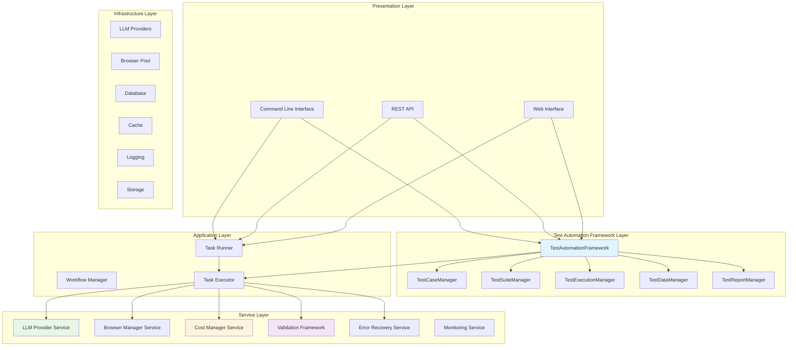
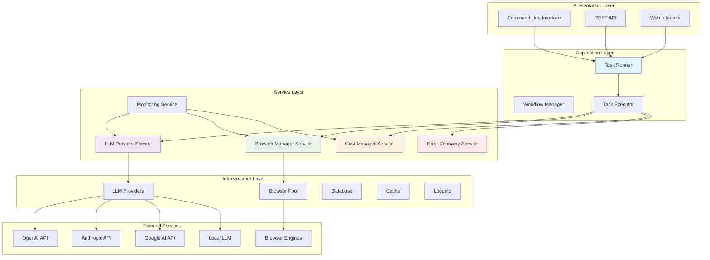
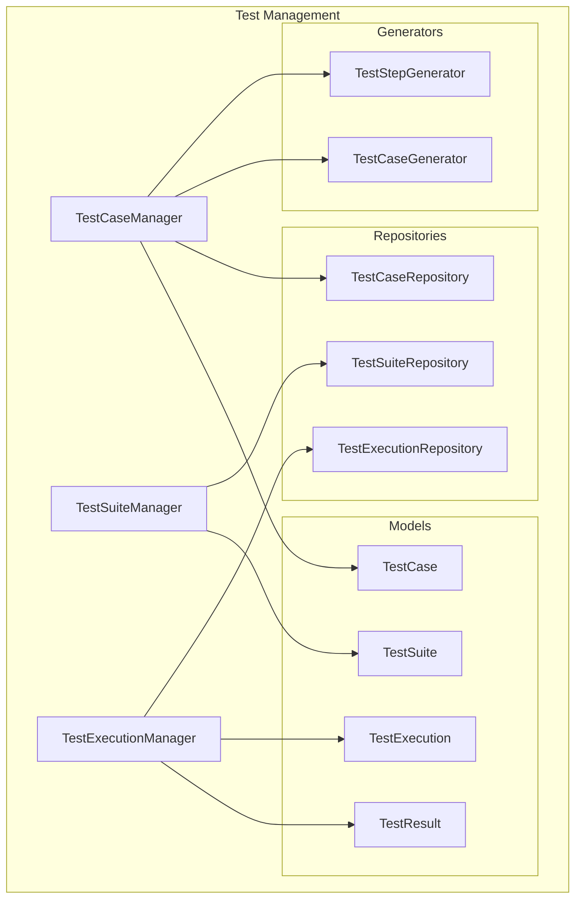
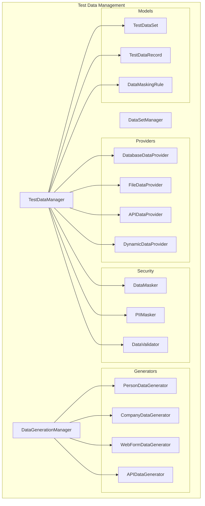
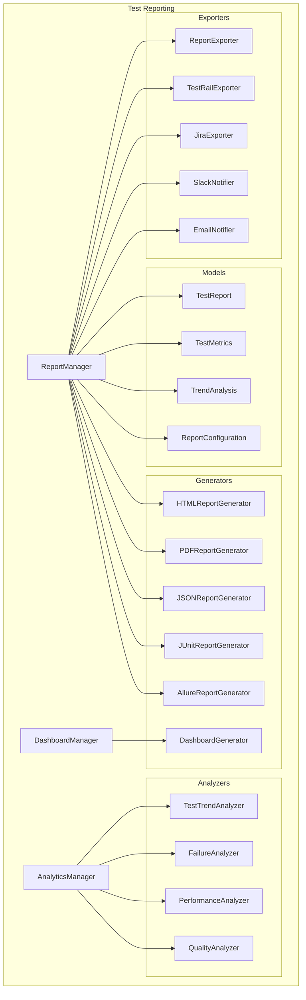
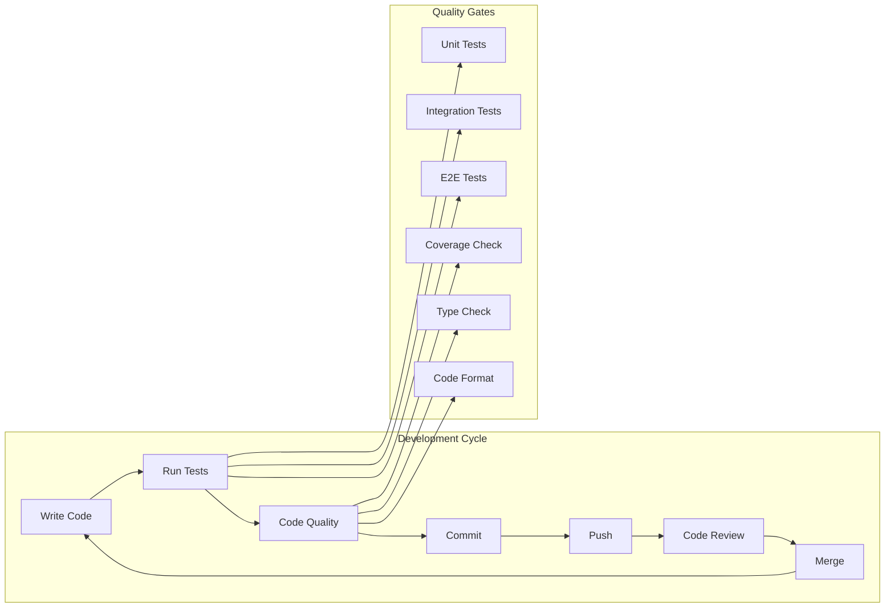
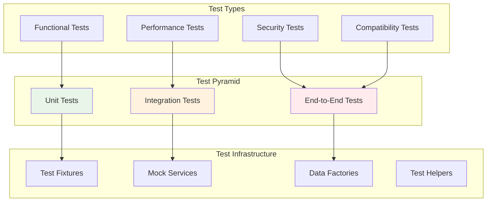
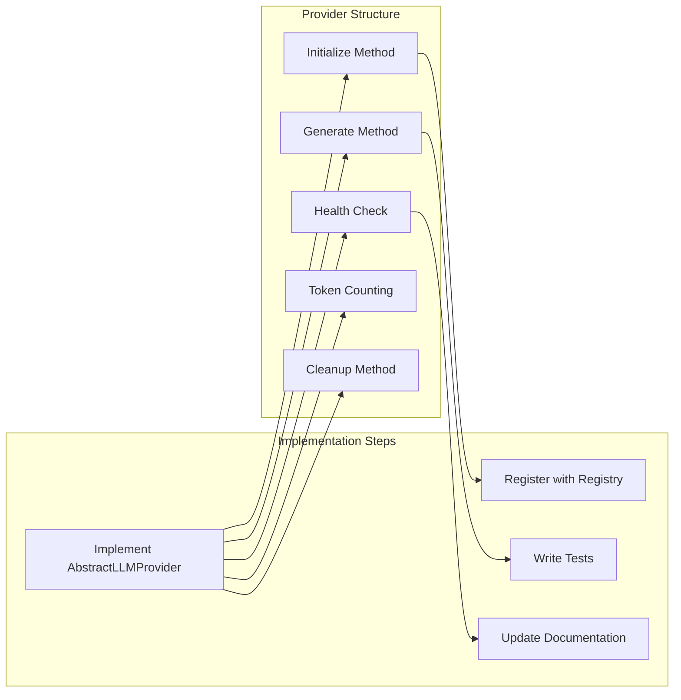

# Browser Use Automation - Developer Guide

This guide provides comprehensive information for developers working on the Browser Use Automation platform, including the new Test Automation Framework.

## 🏗️ Architecture Overview

### Updated System Architecture (with Test Automation Framework)



### Legacy System Architecture



### Core Components

#### 1. Unified Execution Layer
- **Task Runner** (`utils/task_runner.py`): Single entry point for all task execution
- **Task Executor** (`src/execution/task_executor.py`): Core execution logic
- **Workflow Manager**: Orchestrates complex multi-step workflows

#### 2. LLM Abstraction Layer
- **Unified Provider** (`src/execution/llm_abstraction.py`): Provider-agnostic interface
- **Provider Registry**: Dynamic provider registration and discovery
- **Provider Implementations** (`src/execution/providers/`): Specific provider adapters

#### 3. Browser Management
- **Enhanced Browser Manager** (`src/execution/browser_manager.py`): Resource-aware browser lifecycle
- **Browser Pool**: Efficient browser instance pooling
- **Session Management**: Automatic cleanup and resource optimization

#### 4. Cost Management
- **Cost Manager** (`src/infrastructure/cost_management.py`): Budget enforcement and tracking
- **Advanced Rate Limiter**: Multi-dimensional rate limiting
- **Usage Analytics**: Detailed cost breakdown and optimization

#### 5. Error Recovery
- **Enhanced Error Recovery** (`src/execution/enhanced_error_recovery.py`): Intelligent error handling
- **Pattern Analysis**: Error pattern detection and root cause analysis
- **Recovery Strategies**: Targeted recovery actions

#### 6. Test Automation Framework (NEW)
- **TestAutomationFramework** (`src/test_automation_framework.py`): Main framework orchestrator
- **Test Case Management** (`src/test_management/`): Complete test case lifecycle management
- **Test Data Management** (`src/test_data/`): Comprehensive test data handling
- **Test Reporting** (`src/test_reporting/`): Advanced reporting and analytics

### Test Automation Framework Components

#### Test Management Layer


#### Test Data Management Layer


#### Test Reporting Layer


## 🚀 Development Setup

### Prerequisites

- Python 3.12+
- UV package manager
- Git
- IDE with Python support (VS Code recommended)

### Environment Setup

```bash
# Clone repository
git clone <repository-url>
cd browser-use-automation

# Install UV if not already installed
curl -LsSf https://astral.sh/uv/install.sh | sh

# Setup development environment
uv sync --dev
uv run playwright install

# Setup pre-commit hooks
uv run pre-commit install

# Copy environment file
cp .env.example .env
# Edit .env with your API keys and settings
```

### Development Workflow



## 📁 Project Structure

```
browser-use-automation/
├── src/                          # Source code
│   ├── test_automation_framework.py  # Main framework orchestrator
│   ├── test_management/         # Test case management (NEW)
│   │   ├── __init__.py         # Module interface
│   │   ├── models.py           # Test case, suite, execution models
│   │   ├── managers.py         # Business logic managers
│   │   ├── repositories.py     # Data persistence layer
│   │   ├── services.py         # High-level services
│   │   └── generators.py       # Test case generators
│   ├── test_data/              # Test data management (NEW)
│   │   ├── __init__.py         # Module interface
│   │   ├── models.py           # Data models and schemas
│   │   ├── managers.py         # Data management logic
│   │   ├── generators.py       # Data generators
│   │   ├── providers.py        # Data source providers
│   │   ├── masking.py          # Data privacy and masking
│   │   └── validation.py       # Data quality validation
│   ├── test_reporting/         # Advanced reporting (NEW)
│   │   ├── __init__.py         # Module interface
│   │   ├── models.py           # Report models and metrics
│   │   ├── managers.py         # Report management
│   │   ├── generators.py       # Report generators
│   │   ├── analyzers.py        # Trend and failure analysis
│   │   ├── exporters.py        # External integrations
│   │   └── templates.py        # Report templates
│   ├── execution/              # Core execution components
│   │   ├── task_executor.py    # Main task execution logic
│   │   ├── llm_abstraction.py  # LLM provider abstraction
│   │   ├── llm_provider.py     # Enhanced LLM provider
│   │   ├── browser_manager.py  # Browser lifecycle management
│   │   ├── enhanced_error_recovery.py  # Error handling
│   │   └── providers/          # LLM provider implementations
│   ├── validation/             # Validation framework
│   │   ├── __init__.py         # Module interface
│   │   ├── core/               # Core validation components
│   │   └── validators/         # Individual validators
│   ├── infrastructure/         # Infrastructure services
│   │   ├── cost_management.py  # Cost tracking and budgets
│   │   ├── logging/            # Logging infrastructure
│   │   ├── config/             # Configuration management
│   │   └── resources/          # Resource management
│   ├── monitoring/             # System monitoring
│   │   └── system_monitor.py   # Comprehensive monitoring
│   └── llm/                    # LLM-related utilities
├── utils/                      # Utility modules
│   └── task_runner.py          # Simplified task runner
├── core/                       # Core interfaces and exceptions
│   ├── interfaces.py           # Abstract interfaces
│   └── exceptions.py           # Custom exceptions
├── tests/                      # Test suite
│   ├── test_automation_framework/  # Framework tests (NEW)
│   │   ├── test_framework_integration.py
│   │   ├── test_test_case_management.py
│   │   ├── test_test_data_management.py
│   │   └── test_test_reporting.py
│   ├── validation/             # Validation framework tests
│   ├── unit/                   # Unit tests
│   ├── integration/            # Integration tests
│   └── e2e/                    # End-to-end tests
├── docs/                       # Documentation
│   ├── user-guide.md          # Updated user guide
│   ├── developer-guide.md     # Updated developer guide
│   ├── validation-framework-summary.md
│   └── phase1-implementation-summary.md
├── scripts/                    # Setup and utility scripts
├── examples/                   # Example workflows
│   ├── complete_framework_demo.py  # Complete framework demo (NEW)
│   └── validation_demo.py      # Validation framework demo
└── workflows/                  # Predefined workflows
```

## 🔧 Development Commands

### Package Management

```bash
# Install dependencies
uv sync

# Add new dependency
uv add requests
uv add pytest --dev  # Development dependency

# Add optional dependency group
uv add --optional google google-generativeai

# Remove dependency
uv remove requests

# Update dependencies
uv sync --upgrade
```

### Code Quality

```bash
# Format code
uv run black .
uv run isort .

# Type checking
uv run mypy src/

# Linting
uv run flake8 src/ tests/

# Run all quality checks
uv run pre-commit run --all-files
```

### Testing

```bash
# Run all tests
uv run pytest

# Run specific test categories
uv run pytest tests/unit/           # Unit tests
uv run pytest tests/integration/    # Integration tests
uv run pytest tests/e2e/           # End-to-end tests

# Run with coverage
uv run pytest --cov=src --cov-report=html

# Run specific test file
uv run pytest tests/unit/test_llm_provider.py

# Run tests with specific markers
uv run pytest -m "not slow"        # Skip slow tests
uv run pytest -m integration       # Only integration tests
```

### Running Applications

```bash
# Main application
uv run python main.py

# Task runner (legacy)
uv run python -m utils.task_runner

# Test automation framework demo (NEW)
uv run python examples/complete_framework_demo.py

# Validation framework demo
uv run python examples/validation_demo.py

# Specific workflow
uv run python workflows/sample_workflow.py

# With debugging
uv run python -m pdb main.py
```

### Test Automation Framework Development

```bash
# Run framework integration tests
uv run pytest tests/test_automation_framework/

# Run specific framework component tests
uv run pytest tests/test_automation_framework/test_test_case_management.py
uv run pytest tests/test_automation_framework/test_test_data_management.py
uv run pytest tests/test_automation_framework/test_test_reporting.py

# Run advanced LLM features tests (NEW)
uv run pytest tests/test_automation_framework/test_advanced_llm_features.py

# Run framework tests with coverage
uv run pytest tests/test_automation_framework/ --cov=src/test_management --cov=src/test_data --cov=src/test_reporting

# Test framework with real LLM (requires API keys)
uv run pytest tests/test_automation_framework/ -m "not mock" --api-key=$OPENAI_API_KEY

# Test advanced LLM features with real LLM
uv run pytest tests/test_automation_framework/test_advanced_llm_features.py --api-key=$OPENAI_API_KEY
```

### Advanced LLM Features Development

```bash
# Run advanced LLM features demo
uv run python examples/advanced_llm_features_demo.py

# Test requirements-to-test generation
uv run python -c "
import asyncio
from src.test_management.llm_features import RequirementsToTestGenerator
from src.execution.llm_provider import create_llm_provider

async def test_requirements():
    llm = await create_llm_provider('openai', 'gpt-4')
    generator = RequirementsToTestGenerator()

    requirements = '''
    User can login with email and password.
    System validates credentials and creates session.
    '''

    test_cases = await generator.generate_test_cases_from_requirements(
        requirements_document=requirements,
        llm_provider=llm,
        test_coverage_level='standard'
    )

    print(f'Generated {len(test_cases)} test cases')
    for tc in test_cases:
        print(f'- {tc.name} ({tc.test_type.value})')

asyncio.run(test_requirements())
"

# Test maintenance engine
uv run python -c "
import asyncio
from src.test_management.llm_features import TestMaintenanceEngine
from src.test_management.models import TestCase, TestType
from src.execution.llm_provider import create_llm_provider

async def test_maintenance():
    llm = await create_llm_provider('openai', 'gpt-4')
    engine = TestMaintenanceEngine()

    test_case = TestCase(
        name='Login Test',
        description='Test user login',
        test_type=TestType.FUNCTIONAL
    )

    ui_changes = 'Login button ID changed from login-btn to sign-in-button'

    updated_case = await engine.update_test_case_for_changes(
        test_case=test_case,
        change_description=ui_changes,
        llm_provider=llm
    )

    print(f'Updated: {updated_case.name} (v{updated_case.version})')

asyncio.run(test_maintenance())
"
```

## 🧪 Testing Strategy

### Test Architecture



### Writing Tests

#### Unit Tests

```python
# tests/unit/test_llm_provider.py
import pytest
from unittest.mock import AsyncMock, patch
from src.execution.llm_provider import TaskLLMProvider

@pytest.fixture
async def llm_provider():
    provider = TaskLLMProvider(
        primary_provider="openai",
        primary_model="gpt-4",
        primary_config={"api_key": "test-key"}
    )
    await provider.initialize()
    return provider

@pytest.mark.asyncio
async def test_llm_invoke_success(llm_provider):
    with patch.object(llm_provider.unified_provider, 'invoke') as mock_invoke:
        mock_invoke.return_value = "Test response"
        
        result = await llm_provider.invoke("Test prompt")
        
        assert result == "Test response"
        mock_invoke.assert_called_once()

@pytest.mark.asyncio
async def test_llm_invoke_with_cost_tracking(llm_provider):
    # Test cost tracking functionality
    result = await llm_provider.invoke(
        "Test prompt",
        user_id="test-user",
        project_id="test-project"
    )
    
    # Verify cost was recorded
    stats = llm_provider.get_statistics()
    assert stats["basic_stats"]["request_count"] > 0
```

#### Integration Tests

```python
# tests/integration/test_task_execution.py
import pytest
from utils.task_runner import run_task
from src.execution.llm_provider import create_llm_provider

@pytest.mark.integration
@pytest.mark.asyncio
async def test_full_task_execution():
    # Create real LLM provider (with test API key)
    llm = await create_llm_provider(
        primary_provider="openai",
        primary_model="gpt-3.5-turbo",
        primary_config={"api_key": os.getenv("TEST_OPENAI_API_KEY")}
    )
    
    # Run actual task
    result = await run_task(
        "Navigate to httpbin.org and get the current IP",
        llm,
        "logs/test_execution"
    )
    
    assert result is not None
    assert "ip" in result.lower()
```

#### End-to-End Tests

```python
# tests/e2e/test_complete_workflow.py
import pytest
from workflows.sample_workflow import SampleWorkflow

@pytest.mark.e2e
@pytest.mark.slow
@pytest.mark.asyncio
async def test_complete_automation_workflow():
    workflow = SampleWorkflow()
    
    # Run complete workflow
    result = await workflow.execute({
        "target_url": "https://httpbin.org",
        "actions": ["navigate", "extract_data", "validate"]
    })
    
    assert result["status"] == "completed"
    assert result["data"] is not None
    assert len(result["steps"]) > 0
```

### Test Configuration

```python
# tests/conftest.py
import pytest
import asyncio
from unittest.mock import AsyncMock

@pytest.fixture(scope="session")
def event_loop():
    """Create an instance of the default event loop for the test session."""
    loop = asyncio.get_event_loop_policy().new_event_loop()
    yield loop
    loop.close()

@pytest.fixture
async def mock_llm_provider():
    """Mock LLM provider for testing."""
    provider = AsyncMock()
    provider.invoke.return_value = "Mock response"
    provider.get_token_count.return_value = 100
    provider.health_check.return_value = True
    return provider

@pytest.fixture
async def test_browser_manager():
    """Test browser manager with minimal configuration."""
    from src.execution.browser_manager import EnhancedBrowserManager
    
    manager = EnhancedBrowserManager(
        enable_pooling=False,  # Disable pooling for tests
        memory_threshold=0.95,  # Higher threshold for tests
        cleanup_interval=60     # Less frequent cleanup
    )
    
    await manager.initialize()
    yield manager
    await manager.cleanup()
```

## 🔌 Adding New Features

### Extending the Test Automation Framework

#### Adding a New Test Data Generator

```python
# src/test_data/generators/custom_generator.py
from typing import Dict, Any, List
from ..models import TestDataRecord, DataType

class CustomDataGenerator:
    """Custom data generator for specific domain data."""

    def __init__(self):
        self.data_type = DataType.CUSTOM

    async def generate_records(
        self,
        count: int,
        include_fields: List[str] = None,
        **kwargs
    ) -> List[TestDataRecord]:
        """Generate custom test data records."""
        records = []

        for i in range(count):
            data = await self._generate_single_record(include_fields, **kwargs)
            record = TestDataRecord(
                data=data,
                data_type=self.data_type,
                source="generated"
            )
            records.append(record)

        return records

    async def _generate_single_record(
        self,
        include_fields: List[str] = None,
        **kwargs
    ) -> Dict[str, Any]:
        """Generate a single data record."""
        # Implement your custom data generation logic
        return {
            "custom_field_1": "generated_value_1",
            "custom_field_2": "generated_value_2",
            # Add more fields as needed
        }

# Register the generator
from src.test_data import TestDataManager

# In your initialization code
data_manager = TestDataManager()
data_manager.register_generator("custom", CustomDataGenerator())
```

#### Adding a New Report Generator

```python
# src/test_reporting/generators/custom_report_generator.py
from typing import Dict, Any
from ..models import TestReport, ReportFormat, TestExecution

class CustomReportGenerator:
    """Custom report generator for specific format."""

    def __init__(self):
        self.format = ReportFormat.CUSTOM

    async def generate_report(
        self,
        execution: TestExecution,
        config: Dict[str, Any] = None
    ) -> TestReport:
        """Generate custom format report."""
        report = TestReport(
            title=f"Custom Report - {execution.name}",
            format=self.format,
            execution_ids=[execution.id]
        )

        # Add custom sections
        summary_section = self._create_summary_section(execution)
        report.add_section(summary_section)

        # Generate custom format output
        output_path = await self._generate_custom_output(execution, config)
        report.file_path = output_path

        return report

    def _create_summary_section(self, execution: TestExecution):
        """Create custom summary section."""
        from ..models import ReportSection, SectionType

        return ReportSection(
            title="Custom Summary",
            section_type=SectionType.SUMMARY,
            content={
                "execution_id": execution.id,
                "total_tests": execution.total_tests,
                "success_rate": execution.get_success_rate(),
                "custom_metrics": self._calculate_custom_metrics(execution)
            }
        )

    def _calculate_custom_metrics(self, execution: TestExecution) -> Dict[str, Any]:
        """Calculate custom metrics."""
        # Implement your custom metrics calculation
        return {
            "custom_metric_1": 0.95,
            "custom_metric_2": "excellent"
        }

    async def _generate_custom_output(
        self,
        execution: TestExecution,
        config: Dict[str, Any]
    ) -> str:
        """Generate custom format output file."""
        # Implement your custom file generation logic
        output_path = f"reports/custom_report_{execution.id}.custom"

        # Write your custom format
        with open(output_path, 'w') as f:
            f.write(f"Custom Report for {execution.name}\n")
            f.write(f"Success Rate: {execution.get_success_rate():.2%}\n")
            # Add more custom content

        return output_path

# Register the generator
from src.test_reporting import ReportManager

# In your initialization code
report_manager = ReportManager()
report_manager.register_generator("custom", CustomReportGenerator())
```

#### Adding a New Validator

```python
# src/validation/validators/custom_validator.py
from typing import Dict, Any, Optional
from ..core.validation_config import ValidationConfig
from ..core.evidence_collector import EvidenceCollector
from .base_validator import BaseValidator

class CustomValidator(BaseValidator):
    """Custom validator for domain-specific validation."""

    def __init__(self, config: ValidationConfig):
        super().__init__(config)
        self.custom_rules = config.custom_validation_rules or {}

    async def validate(
        self,
        context: Dict[str, Any],
        evidence_collector: Optional[EvidenceCollector] = None
    ) -> None:
        """Perform custom validation."""
        if not self.config.enable_custom_validation:
            self.add_info("Custom validation disabled", "config_check")
            return

        # Implement your custom validation logic
        await self._validate_custom_rules(context, evidence_collector)
        await self._validate_domain_specific_logic(context, evidence_collector)

    async def _validate_custom_rules(
        self,
        context: Dict[str, Any],
        evidence_collector: Optional[EvidenceCollector]
    ) -> None:
        """Validate custom business rules."""
        task_result = context.get("task_result", {})

        for rule_name, rule_config in self.custom_rules.items():
            try:
                result = await self._apply_custom_rule(rule_name, rule_config, task_result)

                if not result["passed"]:
                    self.add_error(
                        f"Custom rule '{rule_name}' failed: {result['message']}",
                        f"custom_rule_{rule_name}",
                        {"rule": rule_name, "details": result},
                        result.get("suggestion", "Review custom rule configuration")
                    )
                else:
                    self.add_info(
                        f"Custom rule '{rule_name}' passed",
                        f"custom_rule_{rule_name}_passed"
                    )

            except Exception as e:
                self.add_error(
                    f"Failed to apply custom rule '{rule_name}': {str(e)}",
                    f"custom_rule_{rule_name}_error",
                    {"rule": rule_name, "error": str(e)},
                    "Check custom rule implementation"
                )

    async def _apply_custom_rule(
        self,
        rule_name: str,
        rule_config: Dict[str, Any],
        task_result: Dict[str, Any]
    ) -> Dict[str, Any]:
        """Apply a specific custom rule."""
        # Implement your custom rule logic
        # This is just an example

        if rule_name == "response_time_limit":
            max_time = rule_config.get("max_seconds", 30)
            actual_time = task_result.get("execution_time", 0)

            if actual_time > max_time:
                return {
                    "passed": False,
                    "message": f"Response time {actual_time}s exceeds limit {max_time}s",
                    "suggestion": "Optimize task execution or increase time limit"
                }
            else:
                return {"passed": True, "message": "Response time within limits"}

        # Add more custom rules as needed
        return {"passed": True, "message": "Rule not implemented"}

    async def _validate_domain_specific_logic(
        self,
        context: Dict[str, Any],
        evidence_collector: Optional[EvidenceCollector]
    ) -> None:
        """Validate domain-specific business logic."""
        # Implement domain-specific validation
        pass

    def get_validation_rules(self) -> List[str]:
        """Get list of validation rules this validator implements."""
        return [
            "custom_rule_response_time_limit",
            "custom_rule_data_quality",
            "custom_rule_business_logic",
            # Add more custom rules
        ]

# Register the validator
from src.validation import ValidationEngine

# In your validation configuration
def create_custom_validation_config():
    config = ValidationConfig.create_standard_config()
    config.enable_custom_validation = True
    config.custom_validation_rules = {
        "response_time_limit": {"max_seconds": 30},
        "data_quality": {"min_completeness": 0.95}
    }
    return config

# Add to validation engine
validation_engine = ValidationEngine(create_custom_validation_config())
validation_engine.add_custom_validator(
    "custom",
    CustomValidator(validation_engine.config),
    [ValidationPhase.POST_EXECUTION]
)
```

### Adding a New LLM Provider



#### Step 1: Create Provider Implementation

```python
# src/execution/providers/new_provider.py
from ..llm_abstraction import AbstractLLMProvider, LLMRequest, LLMResponse, ProviderCapability

class NewProvider(AbstractLLMProvider):
    """Provider implementation for New LLM Service."""
    
    def __init__(self, provider_name: str, model: str, config: Dict[str, Any]):
        super().__init__(provider_name, model, config)
        
        # Set capabilities
        self.capabilities = [
            ProviderCapability.TEXT_GENERATION,
            ProviderCapability.CONVERSATION,
            # Add other capabilities as supported
        ]
        
        self.client = None
        self.api_key = None
    
    async def initialize(self) -> None:
        """Initialize the provider."""
        # Get API key
        self.api_key = self.config.get("api_key") or os.environ.get("NEW_PROVIDER_API_KEY")
        if not self.api_key:
            raise ConfigurationError("New Provider API key not found")
        
        # Initialize client
        # self.client = NewProviderClient(api_key=self.api_key)
        
        self.is_initialized = True
        self.logger.info("New provider initialized")
    
    async def generate(self, request: LLMRequest) -> LLMResponse:
        """Generate a response using the new provider."""
        if not self.is_initialized or not self.client:
            raise LLMError("New provider not initialized")
        
        # Implementation specific to the new provider
        # response = await self.client.generate(request.prompt)
        
        # Return standardized response
        return LLMResponse(
            content="response_content",
            request_id=request.request_id,
            provider=self.provider_name,
            model=self.model,
            usage={"prompt_tokens": 0, "completion_tokens": 0, "total_tokens": 0}
        )
    
    async def health_check(self) -> bool:
        """Check if provider is healthy."""
        # Implement health check logic
        return True
    
    def get_token_count(self, text: str) -> int:
        """Get token count for text."""
        # Implement token counting logic
        return len(text) // 4  # Rough estimate
```

#### Step 2: Register Provider

```python
# src/execution/llm_abstraction.py (in _register_known_providers method)
try:
    from .providers.new_provider import NewProvider
    self.registry.register_provider("new_provider", NewProvider)
except ImportError:
    self.logger.warning("New provider not available")
```

#### Step 3: Add Tests

```python
# tests/unit/test_new_provider.py
import pytest
from src.execution.providers.new_provider import NewProvider

@pytest.fixture
def new_provider():
    return NewProvider("new_provider", "test-model", {"api_key": "test-key"})

@pytest.mark.asyncio
async def test_new_provider_initialization(new_provider):
    await new_provider.initialize()
    assert new_provider.is_initialized

@pytest.mark.asyncio
async def test_new_provider_generate(new_provider):
    await new_provider.initialize()
    
    request = LLMRequest("Test prompt")
    response = await new_provider.generate(request)
    
    assert response.content is not None
    assert response.provider == "new_provider"
```

### Adding New Monitoring Metrics

```python
# src/monitoring/custom_metrics.py
from .system_monitor import SystemMonitor

class CustomMetricsCollector:
    """Collect custom application metrics."""
    
    def __init__(self, system_monitor: SystemMonitor):
        self.system_monitor = system_monitor
        self.custom_metrics = {}
    
    async def collect_custom_metrics(self) -> Dict[str, Any]:
        """Collect custom metrics."""
        return {
            "custom_metric_1": self._calculate_metric_1(),
            "custom_metric_2": self._calculate_metric_2(),
            # Add more custom metrics
        }
    
    def _calculate_metric_1(self) -> float:
        """Calculate custom metric 1."""
        # Implementation
        return 0.0
```

## 📊 Performance Optimization

### Profiling

```bash
# Profile application
uv run python -m cProfile -o profile.stats main.py

# Analyze profile
uv run python -c "
import pstats
p = pstats.Stats('profile.stats')
p.sort_stats('cumulative').print_stats(20)
"

# Memory profiling
uv run python -m memory_profiler main.py
```

### Optimization Guidelines

1. **LLM Optimization**:
   - Use appropriate model sizes for tasks
   - Implement response caching
   - Batch similar requests
   - Use streaming for long responses

2. **Browser Optimization**:
   - Reuse browser instances
   - Implement proper cleanup
   - Use headless mode when possible
   - Optimize page load strategies

3. **Memory Management**:
   - Monitor memory usage
   - Implement automatic cleanup
   - Use weak references where appropriate
   - Profile memory leaks

## 🚀 Deployment

### Docker Deployment

```dockerfile
# Dockerfile
FROM python:3.12-slim

# Install system dependencies
RUN apt-get update && apt-get install -y \
    curl \
    && rm -rf /var/lib/apt/lists/*

# Install UV
RUN curl -LsSf https://astral.sh/uv/install.sh | sh
ENV PATH="/root/.local/bin:$PATH"

# Set working directory
WORKDIR /app

# Copy project files
COPY pyproject.toml uv.lock ./
COPY src/ src/
COPY utils/ utils/
COPY core/ core/

# Install dependencies
RUN uv sync --no-dev

# Install Playwright browsers
RUN uv run playwright install

# Expose port
EXPOSE 8000

# Run application
CMD ["uv", "run", "python", "main.py"]
```

### Production Configuration

```python
# config/production.py
import os

class ProductionConfig:
    """Production configuration."""
    
    # Application settings
    DEBUG = False
    LOG_LEVEL = "INFO"
    
    # LLM settings
    DEFAULT_LLM_PROVIDER = "openai"
    DEFAULT_MODEL = "gpt-4"
    ENABLE_LLM_CACHING = True
    
    # Browser settings
    HEADLESS = True
    BROWSER_TIMEOUT = 60
    MAX_BROWSER_SESSIONS = 10
    
    # Cost management
    ENABLE_COST_TRACKING = True
    DAILY_BUDGET_LIMIT = float(os.getenv("DAILY_BUDGET_LIMIT", "500"))
    MONTHLY_BUDGET_LIMIT = float(os.getenv("MONTHLY_BUDGET_LIMIT", "10000"))
    
    # Monitoring
    ENABLE_MONITORING = True
    MONITORING_INTERVAL = 30
    MEMORY_THRESHOLD = 0.8
```

## 📚 Contributing Guidelines

### Code Style

- Follow PEP 8 style guidelines
- Use type hints for all functions
- Write comprehensive docstrings
- Maintain test coverage above 80%

### Pull Request Process

1. Create feature branch from `main`
2. Implement changes with tests
3. Run quality checks: `uv run pre-commit run --all-files`
4. Update documentation if needed
5. Submit pull request with clear description
6. Address review feedback
7. Merge after approval

### Documentation Standards

- Use clear, concise language
- Include code examples
- Add Mermaid diagrams for complex flows
- Update user guide for user-facing changes
- Update developer guide for internal changes

## 🔍 Debugging

### Logging Configuration

```python
# Enable debug logging
import logging
logging.basicConfig(level=logging.DEBUG)

# Component-specific logging
from src.infrastructure.logging.logger import StructuredLogger
logger = StructuredLogger("debug_component")
logger.debug("Debug message", extra_data={"key": "value"})
```

### Common Debugging Scenarios

1. **LLM Provider Issues**: Check API keys, rate limits, model availability
2. **Browser Issues**: Verify Playwright installation, check browser logs
3. **Memory Issues**: Monitor resource usage, check for leaks
4. **Cost Issues**: Review budget settings, check usage patterns

This developer guide provides a comprehensive foundation for working with the Browser Use Automation platform. For specific implementation details, refer to the code documentation and examples in the repository.
