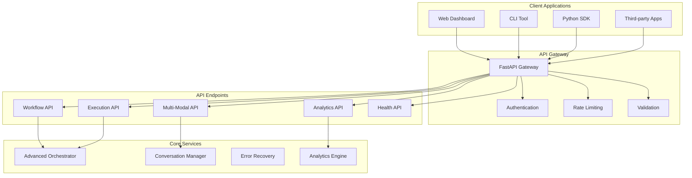
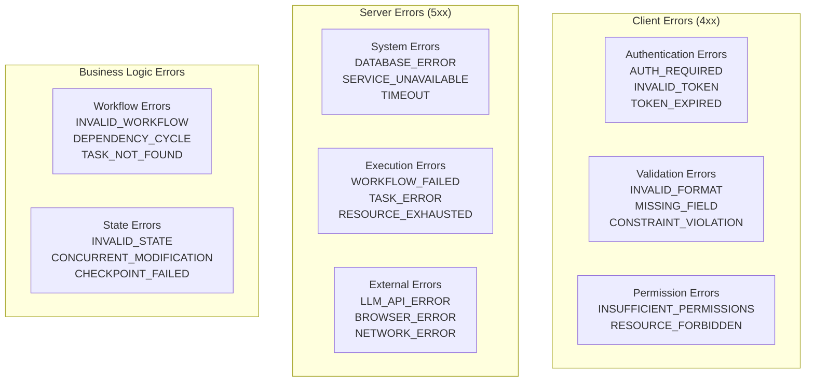
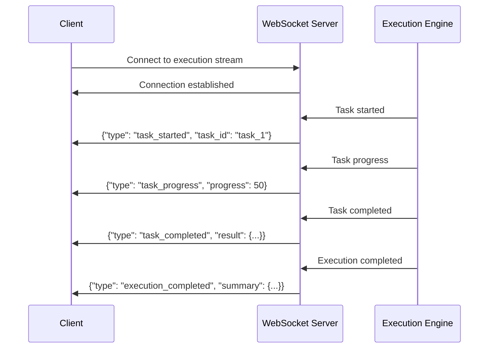

# API Reference

Complete API documentation for the Browser Automation Framework.

## 📚 Table of Contents

1. [API Overview](#api-overview)
2. [Authentication](#authentication)
3. [Workflow Management](#workflow-management)
4. [Execution Control](#execution-control)
5. [Analytics & Monitoring](#analytics--monitoring)
6. [Multi-Modal Processing](#multi-modal-processing)
7. [Error Handling](#error-handling)
8. [WebSocket API](#websocket-api)

## 🌐 API Overview

### Base URL
```
Production: https://api.automation-framework.com/v1
Development: http://localhost:8000/api/v1
```

### API Architecture



### Response Format
All API responses follow a consistent format:

```json
{
  "success": true,
  "data": {
    // Response data
  },
  "metadata": {
    "timestamp": "2024-12-19T10:00:00Z",
    "request_id": "req_123456789",
    "version": "1.0.0"
  },
  "pagination": {  // For paginated responses
    "page": 1,
    "per_page": 20,
    "total": 100,
    "pages": 5
  }
}
```

### Error Response Format
```json
{
  "success": false,
  "error": {
    "code": "VALIDATION_ERROR",
    "message": "Invalid workflow definition",
    "details": {
      "field": "tasks",
      "reason": "At least one task is required"
    }
  },
  "metadata": {
    "timestamp": "2024-12-19T10:00:00Z",
    "request_id": "req_123456789"
  }
}
```

## 🔐 Authentication

### API Key Authentication
```http
GET /api/v1/workflows
Authorization: Bearer your_api_key_here
Content-Type: application/json
```

### JWT Authentication
```http
POST /api/v1/auth/login
Content-Type: application/json

{
  "username": "user@example.com",
  "password": "secure_password"
}
```

Response:
```json
{
  "success": true,
  "data": {
    "access_token": "eyJ0eXAiOiJKV1QiLCJhbGciOiJIUzI1NiJ9...",
    "refresh_token": "eyJ0eXAiOiJKV1QiLCJhbGciOiJIUzI1NiJ9...",
    "expires_in": 3600,
    "token_type": "Bearer"
  }
}
```

## 🔄 Workflow Management

### Create Workflow

```http
POST /api/v1/workflows
Authorization: Bearer {token}
Content-Type: application/json
```

Request Body:
```json
{
  "type": "web_scraping",
  "name": "Product Data Extraction",
  "description": "Extract product information from e-commerce site",
  "version": "1.0",
  "metadata": {
    "author": "automation_team",
    "tags": ["scraping", "products", "e-commerce"]
  },
  "tasks": [
    {
      "id": "navigate_to_products",
      "name": "Navigate to Products Page",
      "type": "navigate",
      "priority": "high",
      "definition": {
        "url": "https://example-store.com/products",
        "wait_for": ".product-list",
        "timeout": 30
      }
    },
    {
      "id": "extract_product_data",
      "name": "Extract Product Information",
      "type": "extract_data",
      "priority": "normal",
      "definition": {
        "selectors": {
          "name": ".product-name",
          "price": ".product-price",
          "description": ".product-description"
        },
        "multiple": true
      }
    }
  ],
  "dependencies": [
    {
      "from": "navigate_to_products",
      "to": "extract_product_data",
      "type": "hard"
    }
  ],
  "configuration": {
    "execution_mode": "sequential",
    "timeout": 300,
    "retry_policy": "exponential_backoff"
  }
}
```

Response:
```json
{
  "success": true,
  "data": {
    "workflow_id": "wf_123456789",
    "status": "created",
    "created_at": "2024-12-19T10:00:00Z",
    "validation_result": {
      "valid": true,
      "warnings": [],
      "suggestions": [
        "Consider adding error handling for network timeouts"
      ]
    }
  }
}
```

### List Workflows

```http
GET /api/v1/workflows?page=1&per_page=20&type=web_scraping&status=active
Authorization: Bearer {token}
```

Response:
```json
{
  "success": true,
  "data": [
    {
      "workflow_id": "wf_123456789",
      "name": "Product Data Extraction",
      "type": "web_scraping",
      "status": "active",
      "created_at": "2024-12-19T10:00:00Z",
      "last_executed": "2024-12-19T11:30:00Z",
      "execution_count": 15,
      "success_rate": 0.93
    }
  ],
  "pagination": {
    "page": 1,
    "per_page": 20,
    "total": 1,
    "pages": 1
  }
}
```

### Get Workflow Details

```http
GET /api/v1/workflows/{workflow_id}
Authorization: Bearer {token}
```

### Update Workflow

```http
PUT /api/v1/workflows/{workflow_id}
Authorization: Bearer {token}
Content-Type: application/json
```

### Delete Workflow

```http
DELETE /api/v1/workflows/{workflow_id}
Authorization: Bearer {token}
```

## ⚡ Execution Control

### Execute Workflow

```http
POST /api/v1/workflows/{workflow_id}/execute
Authorization: Bearer {token}
Content-Type: application/json
```

Request Body:
```json
{
  "config": {
    "enable_llm_assistance": true,
    "enable_multimodal": true,
    "enable_error_recovery": true,
    "enable_analytics": true,
    "auto_optimize": true,
    "learning_mode": true,
    "conversation_context": {
      "user_role": "data_analyst",
      "priority": "accuracy"
    }
  },
  "context": {
    "execution_environment": "production",
    "data_source": "api_request",
    "user_id": "user_123"
  },
  "parameters": {
    "target_url": "https://custom-site.com",
    "max_pages": 10
  }
}
```

Response:
```json
{
  "success": true,
  "data": {
    "execution_id": "exec_987654321",
    "workflow_id": "wf_123456789",
    "status": "running",
    "started_at": "2024-12-19T12:00:00Z",
    "estimated_completion": "2024-12-19T12:05:00Z",
    "progress": {
      "completed_tasks": 0,
      "total_tasks": 2,
      "current_task": "navigate_to_products"
    }
  }
}
```

### Get Execution Status

```http
GET /api/v1/executions/{execution_id}
Authorization: Bearer {token}
```

Response:
```json
{
  "success": true,
  "data": {
    "execution_id": "exec_987654321",
    "workflow_id": "wf_123456789",
    "status": "completed",
    "started_at": "2024-12-19T12:00:00Z",
    "completed_at": "2024-12-19T12:04:32Z",
    "execution_time": 272.5,
    "result": {
      "success": true,
      "tasks_completed": 2,
      "tasks_failed": 0,
      "data_extracted": {
        "products": 25,
        "total_records": 25
      }
    },
    "intelligence_insights": {
      "llm_analysis": {
        "performance_rating": "excellent",
        "optimization_suggestions": [
          "Consider parallel execution for future runs"
        ]
      },
      "error_recovery_stats": {
        "errors_encountered": 1,
        "auto_recovered": 1,
        "recovery_time": 2.3
      }
    }
  }
}
```

### Control Execution

```http
POST /api/v1/executions/{execution_id}/pause
POST /api/v1/executions/{execution_id}/resume
POST /api/v1/executions/{execution_id}/cancel
Authorization: Bearer {token}
```

### List Executions

```http
GET /api/v1/executions?workflow_id={workflow_id}&status=completed&limit=50
Authorization: Bearer {token}
```

## 📊 Analytics & Monitoring

### Get System Health

```http
GET /api/v1/health
```

Response:
```json
{
  "success": true,
  "data": {
    "status": "healthy",
    "timestamp": "2024-12-19T12:00:00Z",
    "components": {
      "database": {
        "status": "healthy",
        "response_time": 12.5,
        "connections": 15
      },
      "redis": {
        "status": "healthy",
        "response_time": 2.1,
        "memory_usage": "45%"
      },
      "orchestrator": {
        "status": "healthy",
        "active_executions": 3,
        "queue_size": 0
      },
      "analytics": {
        "status": "healthy",
        "metrics_collected": 15420,
        "processing_lag": 0.5
      }
    },
    "system_metrics": {
      "cpu_usage": 35.2,
      "memory_usage": 62.8,
      "disk_usage": 23.1
    }
  }
}
```

### Get Performance Metrics

```http
GET /api/v1/analytics/metrics?metric=throughput&timeframe=1h&granularity=5m
Authorization: Bearer {token}
```

Response:
```json
{
  "success": true,
  "data": {
    "metric": "throughput",
    "timeframe": "1h",
    "granularity": "5m",
    "data_points": [
      {
        "timestamp": "2024-12-19T11:00:00Z",
        "value": 45.2,
        "unit": "ops/sec"
      },
      {
        "timestamp": "2024-12-19T11:05:00Z",
        "value": 48.7,
        "unit": "ops/sec"
      }
    ],
    "summary": {
      "average": 46.8,
      "min": 42.1,
      "max": 52.3,
      "trend": "stable"
    }
  }
}
```

### Generate Reports

```http
POST /api/v1/analytics/reports
Authorization: Bearer {token}
Content-Type: application/json
```

Request Body:
```json
{
  "report_type": "performance_analysis",
  "time_range": {
    "start": "2024-12-18T00:00:00Z",
    "end": "2024-12-19T00:00:00Z"
  },
  "filters": {
    "workflow_types": ["web_scraping", "form_automation"],
    "include_errors": true
  },
  "format": "json",
  "include_charts": true
}
```

## 🎨 Multi-Modal Processing

### Process Content

```http
POST /api/v1/multimodal/process
Authorization: Bearer {token}
Content-Type: multipart/form-data
```

Form Data:
```
file: [binary file data]
media_type: image
processing_mode: analyze
analysis_type: ui
extract_text: true
```

Response:
```json
{
  "success": true,
  "data": {
    "content_id": "content_123456",
    "processing_result": {
      "result_id": "result_789012",
      "media_type": "image",
      "processing_mode": "analyze",
      "result_data": {
        "basic": {
          "dimensions": {"width": 1920, "height": 1080},
          "format": "PNG",
          "file_size": 245760
        },
        "llm": {
          "description": "Screenshot of a web application login page",
          "elements_detected": ["form", "input fields", "submit button"],
          "accessibility_score": 85
        },
        "computer_vision": {
          "edge_density": 0.23,
          "brightness": 128.5,
          "contrast": 45.2,
          "text_regions": 5
        }
      },
      "confidence": 0.94,
      "processing_time": 2.3
    }
  }
}
```

### Get Processing Result

```http
GET /api/v1/multimodal/results/{result_id}
Authorization: Bearer {token}
```

## 🚨 Error Handling

### HTTP Status Codes

| Code | Description | Usage |
|------|-------------|-------|
| 200 | OK | Successful request |
| 201 | Created | Resource created successfully |
| 400 | Bad Request | Invalid request format or parameters |
| 401 | Unauthorized | Authentication required or invalid |
| 403 | Forbidden | Insufficient permissions |
| 404 | Not Found | Resource not found |
| 409 | Conflict | Resource conflict (e.g., duplicate name) |
| 422 | Unprocessable Entity | Validation errors |
| 429 | Too Many Requests | Rate limit exceeded |
| 500 | Internal Server Error | Server error |
| 503 | Service Unavailable | Service temporarily unavailable |

### Error Codes



### Error Response Examples

**Validation Error (422)**
```json
{
  "success": false,
  "error": {
    "code": "VALIDATION_ERROR",
    "message": "Workflow validation failed",
    "details": {
      "field": "tasks[0].definition.url",
      "reason": "Invalid URL format",
      "value": "not-a-valid-url"
    }
  }
}
```

**Rate Limit Error (429)**
```json
{
  "success": false,
  "error": {
    "code": "RATE_LIMIT_EXCEEDED",
    "message": "Too many requests",
    "details": {
      "limit": 100,
      "window": "1h",
      "retry_after": 3600
    }
  }
}
```

## 🔌 WebSocket API

### Connection

```javascript
const ws = new WebSocket('ws://localhost:8000/ws/executions/{execution_id}');
```

### Real-time Execution Updates



### Message Types

**Task Events**
```json
{
  "type": "task_started",
  "timestamp": "2024-12-19T12:00:00Z",
  "data": {
    "task_id": "navigate_to_products",
    "task_name": "Navigate to Products Page"
  }
}
```

**Progress Updates**
```json
{
  "type": "execution_progress",
  "timestamp": "2024-12-19T12:01:30Z",
  "data": {
    "completed_tasks": 1,
    "total_tasks": 3,
    "progress_percentage": 33.3,
    "current_task": "extract_product_data"
  }
}
```

**Error Events**
```json
{
  "type": "error_occurred",
  "timestamp": "2024-12-19T12:02:15Z",
  "data": {
    "task_id": "extract_product_data",
    "error_type": "ElementNotFoundError",
    "error_message": "Could not find element with selector '.product-list'",
    "recovery_attempted": true,
    "recovery_strategy": "retry_with_fallback"
  }
}
```

## 📚 SDK Examples

### Python SDK

```python
from automation_framework_sdk import AutomationClient

# Initialize client
client = AutomationClient(
    base_url="http://localhost:8000/api/v1",
    api_key="your_api_key"
)

# Create and execute workflow
workflow = client.workflows.create({
    "name": "My Workflow",
    "type": "web_scraping",
    "tasks": [...]
})

execution = client.workflows.execute(
    workflow.id,
    config={
        "enable_llm_assistance": True,
        "enable_error_recovery": True
    }
)

# Monitor execution
for update in client.executions.stream(execution.id):
    print(f"Status: {update.type} - {update.data}")

# Get results
result = client.executions.get_result(execution.id)
print(f"Success: {result.success}")
```

### JavaScript SDK

```javascript
import { AutomationClient } from '@automation-framework/sdk';

const client = new AutomationClient({
  baseUrl: 'http://localhost:8000/api/v1',
  apiKey: 'your_api_key'
});

// Create workflow
const workflow = await client.workflows.create({
  name: 'My Workflow',
  type: 'web_scraping',
  tasks: [...]
});

// Execute with real-time updates
const execution = await client.workflows.execute(workflow.id, {
  config: {
    enableLlmAssistance: true,
    enableErrorRecovery: true
  }
});

// Listen for updates
execution.on('progress', (update) => {
  console.log(`Progress: ${update.progressPercentage}%`);
});

execution.on('completed', (result) => {
  console.log('Execution completed:', result);
});
```

## 🔗 Next Steps

- **[Development Setup](development-setup.md)** - Set up your development environment
- **[Testing Guide](testing.md)** - Learn about testing the API
- **[SDK Documentation](sdk-documentation.md)** - Detailed SDK usage guides
- **[Rate Limiting](rate-limiting.md)** - Understanding API limits and best practices
