# Architecture Overview

Comprehensive guide to the Browser Automation Framework's architecture, design patterns, and implementation details.

## 🏗️ System Architecture

### High-Level Architecture

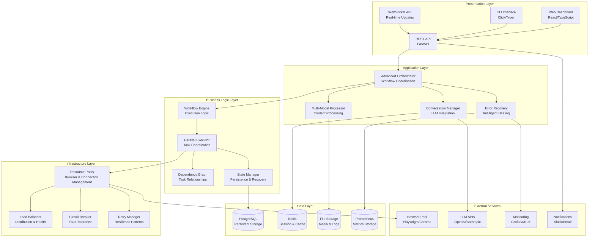

## 🧩 Core Components

### 1. Advanced Orchestrator

The central coordination component that integrates all intelligent features.

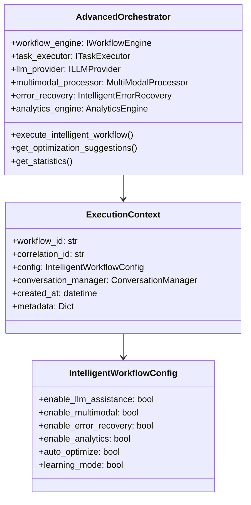

### 2. Conversation Manager

Handles LLM interactions with context preservation and memory management.

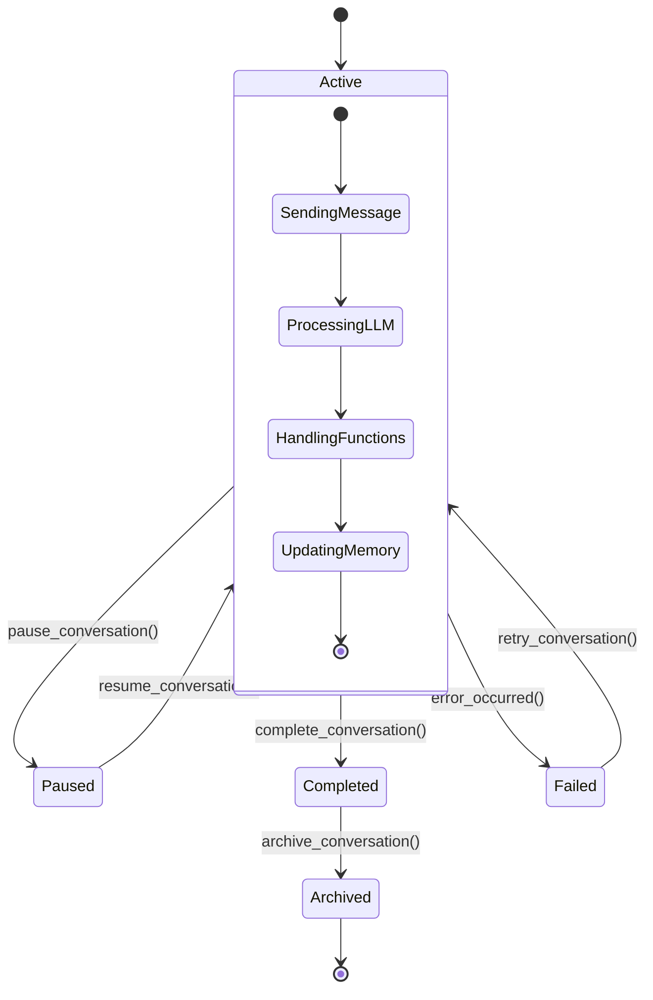

### 3. Multi-Modal Processor

Processes various content types with AI integration.

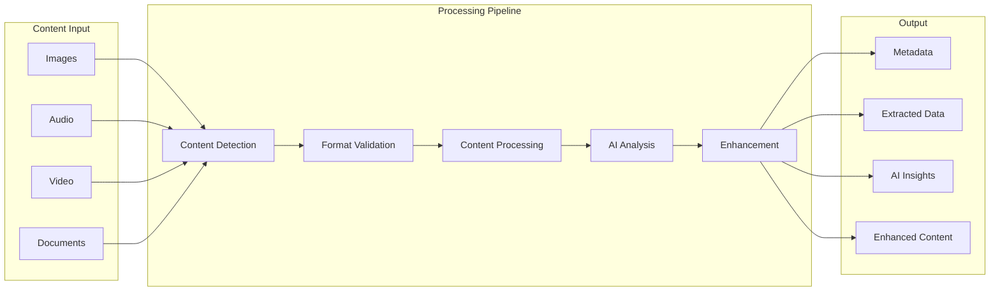

### 4. Parallel Executor

Manages parallel task execution with dependency resolution.

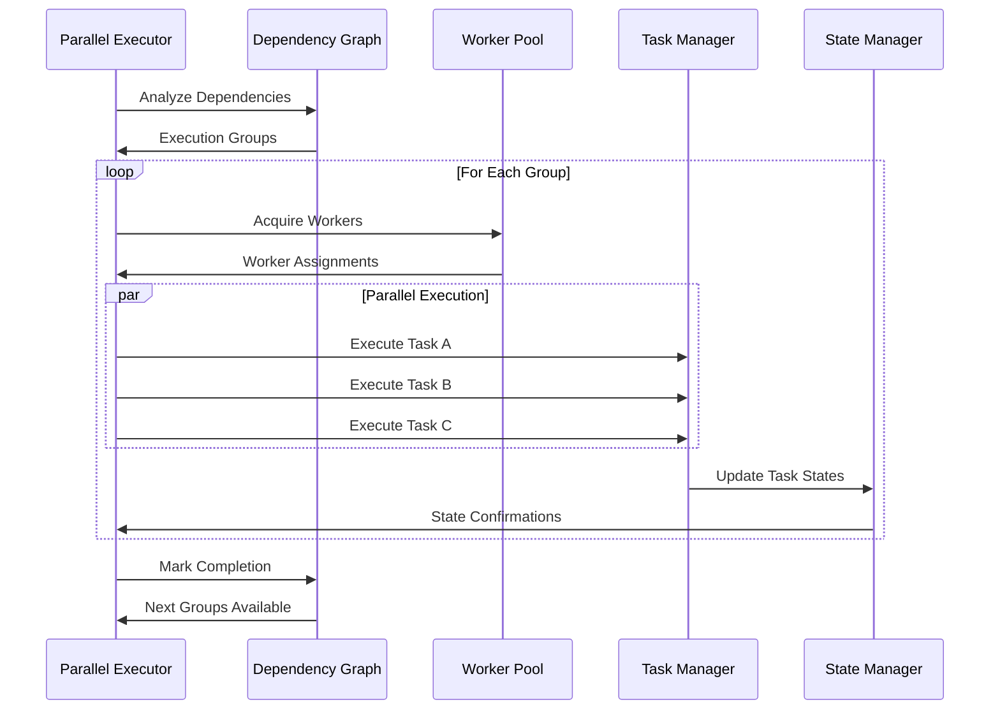

## 🔧 Design Patterns

### 1. Interface Segregation

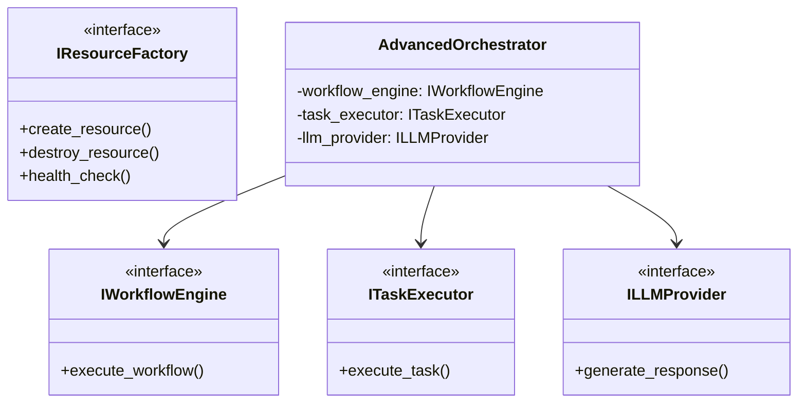

### 2. Strategy Pattern for Recovery

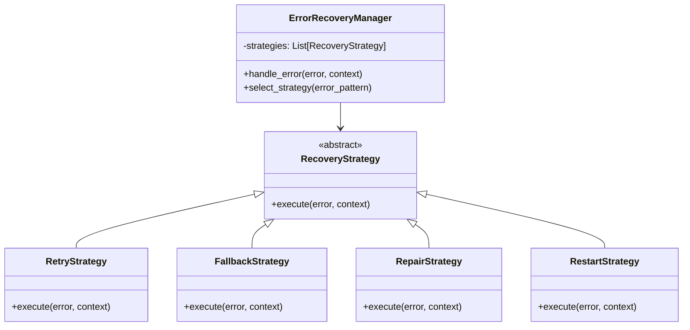

### 3. Observer Pattern for Analytics

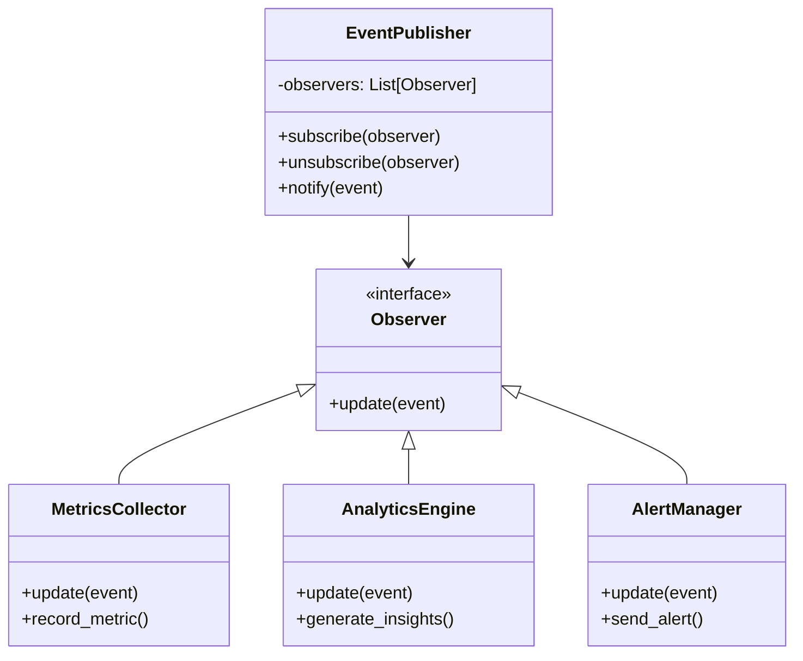

## 🏛️ Architectural Principles

### 1. Separation of Concerns

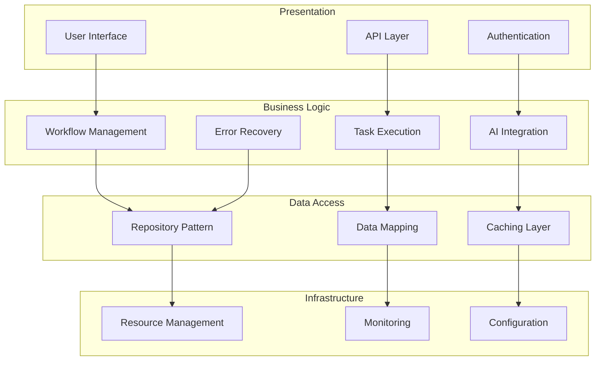

### 2. Dependency Inversion

```mermaid
graph TB
    subgraph "High-Level Modules"
        ORCH[Advanced Orchestrator]
        WF[Workflow Engine]
        EXEC[Task Executor]
    end
    
    subgraph "Abstractions"
        IWF[IWorkflowEngine]
        ITE[ITaskExecutor]
        ILLM[ILLMProvider]
        IRP[IResourcePool]
    end
    
    subgraph "Low-Level Modules"
        IMPL1[Concrete Workflow Engine]
        IMPL2[Concrete Task Executor]
        IMPL3[OpenAI Provider]
        IMPL4[Browser Pool]
    end
    
    ORCH --> IWF
    ORCH --> ITE
    ORCH --> ILLM
    WF --> IRP
    
    IWF <|-- IMPL1
    ITE <|-- IMPL2
    ILLM <|-- IMPL3
    IRP <|-- IMPL4
```

### 3. Single Responsibility Principle

Each component has a single, well-defined responsibility:

| Component | Responsibility |
|-----------|----------------|
| **AdvancedOrchestrator** | Coordinate intelligent workflow execution |
| **ConversationManager** | Manage LLM interactions and context |
| **MultiModalProcessor** | Process various content types |
| **ErrorRecovery** | Handle errors and recovery strategies |
| **ParallelExecutor** | Execute tasks in parallel with dependencies |
| **ResourcePool** | Manage resource lifecycle and allocation |
| **AnalyticsEngine** | Collect metrics and generate insights |

## 🔄 Data Flow

### Workflow Execution Flow

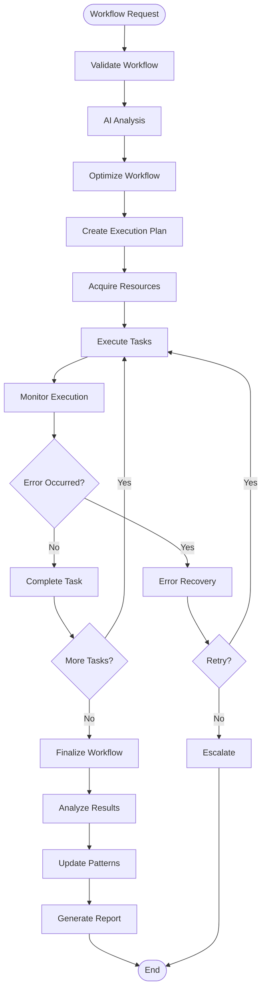

### Error Recovery Flow

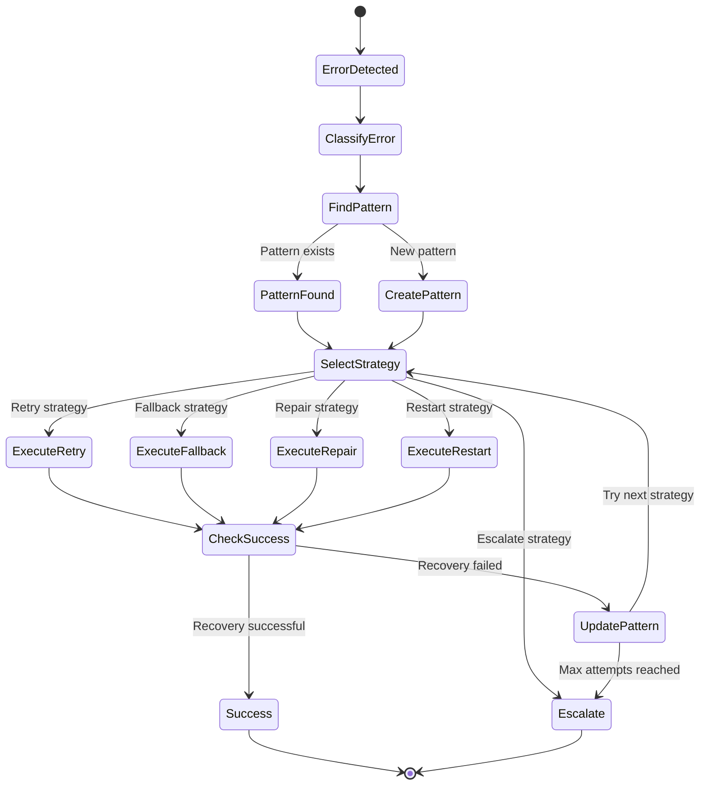

## 🔌 Integration Points

### External Service Integration

```mermaid
graph TB
    subgraph "Framework Core"
        CORE[Advanced Orchestrator]
    end
    
    subgraph "LLM Providers"
        OPENAI[OpenAI API]
        ANTHROPIC[Anthropic API]
        AZURE[Azure OpenAI]
        LOCAL[Local LLM]
    end
    
    subgraph "Browser Services"
        PLAYWRIGHT[Playwright]
        SELENIUM[Selenium]
        BROWSERLESS[Browserless.io]
    end
    
    subgraph "Monitoring & Analytics"
        PROMETHEUS[Prometheus]
        GRAFANA[Grafana]
        ELK[ELK Stack]
        DATADOG[DataDog]
    end
    
    subgraph "Storage Services"
        POSTGRES[PostgreSQL]
        REDIS[Redis]
        S3[AWS S3]
        MINIO[MinIO]
    end
    
    CORE --> OPENAI
    CORE --> ANTHROPIC
    CORE --> AZURE
    CORE --> LOCAL
    
    CORE --> PLAYWRIGHT
    CORE --> SELENIUM
    CORE --> BROWSERLESS
    
    CORE --> PROMETHEUS
    CORE --> GRAFANA
    CORE --> ELK
    CORE --> DATADOG
    
    CORE --> POSTGRES
    CORE --> REDIS
    CORE --> S3
    CORE --> MINIO
```

## 🚀 Scalability Considerations

### Horizontal Scaling

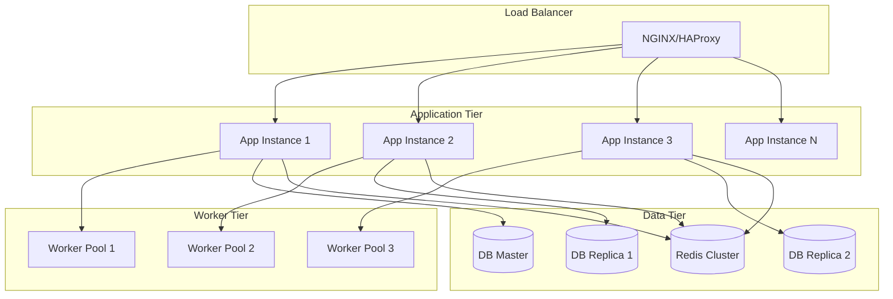

### Performance Optimization

| Layer | Optimization Strategy |
|-------|----------------------|
| **Application** | Connection pooling, async processing, caching |
| **Database** | Read replicas, query optimization, indexing |
| **Network** | CDN, compression, keep-alive connections |
| **Resource** | Auto-scaling, resource pooling, load balancing |
| **Monitoring** | Real-time metrics, predictive scaling, alerting |

## 🔒 Security Architecture

### Security Layers

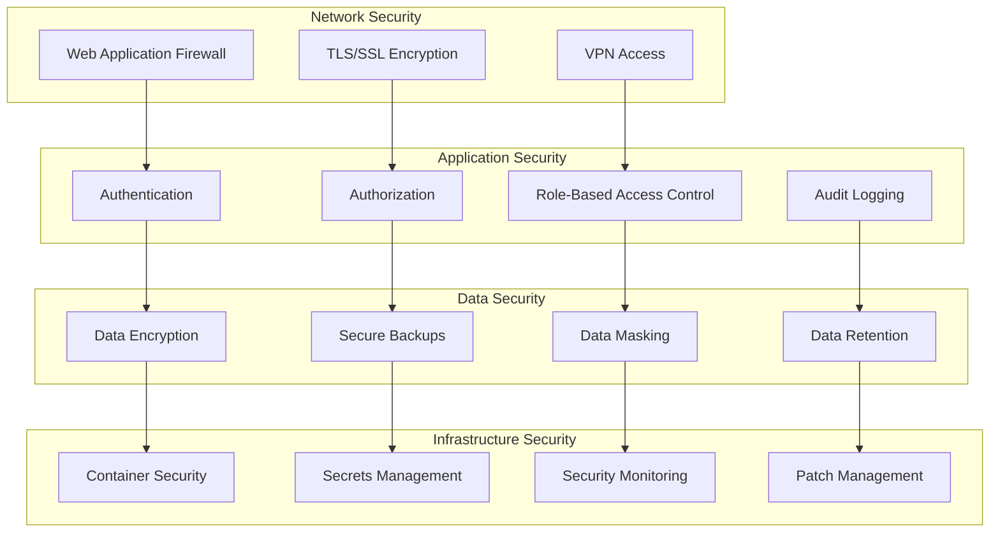

## 📚 Next Steps

- **[API Reference](api-reference.md)** - Complete API documentation
- **[Development Setup](development-setup.md)** - Setting up development environment
- **[Testing Guide](testing.md)** - Testing strategies and best practices
- **[Deployment Guide](deployment.md)** - Production deployment instructions
- **[Performance Tuning](performance.md)** - Optimization and tuning guide
