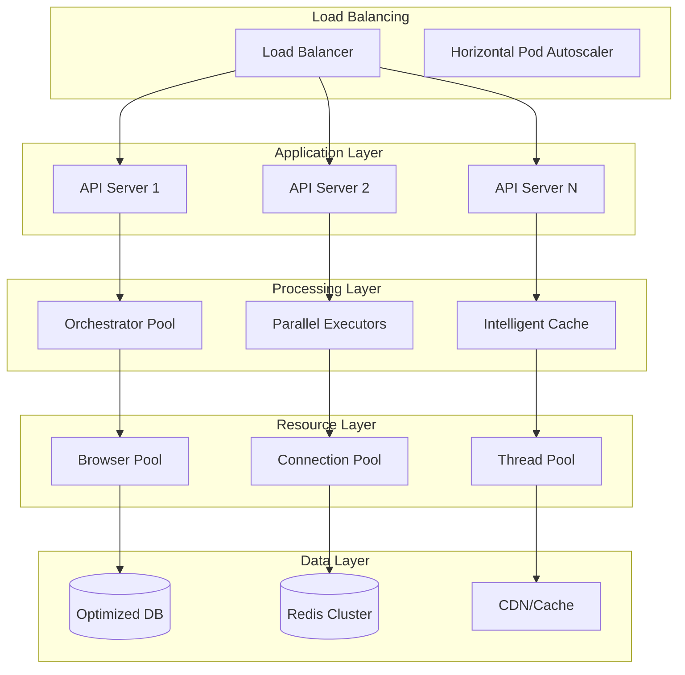

# Performance Tuning Guide

Comprehensive guide for optimizing the Browser Automation Framework for maximum performance, scalability, and efficiency.

## 🎯 Performance Overview

### Key Performance Metrics

| Metric | Target | Excellent | Good | Needs Improvement |
|--------|--------|-----------|------|-------------------|
| **Throughput** | Workflows/min | >100 | 50-100 | 10-50 | <10 |
| **Response Time** | P95 latency | <5s | 5-15s | 15-30s | >30s |
| **Success Rate** | % successful | >99% | 95-99% | 90-95% | <90% |
| **Resource Usage** | CPU/Memory | <70% | 70-85% | 85-95% | >95% |
| **Error Rate** | % failed | <0.1% | 0.1-1% | 1-5% | >5% |

### Performance Architecture



## ⚡ Application Performance

### Async Optimization

```python
# Optimized async patterns
import asyncio
from typing import List, Any
from concurrent.futures import ThreadPoolExecutor

class OptimizedOrchestrator:
    """High-performance orchestrator with optimized async patterns."""
    
    def __init__(self):
        self.thread_pool = ThreadPoolExecutor(max_workers=10)
        self.semaphore = asyncio.Semaphore(20)  # Limit concurrent operations
    
    async def execute_workflows_batch(
        self, 
        workflows: List[Dict[str, Any]]
    ) -> List[WorkflowResult]:
        """Execute multiple workflows with optimal concurrency."""
        
        # Use semaphore to control concurrency
        async def execute_with_semaphore(workflow):
            async with self.semaphore:
                return await self.execute_workflow(workflow)
        
        # Execute with optimal batching
        batch_size = min(len(workflows), 10)
        results = []
        
        for i in range(0, len(workflows), batch_size):
            batch = workflows[i:i + batch_size]
            batch_results = await asyncio.gather(
                *[execute_with_semaphore(wf) for wf in batch],
                return_exceptions=True
            )
            results.extend(batch_results)
        
        return results
    
    async def execute_tasks_parallel(
        self, 
        tasks: List[Task]
    ) -> List[TaskResult]:
        """Execute tasks with intelligent parallelization."""
        
        # Group tasks by dependency level
        dependency_levels = self._analyze_dependencies(tasks)
        results = {}
        
        for level, level_tasks in dependency_levels.items():
            # Execute tasks at same level in parallel
            level_results = await asyncio.gather(
                *[self._execute_task(task, results) for task in level_tasks],
                return_exceptions=True
            )
            
            # Update results
            for task, result in zip(level_tasks, level_results):
                results[task.id] = result
        
        return list(results.values())
```

### Memory Optimization

```python
# Memory-efficient processing
import gc
import weakref
from typing import Optional

class MemoryOptimizedProcessor:
    """Processor with aggressive memory management."""
    
    def __init__(self):
        self.cache = weakref.WeakValueDictionary()
        self.memory_threshold = 1024 * 1024 * 1024  # 1GB
    
    async def process_large_dataset(self, data_stream):
        """Process large datasets with memory streaming."""
        
        async for chunk in self._chunk_data(data_stream, chunk_size=1000):
            # Process chunk
            result = await self._process_chunk(chunk)
            
            # Yield result immediately to free memory
            yield result
            
            # Force garbage collection periodically
            if self._get_memory_usage() > self.memory_threshold:
                gc.collect()
    
    def _get_memory_usage(self) -> int:
        """Get current memory usage."""
        import psutil
        process = psutil.Process()
        return process.memory_info().rss
    
    async def _process_chunk(self, chunk):
        """Process data chunk with memory cleanup."""
        try:
            # Process chunk
            result = await self._do_processing(chunk)
            return result
        finally:
            # Explicit cleanup
            del chunk
            gc.collect()
```

### CPU Optimization

```python
# CPU-optimized processing
import multiprocessing as mp
from concurrent.futures import ProcessPoolExecutor

class CPUOptimizedProcessor:
    """Processor optimized for CPU-intensive tasks."""
    
    def __init__(self):
        self.cpu_count = mp.cpu_count()
        self.process_pool = ProcessPoolExecutor(max_workers=self.cpu_count)
    
    async def process_cpu_intensive_tasks(self, tasks: List[Task]):
        """Process CPU-intensive tasks using multiple processes."""
        
        # Distribute tasks across processes
        loop = asyncio.get_event_loop()
        
        # Use process pool for CPU-bound work
        futures = [
            loop.run_in_executor(
                self.process_pool, 
                self._cpu_intensive_work, 
                task
            )
            for task in tasks
        ]
        
        results = await asyncio.gather(*futures)
        return results
    
    def _cpu_intensive_work(self, task: Task):
        """CPU-intensive work that runs in separate process."""
        # This runs in a separate process
        # No shared state, pure computation
        return self._compute_result(task)
```

## 🌐 Browser Performance

### Browser Pool Optimization

```python
# Optimized browser pool management
from src.infrastructure.browser_pool import BrowserPool

class OptimizedBrowserPool(BrowserPool):
    """High-performance browser pool with advanced optimization."""
    
    def __init__(self):
        super().__init__()
        self.pool_config = {
            "min_browsers": 5,
            "max_browsers": 20,
            "idle_timeout": 300,  # 5 minutes
            "health_check_interval": 60,
            "memory_limit": 512 * 1024 * 1024,  # 512MB per browser
            "page_limit": 5,  # Max pages per browser
        }
        
        # Performance monitoring
        self.performance_metrics = {
            "browser_startup_time": [],
            "page_load_time": [],
            "memory_usage": [],
            "cpu_usage": []
        }
    
    async def get_optimized_browser(self, requirements: Dict[str, Any]):
        """Get browser optimized for specific requirements."""
        
        # Select browser based on current load
        browser = await self._select_least_loaded_browser()
        
        if not browser:
            # Create new browser with optimized settings
            browser = await self._create_optimized_browser(requirements)
        
        # Configure browser for optimal performance
        await self._optimize_browser_settings(browser, requirements)
        
        return browser
    
    async def _create_optimized_browser(self, requirements: Dict[str, Any]):
        """Create browser with performance optimizations."""
        
        browser_args = [
            "--no-sandbox",
            "--disable-dev-shm-usage",
            "--disable-gpu",
            "--disable-background-timer-throttling",
            "--disable-backgrounding-occluded-windows",
            "--disable-renderer-backgrounding",
            "--disable-features=TranslateUI",
            "--disable-ipc-flooding-protection",
            "--memory-pressure-off",
            f"--max_old_space_size={requirements.get('memory_limit', 512)}"
        ]
        
        # Add performance-specific args
        if requirements.get("high_performance"):
            browser_args.extend([
                "--aggressive-cache-discard",
                "--enable-fast-unload",
                "--disable-background-networking"
            ])
        
        browser = await self.playwright.chromium.launch(
            headless=True,
            args=browser_args
        )
        
        return browser
```

### Page Optimization

```python
# Optimized page handling
class OptimizedPageManager:
    """Manage pages with performance optimizations."""
    
    async def create_optimized_page(self, browser, options: Dict[str, Any]):
        """Create page with performance optimizations."""
        
        context = await browser.new_context(
            viewport={"width": 1920, "height": 1080},
            user_agent="Mozilla/5.0 (compatible; AutomationBot/1.0)",
            # Disable unnecessary features for performance
            java_script_enabled=options.get("javascript", True),
            images_enabled=options.get("images", False),  # Disable images by default
            locale="en-US",
            timezone_id="America/New_York"
        )
        
        page = await context.new_page()
        
        # Set performance-oriented timeouts
        page.set_default_timeout(30000)  # 30 seconds
        page.set_default_navigation_timeout(60000)  # 60 seconds
        
        # Block unnecessary resources
        if options.get("block_resources"):
            await page.route("**/*", self._resource_filter)
        
        # Enable request interception for caching
        if options.get("enable_caching"):
            await page.route("**/*", self._caching_handler)
        
        return page
    
    async def _resource_filter(self, route):
        """Filter resources to improve performance."""
        resource_type = route.request.resource_type
        
        # Block unnecessary resource types
        if resource_type in ["image", "media", "font", "stylesheet"]:
            await route.abort()
        else:
            await route.continue_()
    
    async def _caching_handler(self, route):
        """Handle request caching for performance."""
        request = route.request
        
        # Check cache first
        cached_response = await self._get_cached_response(request.url)
        if cached_response:
            await route.fulfill(
                status=200,
                body=cached_response["body"],
                headers=cached_response["headers"]
            )
        else:
            # Continue with request and cache response
            response = await route.fetch()
            await self._cache_response(request.url, response)
            await route.fulfill(response=response)
```

## 🗄️ Database Performance

### Query Optimization

```python
# Optimized database queries
from sqlalchemy import text
from sqlalchemy.orm import selectinload, joinedload

class OptimizedRepository:
    """Repository with optimized database queries."""
    
    async def get_workflows_with_tasks(self, limit: int = 100):
        """Get workflows with tasks using optimized query."""
        
        # Use eager loading to avoid N+1 queries
        query = (
            select(Workflow)
            .options(
                selectinload(Workflow.tasks),
                selectinload(Workflow.executions)
            )
            .limit(limit)
        )
        
        result = await self.session.execute(query)
        return result.scalars().all()
    
    async def get_execution_metrics(self, time_range: str):
        """Get execution metrics with optimized aggregation."""
        
        # Use raw SQL for complex aggregations
        query = text("""
            SELECT 
                DATE_TRUNC('hour', created_at) as hour,
                COUNT(*) as total_executions,
                AVG(duration) as avg_duration,
                SUM(CASE WHEN status = 'success' THEN 1 ELSE 0 END) as successful,
                PERCENTILE_CONT(0.95) WITHIN GROUP (ORDER BY duration) as p95_duration
            FROM workflow_executions 
            WHERE created_at >= NOW() - INTERVAL :time_range
            GROUP BY DATE_TRUNC('hour', created_at)
            ORDER BY hour DESC
        """)
        
        result = await self.session.execute(query, {"time_range": time_range})
        return result.fetchall()
    
    async def bulk_insert_optimized(self, records: List[Dict]):
        """Optimized bulk insert with batching."""
        
        batch_size = 1000
        for i in range(0, len(records), batch_size):
            batch = records[i:i + batch_size]
            
            # Use bulk insert for performance
            await self.session.execute(
                insert(WorkflowExecution),
                batch
            )
            
            # Commit in batches to avoid long transactions
            if i % (batch_size * 10) == 0:
                await self.session.commit()
        
        await self.session.commit()
```

### Connection Pool Optimization

```python
# Optimized database connection pool
from sqlalchemy.ext.asyncio import create_async_engine
from sqlalchemy.pool import QueuePool

def create_optimized_engine(database_url: str):
    """Create database engine with optimized connection pool."""
    
    return create_async_engine(
        database_url,
        # Connection pool settings
        poolclass=QueuePool,
        pool_size=20,  # Base number of connections
        max_overflow=30,  # Additional connections under load
        pool_pre_ping=True,  # Validate connections
        pool_recycle=3600,  # Recycle connections every hour
        
        # Performance settings
        echo=False,  # Disable SQL logging in production
        future=True,
        
        # Connection arguments
        connect_args={
            "server_settings": {
                "application_name": "automation_framework",
                "jit": "off",  # Disable JIT for consistent performance
            },
            "command_timeout": 30,
            "prepared_statement_cache_size": 100,
        }
    )
```

## 🚀 Caching Strategies

### Multi-Level Caching

```python
# Comprehensive caching strategy
import redis.asyncio as redis
from typing import Optional, Any
import json
import hashlib

class MultiLevelCache:
    """Multi-level caching with memory, Redis, and application-level caching."""
    
    def __init__(self):
        # L1: In-memory cache (fastest)
        self.memory_cache = {}
        self.memory_cache_size = 1000
        
        # L2: Redis cache (shared across instances)
        self.redis_client = redis.Redis.from_url("redis://localhost:6379")
        
        # L3: Application-level cache (persistent)
        self.app_cache = {}
    
    async def get(self, key: str) -> Optional[Any]:
        """Get value from cache with fallback strategy."""
        
        # Try L1 cache first (memory)
        if key in self.memory_cache:
            return self.memory_cache[key]
        
        # Try L2 cache (Redis)
        redis_value = await self.redis_client.get(key)
        if redis_value:
            value = json.loads(redis_value)
            # Populate L1 cache
            self._set_memory_cache(key, value)
            return value
        
        # Try L3 cache (application)
        if key in self.app_cache:
            value = self.app_cache[key]
            # Populate higher levels
            await self._set_redis_cache(key, value, ttl=3600)
            self._set_memory_cache(key, value)
            return value
        
        return None
    
    async def set(self, key: str, value: Any, ttl: int = 3600):
        """Set value in all cache levels."""
        
        # Set in all levels
        self._set_memory_cache(key, value)
        await self._set_redis_cache(key, value, ttl)
        self.app_cache[key] = value
    
    def _set_memory_cache(self, key: str, value: Any):
        """Set value in memory cache with LRU eviction."""
        
        if len(self.memory_cache) >= self.memory_cache_size:
            # Remove oldest item (simple LRU)
            oldest_key = next(iter(self.memory_cache))
            del self.memory_cache[oldest_key]
        
        self.memory_cache[key] = value
    
    async def _set_redis_cache(self, key: str, value: Any, ttl: int):
        """Set value in Redis cache."""
        await self.redis_client.setex(
            key, 
            ttl, 
            json.dumps(value, default=str)
        )
```

### Intelligent Caching

```python
# Smart caching with automatic invalidation
class IntelligentCache:
    """Cache with automatic invalidation and optimization."""
    
    def __init__(self):
        self.cache = MultiLevelCache()
        self.cache_stats = {
            "hits": 0,
            "misses": 0,
            "invalidations": 0
        }
    
    async def get_or_compute(
        self, 
        key: str, 
        compute_func: callable,
        ttl: int = 3600,
        force_refresh: bool = False
    ):
        """Get cached value or compute and cache it."""
        
        if not force_refresh:
            cached_value = await self.cache.get(key)
            if cached_value is not None:
                self.cache_stats["hits"] += 1
                return cached_value
        
        # Cache miss - compute value
        self.cache_stats["misses"] += 1
        value = await compute_func()
        
        # Cache the computed value
        await self.cache.set(key, value, ttl)
        
        return value
    
    def generate_cache_key(self, *args, **kwargs) -> str:
        """Generate consistent cache key from arguments."""
        
        # Create deterministic key from arguments
        key_data = {
            "args": args,
            "kwargs": sorted(kwargs.items())
        }
        
        key_string = json.dumps(key_data, sort_keys=True, default=str)
        return hashlib.md5(key_string.encode()).hexdigest()
    
    async def invalidate_pattern(self, pattern: str):
        """Invalidate cache entries matching pattern."""
        
        # Invalidate Redis cache
        keys = await self.redis_client.keys(pattern)
        if keys:
            await self.redis_client.delete(*keys)
        
        # Invalidate memory cache
        keys_to_remove = [
            key for key in self.cache.memory_cache.keys()
            if pattern in key
        ]
        for key in keys_to_remove:
            del self.cache.memory_cache[key]
        
        self.cache_stats["invalidations"] += len(keys_to_remove)
```

## 📊 Performance Monitoring

### Real-Time Metrics

```python
# Performance monitoring and metrics
import time
import psutil
from dataclasses import dataclass
from typing import Dict, List

@dataclass
class PerformanceMetrics:
    """Performance metrics data structure."""
    timestamp: float
    cpu_usage: float
    memory_usage: float
    active_workflows: int
    throughput: float
    response_time: float
    error_rate: float

class PerformanceMonitor:
    """Real-time performance monitoring."""
    
    def __init__(self):
        self.metrics_history: List[PerformanceMetrics] = []
        self.max_history = 1000
        
        # Performance thresholds
        self.thresholds = {
            "cpu_usage": 80.0,
            "memory_usage": 85.0,
            "response_time": 30.0,
            "error_rate": 5.0
        }
    
    async def collect_metrics(self) -> PerformanceMetrics:
        """Collect current performance metrics."""
        
        # System metrics
        cpu_usage = psutil.cpu_percent(interval=1)
        memory = psutil.virtual_memory()
        memory_usage = memory.percent
        
        # Application metrics
        active_workflows = await self._get_active_workflow_count()
        throughput = await self._calculate_throughput()
        response_time = await self._get_average_response_time()
        error_rate = await self._calculate_error_rate()
        
        metrics = PerformanceMetrics(
            timestamp=time.time(),
            cpu_usage=cpu_usage,
            memory_usage=memory_usage,
            active_workflows=active_workflows,
            throughput=throughput,
            response_time=response_time,
            error_rate=error_rate
        )
        
        # Store metrics
        self._store_metrics(metrics)
        
        # Check thresholds
        await self._check_thresholds(metrics)
        
        return metrics
    
    def _store_metrics(self, metrics: PerformanceMetrics):
        """Store metrics with size limit."""
        self.metrics_history.append(metrics)
        
        if len(self.metrics_history) > self.max_history:
            self.metrics_history.pop(0)
    
    async def _check_thresholds(self, metrics: PerformanceMetrics):
        """Check if metrics exceed thresholds."""
        
        alerts = []
        
        if metrics.cpu_usage > self.thresholds["cpu_usage"]:
            alerts.append(f"High CPU usage: {metrics.cpu_usage}%")
        
        if metrics.memory_usage > self.thresholds["memory_usage"]:
            alerts.append(f"High memory usage: {metrics.memory_usage}%")
        
        if metrics.response_time > self.thresholds["response_time"]:
            alerts.append(f"High response time: {metrics.response_time}s")
        
        if metrics.error_rate > self.thresholds["error_rate"]:
            alerts.append(f"High error rate: {metrics.error_rate}%")
        
        if alerts:
            await self._send_alerts(alerts)
    
    def get_performance_summary(self, time_range: int = 3600) -> Dict:
        """Get performance summary for time range."""
        
        cutoff_time = time.time() - time_range
        recent_metrics = [
            m for m in self.metrics_history 
            if m.timestamp >= cutoff_time
        ]
        
        if not recent_metrics:
            return {}
        
        return {
            "avg_cpu_usage": sum(m.cpu_usage for m in recent_metrics) / len(recent_metrics),
            "avg_memory_usage": sum(m.memory_usage for m in recent_metrics) / len(recent_metrics),
            "avg_response_time": sum(m.response_time for m in recent_metrics) / len(recent_metrics),
            "avg_throughput": sum(m.throughput for m in recent_metrics) / len(recent_metrics),
            "avg_error_rate": sum(m.error_rate for m in recent_metrics) / len(recent_metrics),
            "peak_cpu": max(m.cpu_usage for m in recent_metrics),
            "peak_memory": max(m.memory_usage for m in recent_metrics),
            "total_workflows": sum(m.active_workflows for m in recent_metrics)
        }
```

## 🔧 Configuration Tuning

### Performance Configuration

```yaml
# performance_config.yaml
performance:
  # Application settings
  max_concurrent_workflows: 50
  worker_concurrency: 10
  task_timeout: 300
  
  # Browser pool settings
  browser_pool:
    min_size: 5
    max_size: 20
    idle_timeout: 300
    memory_limit: "512MB"
    
  # Database settings
  database:
    pool_size: 20
    max_overflow: 30
    pool_recycle: 3600
    query_timeout: 30
    
  # Cache settings
  cache:
    memory_cache_size: 1000
    redis_ttl: 3600
    enable_compression: true
    
  # LLM settings
  llm:
    timeout: 30
    max_retries: 3
    batch_size: 5
    rate_limit: 100  # requests per minute
    
  # Monitoring settings
  monitoring:
    metrics_interval: 10  # seconds
    health_check_interval: 30
    alert_thresholds:
      cpu_usage: 80
      memory_usage: 85
      response_time: 30
      error_rate: 5
```

## 🚀 Best Practices

### 1. Resource Management

```python
# Efficient resource management
async def with_managed_resources():
    """Example of proper resource management."""
    
    browser = None
    page = None
    
    try:
        # Acquire resources
        browser = await browser_pool.acquire()
        page = await browser.new_page()
        
        # Use resources
        result = await perform_automation(page)
        
        return result
        
    finally:
        # Always clean up resources
        if page:
            await page.close()
        if browser:
            await browser_pool.release(browser)
```

### 2. Error Handling

```python
# Performance-aware error handling
async def resilient_execution(operation, max_retries=3):
    """Execute operation with performance-aware retry logic."""
    
    for attempt in range(max_retries):
        try:
            return await operation()
        except TemporaryError as e:
            if attempt < max_retries - 1:
                # Exponential backoff with jitter
                delay = (2 ** attempt) + random.uniform(0, 1)
                await asyncio.sleep(delay)
                continue
            raise
        except PermanentError:
            # Don't retry permanent errors
            raise
```

### 3. Monitoring Integration

```python
# Integrate performance monitoring
from functools import wraps

def monitor_performance(func):
    """Decorator to monitor function performance."""
    
    @wraps(func)
    async def wrapper(*args, **kwargs):
        start_time = time.time()
        
        try:
            result = await func(*args, **kwargs)
            
            # Record success metrics
            duration = time.time() - start_time
            await metrics.record_success(func.__name__, duration)
            
            return result
            
        except Exception as e:
            # Record error metrics
            duration = time.time() - start_time
            await metrics.record_error(func.__name__, duration, str(e))
            raise
    
    return wrapper
```

## 🔗 Next Steps

- **[Deployment Guide](deployment.md)** - Deploy optimized production systems
- **[Monitoring Guide](../operations/monitoring.md)** - Set up performance monitoring
- **[Scaling Guide](../operations/scaling.md)** - Scale for high performance
- **[Troubleshooting Guide](../user/troubleshooting.md)** - Solve performance issues
