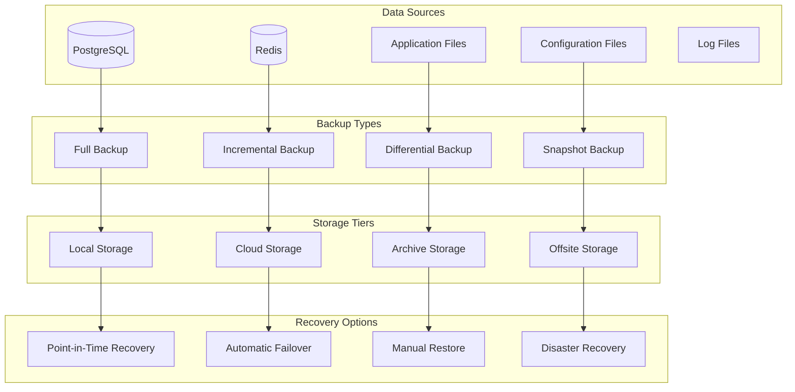

# Backup & Recovery Guide

Comprehensive backup and disaster recovery strategies for the Browser Automation Framework.

## 🎯 Backup Overview

### Backup Architecture



### Backup Strategy

| Component | Frequency | Retention | Method | Storage |
|-----------|-----------|-----------|---------|---------|
| **Database** | Every 6 hours | 30 days | pg_dump + WAL | S3 + Local |
| **Redis** | Every hour | 7 days | RDB + AOF | S3 |
| **Application Files** | Daily | 90 days | rsync | S3 + Archive |
| **Configuration** | On change | 1 year | Git + tar | S3 + Git |
| **Logs** | Daily | 30 days | tar + compress | S3 |

## 🗄️ Database Backup

### PostgreSQL Backup Configuration

```bash
#!/bin/bash
# scripts/backup-database.sh

set -euo pipefail

# Configuration
DB_HOST="${DB_HOST:-localhost}"
DB_PORT="${DB_PORT:-5432}"
DB_NAME="${DB_NAME:-automation_prod}"
DB_USER="${DB_USER:-automation_user}"
BACKUP_DIR="${BACKUP_DIR:-/var/backups/automation}"
S3_BUCKET="${S3_BUCKET:-automation-backups}"
RETENTION_DAYS="${RETENTION_DAYS:-30}"

# Create backup directory
mkdir -p "$BACKUP_DIR"

# Generate backup filename
TIMESTAMP=$(date +%Y%m%d_%H%M%S)
BACKUP_FILE="$BACKUP_DIR/db_backup_$TIMESTAMP.sql"
COMPRESSED_FILE="$BACKUP_FILE.gz"

echo "Starting database backup at $(date)"

# Create database dump
pg_dump \
    --host="$DB_HOST" \
    --port="$DB_PORT" \
    --username="$DB_USER" \
    --dbname="$DB_NAME" \
    --verbose \
    --clean \
    --if-exists \
    --create \
    --format=custom \
    --file="$BACKUP_FILE"

# Compress backup
gzip "$BACKUP_FILE"

# Upload to S3
aws s3 cp "$COMPRESSED_FILE" "s3://$S3_BUCKET/database/" \
    --storage-class STANDARD_IA

# Verify backup integrity
echo "Verifying backup integrity..."
gunzip -t "$COMPRESSED_FILE"

if [ $? -eq 0 ]; then
    echo "Backup verification successful"
else
    echo "Backup verification failed!"
    exit 1
fi

# Clean up old local backups
find "$BACKUP_DIR" -name "db_backup_*.sql.gz" -mtime +7 -delete

# Clean up old S3 backups
aws s3 ls "s3://$S3_BUCKET/database/" | \
    awk '{print $4}' | \
    while read file; do
        if [[ $(aws s3api head-object --bucket "$S3_BUCKET" --key "database/$file" --query 'LastModified' --output text | xargs -I {} date -d {} +%s) -lt $(date -d "$RETENTION_DAYS days ago" +%s) ]]; then
            aws s3 rm "s3://$S3_BUCKET/database/$file"
            echo "Deleted old backup: $file"
        fi
    done

echo "Database backup completed at $(date)"
```

### Point-in-Time Recovery Setup

```bash
#!/bin/bash
# scripts/setup-wal-archiving.sh

# PostgreSQL configuration for WAL archiving
cat >> /etc/postgresql/15/main/postgresql.conf << EOF

# WAL archiving configuration
wal_level = replica
archive_mode = on
archive_command = 'aws s3 cp %p s3://$S3_BUCKET/wal/%f'
archive_timeout = 300

# Backup configuration
max_wal_senders = 3
wal_keep_size = 1GB

# Logging
log_min_duration_statement = 1000
log_checkpoints = on
log_connections = on
log_disconnections = on
log_lock_waits = on

EOF

# Restart PostgreSQL
systemctl restart postgresql
```

### Database Recovery Script

```bash
#!/bin/bash
# scripts/restore-database.sh

set -euo pipefail

BACKUP_FILE="$1"
TARGET_TIME="${2:-latest}"
DB_NAME="${DB_NAME:-automation_prod}"
DB_USER="${DB_USER:-automation_user}"

echo "Starting database restore from $BACKUP_FILE"

# Stop application services
systemctl stop automation-api automation-worker

# Drop existing database
dropdb --if-exists "$DB_NAME"

# Restore from backup
if [[ "$BACKUP_FILE" == *.gz ]]; then
    gunzip -c "$BACKUP_FILE" | pg_restore \
        --username="$DB_USER" \
        --dbname=postgres \
        --verbose \
        --clean \
        --if-exists \
        --create
else
    pg_restore \
        --username="$DB_USER" \
        --dbname=postgres \
        --verbose \
        --clean \
        --if-exists \
        --create \
        "$BACKUP_FILE"
fi

# Point-in-time recovery if specified
if [[ "$TARGET_TIME" != "latest" ]]; then
    echo "Performing point-in-time recovery to $TARGET_TIME"
    
    # Create recovery configuration
    cat > /var/lib/postgresql/15/main/recovery.conf << EOF
restore_command = 'aws s3 cp s3://$S3_BUCKET/wal/%f %p'
recovery_target_time = '$TARGET_TIME'
recovery_target_action = 'promote'
EOF
    
    # Start PostgreSQL in recovery mode
    systemctl start postgresql
    
    # Wait for recovery to complete
    while ! pg_isready; do
        sleep 5
    done
fi

# Start application services
systemctl start automation-api automation-worker

echo "Database restore completed"
```

## 🔴 Redis Backup

### Redis Backup Configuration

```bash
#!/bin/bash
# scripts/backup-redis.sh

set -euo pipefail

REDIS_HOST="${REDIS_HOST:-localhost}"
REDIS_PORT="${REDIS_PORT:-6379}"
REDIS_PASSWORD="${REDIS_PASSWORD:-}"
BACKUP_DIR="${BACKUP_DIR:-/var/backups/automation}"
S3_BUCKET="${S3_BUCKET:-automation-backups}"

mkdir -p "$BACKUP_DIR"

TIMESTAMP=$(date +%Y%m%d_%H%M%S)
BACKUP_FILE="$BACKUP_DIR/redis_backup_$TIMESTAMP.rdb"

echo "Starting Redis backup at $(date)"

# Create Redis backup
if [[ -n "$REDIS_PASSWORD" ]]; then
    redis-cli -h "$REDIS_HOST" -p "$REDIS_PORT" -a "$REDIS_PASSWORD" \
        --rdb "$BACKUP_FILE"
else
    redis-cli -h "$REDIS_HOST" -p "$REDIS_PORT" \
        --rdb "$BACKUP_FILE"
fi

# Compress backup
gzip "$BACKUP_FILE"

# Upload to S3
aws s3 cp "$BACKUP_FILE.gz" "s3://$S3_BUCKET/redis/" \
    --storage-class STANDARD_IA

# Clean up old backups
find "$BACKUP_DIR" -name "redis_backup_*.rdb.gz" -mtime +7 -delete

echo "Redis backup completed at $(date)"
```

### Redis Recovery Script

```bash
#!/bin/bash
# scripts/restore-redis.sh

set -euo pipefail

BACKUP_FILE="$1"
REDIS_DATA_DIR="${REDIS_DATA_DIR:-/var/lib/redis}"

echo "Starting Redis restore from $BACKUP_FILE"

# Stop Redis
systemctl stop redis-server

# Backup current data
if [[ -f "$REDIS_DATA_DIR/dump.rdb" ]]; then
    mv "$REDIS_DATA_DIR/dump.rdb" "$REDIS_DATA_DIR/dump.rdb.backup.$(date +%s)"
fi

# Restore backup
if [[ "$BACKUP_FILE" == *.gz ]]; then
    gunzip -c "$BACKUP_FILE" > "$REDIS_DATA_DIR/dump.rdb"
else
    cp "$BACKUP_FILE" "$REDIS_DATA_DIR/dump.rdb"
fi

# Set correct permissions
chown redis:redis "$REDIS_DATA_DIR/dump.rdb"
chmod 660 "$REDIS_DATA_DIR/dump.rdb"

# Start Redis
systemctl start redis-server

echo "Redis restore completed"
```

## 📁 Application Files Backup

### Application Backup Script

```bash
#!/bin/bash
# scripts/backup-application.sh

set -euo pipefail

APP_DIR="${APP_DIR:-/opt/automation-framework}"
BACKUP_DIR="${BACKUP_DIR:-/var/backups/automation}"
S3_BUCKET="${S3_BUCKET:-automation-backups}"
EXCLUDE_FILE="/tmp/backup-exclude.txt"

mkdir -p "$BACKUP_DIR"

TIMESTAMP=$(date +%Y%m%d_%H%M%S)
BACKUP_FILE="$BACKUP_DIR/app_backup_$TIMESTAMP.tar.gz"

echo "Starting application backup at $(date)"

# Create exclude file
cat > "$EXCLUDE_FILE" << EOF
*.pyc
__pycache__/
.git/
.pytest_cache/
node_modules/
*.log
*.tmp
.env
venv/
.venv/
EOF

# Create application backup
tar -czf "$BACKUP_FILE" \
    --exclude-from="$EXCLUDE_FILE" \
    -C "$(dirname "$APP_DIR")" \
    "$(basename "$APP_DIR")"

# Upload to S3
aws s3 cp "$BACKUP_FILE" "s3://$S3_BUCKET/application/" \
    --storage-class STANDARD_IA

# Clean up
rm "$EXCLUDE_FILE"
find "$BACKUP_DIR" -name "app_backup_*.tar.gz" -mtime +30 -delete

echo "Application backup completed at $(date)"
```

### Configuration Backup

```bash
#!/bin/bash
# scripts/backup-config.sh

set -euo pipefail

CONFIG_DIRS=(
    "/etc/automation-framework"
    "/etc/nginx/sites-available"
    "/etc/supervisor/conf.d"
    "/etc/systemd/system"
)

BACKUP_DIR="${BACKUP_DIR:-/var/backups/automation}"
S3_BUCKET="${S3_BUCKET:-automation-backups}"

mkdir -p "$BACKUP_DIR"

TIMESTAMP=$(date +%Y%m%d_%H%M%S)
BACKUP_FILE="$BACKUP_DIR/config_backup_$TIMESTAMP.tar.gz"

echo "Starting configuration backup at $(date)"

# Create configuration backup
tar -czf "$BACKUP_FILE" "${CONFIG_DIRS[@]}" 2>/dev/null || true

# Upload to S3
aws s3 cp "$BACKUP_FILE" "s3://$S3_BUCKET/configuration/" \
    --storage-class STANDARD_IA

# Clean up old backups
find "$BACKUP_DIR" -name "config_backup_*.tar.gz" -mtime +90 -delete

echo "Configuration backup completed at $(date)"
```

## 🔄 Automated Backup Scheduling

### Cron Configuration

```bash
# /etc/cron.d/automation-backups

# Database backups every 6 hours
0 */6 * * * automation /opt/automation-framework/scripts/backup-database.sh >> /var/log/automation/backup.log 2>&1

# Redis backups every hour
0 * * * * automation /opt/automation-framework/scripts/backup-redis.sh >> /var/log/automation/backup.log 2>&1

# Application backups daily at 2 AM
0 2 * * * automation /opt/automation-framework/scripts/backup-application.sh >> /var/log/automation/backup.log 2>&1

# Configuration backups on changes (triggered by inotify)
# See systemd service below

# Log rotation daily at 3 AM
0 3 * * * automation /opt/automation-framework/scripts/backup-logs.sh >> /var/log/automation/backup.log 2>&1
```

### Systemd Backup Services

```ini
# /etc/systemd/system/automation-backup-db.service
[Unit]
Description=Automation Framework Database Backup
After=postgresql.service

[Service]
Type=oneshot
User=automation
ExecStart=/opt/automation-framework/scripts/backup-database.sh
StandardOutput=journal
StandardError=journal

[Install]
WantedBy=multi-user.target
```

```ini
# /etc/systemd/system/automation-backup-db.timer
[Unit]
Description=Run database backup every 6 hours
Requires=automation-backup-db.service

[Timer]
OnCalendar=*-*-* 00,06,12,18:00:00
Persistent=true

[Install]
WantedBy=timers.target
```

### Backup Monitoring

```python
# src/monitoring/backup_monitor.py
import os
import time
import boto3
from datetime import datetime, timedelta
from typing import Dict, List, Optional

class BackupMonitor:
    """Monitor backup status and health."""
    
    def __init__(self, s3_bucket: str):
        self.s3_bucket = s3_bucket
        self.s3_client = boto3.client('s3')
        
    def check_backup_health(self) -> Dict[str, any]:
        """Check overall backup health."""
        health_status = {
            "database": self._check_database_backups(),
            "redis": self._check_redis_backups(),
            "application": self._check_application_backups(),
            "configuration": self._check_configuration_backups()
        }
        
        overall_health = all(
            status["status"] == "healthy" 
            for status in health_status.values()
        )
        
        return {
            "overall_health": "healthy" if overall_health else "unhealthy",
            "components": health_status,
            "last_check": datetime.utcnow().isoformat()
        }
    
    def _check_database_backups(self) -> Dict[str, any]:
        """Check database backup status."""
        try:
            # List recent database backups
            response = self.s3_client.list_objects_v2(
                Bucket=self.s3_bucket,
                Prefix="database/",
                MaxKeys=10
            )
            
            if 'Contents' not in response:
                return {"status": "unhealthy", "reason": "No backups found"}
            
            # Check if latest backup is recent (within 8 hours)
            latest_backup = max(
                response['Contents'],
                key=lambda x: x['LastModified']
            )
            
            time_diff = datetime.now(latest_backup['LastModified'].tzinfo) - latest_backup['LastModified']
            
            if time_diff > timedelta(hours=8):
                return {
                    "status": "unhealthy",
                    "reason": f"Latest backup is {time_diff} old",
                    "latest_backup": latest_backup['Key']
                }
            
            return {
                "status": "healthy",
                "latest_backup": latest_backup['Key'],
                "backup_age": str(time_diff)
            }
            
        except Exception as e:
            return {"status": "error", "reason": str(e)}
    
    def _check_redis_backups(self) -> Dict[str, any]:
        """Check Redis backup status."""
        # Similar implementation to database backups
        # but with 2-hour threshold
        pass
    
    def _check_application_backups(self) -> Dict[str, any]:
        """Check application backup status."""
        # Similar implementation with 25-hour threshold
        pass
    
    def _check_configuration_backups(self) -> Dict[str, any]:
        """Check configuration backup status."""
        # Similar implementation with 7-day threshold
        pass
    
    def get_backup_metrics(self) -> Dict[str, any]:
        """Get backup metrics for monitoring."""
        try:
            # Count backups by type
            backup_counts = {}
            
            for backup_type in ["database", "redis", "application", "configuration"]:
                response = self.s3_client.list_objects_v2(
                    Bucket=self.s3_bucket,
                    Prefix=f"{backup_type}/"
                )
                
                backup_counts[backup_type] = response.get('KeyCount', 0)
            
            # Calculate total backup size
            total_size = 0
            response = self.s3_client.list_objects_v2(Bucket=self.s3_bucket)
            
            if 'Contents' in response:
                total_size = sum(obj['Size'] for obj in response['Contents'])
            
            return {
                "backup_counts": backup_counts,
                "total_size_bytes": total_size,
                "total_size_gb": round(total_size / (1024**3), 2)
            }
            
        except Exception as e:
            return {"error": str(e)}
```

## 🚨 Disaster Recovery

### Disaster Recovery Plan

```bash
#!/bin/bash
# scripts/disaster-recovery.sh

set -euo pipefail

RECOVERY_TYPE="$1"  # full, partial, database-only
BACKUP_DATE="${2:-latest}"
DR_SITE="${DR_SITE:-us-west-2}"

echo "Starting disaster recovery: $RECOVERY_TYPE from $BACKUP_DATE"

case "$RECOVERY_TYPE" in
    "full")
        echo "Performing full system recovery..."
        
        # 1. Restore database
        ./restore-database.sh "$BACKUP_DATE"
        
        # 2. Restore Redis
        ./restore-redis.sh "$BACKUP_DATE"
        
        # 3. Restore application files
        ./restore-application.sh "$BACKUP_DATE"
        
        # 4. Restore configuration
        ./restore-configuration.sh "$BACKUP_DATE"
        
        # 5. Restart all services
        systemctl restart automation-api automation-worker nginx
        ;;
        
    "partial")
        echo "Performing partial recovery..."
        # Implement partial recovery logic
        ;;
        
    "database-only")
        echo "Performing database-only recovery..."
        ./restore-database.sh "$BACKUP_DATE"
        ;;
        
    *)
        echo "Unknown recovery type: $RECOVERY_TYPE"
        exit 1
        ;;
esac

# Verify system health
echo "Verifying system health..."
./health-check.sh

echo "Disaster recovery completed"
```

### Recovery Testing

```bash
#!/bin/bash
# scripts/test-recovery.sh

set -euo pipefail

TEST_ENV="recovery-test"
BACKUP_DATE="$1"

echo "Starting recovery test with backup from $BACKUP_DATE"

# Create test environment
docker-compose -f docker-compose.test.yml up -d

# Wait for services to start
sleep 30

# Restore backup to test environment
docker-compose -f docker-compose.test.yml exec db \
    pg_restore --clean --if-exists --create \
    /backups/db_backup_$BACKUP_DATE.sql

# Run application tests
docker-compose -f docker-compose.test.yml exec api \
    python -m pytest tests/integration/ -v

# Check data integrity
docker-compose -f docker-compose.test.yml exec api \
    python -m src.cli verify-data-integrity

# Clean up test environment
docker-compose -f docker-compose.test.yml down -v

echo "Recovery test completed successfully"
```

## 📊 Backup Monitoring & Alerting

### Backup Health Checks

```python
# src/monitoring/backup_health.py
from prometheus_client import Gauge, Counter
import time

# Backup metrics
backup_age_hours = Gauge(
    'backup_age_hours',
    'Age of latest backup in hours',
    ['backup_type']
)

backup_size_bytes = Gauge(
    'backup_size_bytes',
    'Size of latest backup in bytes',
    ['backup_type']
)

backup_success_total = Counter(
    'backup_success_total',
    'Total successful backups',
    ['backup_type']
)

backup_failure_total = Counter(
    'backup_failure_total',
    'Total failed backups',
    ['backup_type']
)

def update_backup_metrics():
    """Update backup metrics for monitoring."""
    monitor = BackupMonitor(s3_bucket="automation-backups")
    
    health_status = monitor.check_backup_health()
    
    for backup_type, status in health_status["components"].items():
        if status["status"] == "healthy":
            # Update age metric
            if "backup_age" in status:
                age_str = status["backup_age"]
                # Parse age string and convert to hours
                # This is a simplified example
                hours = parse_age_to_hours(age_str)
                backup_age_hours.labels(backup_type=backup_type).set(hours)
        
        # Update success/failure counters based on status
        if status["status"] == "healthy":
            backup_success_total.labels(backup_type=backup_type).inc()
        else:
            backup_failure_total.labels(backup_type=backup_type).inc()
```

### Backup Alerts

```yaml
# alerts/backup_alerts.yml
groups:
  - name: backup_alerts
    rules:
      - alert: BackupTooOld
        expr: backup_age_hours > 8
        for: 5m
        labels:
          severity: critical
        annotations:
          summary: "Backup is too old"
          description: "{{ $labels.backup_type }} backup is {{ $value }} hours old"
          
      - alert: BackupFailed
        expr: increase(backup_failure_total[1h]) > 0
        for: 0m
        labels:
          severity: critical
        annotations:
          summary: "Backup failed"
          description: "{{ $labels.backup_type }} backup has failed"
          
      - alert: BackupSizeAnomaly
        expr: |
          (
            backup_size_bytes - 
            avg_over_time(backup_size_bytes[7d])
          ) / avg_over_time(backup_size_bytes[7d]) > 0.5
        for: 10m
        labels:
          severity: warning
        annotations:
          summary: "Backup size anomaly"
          description: "{{ $labels.backup_type }} backup size is significantly different from normal"
```

## 🔗 Next Steps

- **[Scaling Guide](scaling.md)** - Scale backup infrastructure
- **[Security Guide](security.md)** - Secure backup practices
- **[Monitoring Guide](monitoring.md)** - Monitor backup processes
- **[Configuration Guide](configuration.md)** - Configure backup settings
