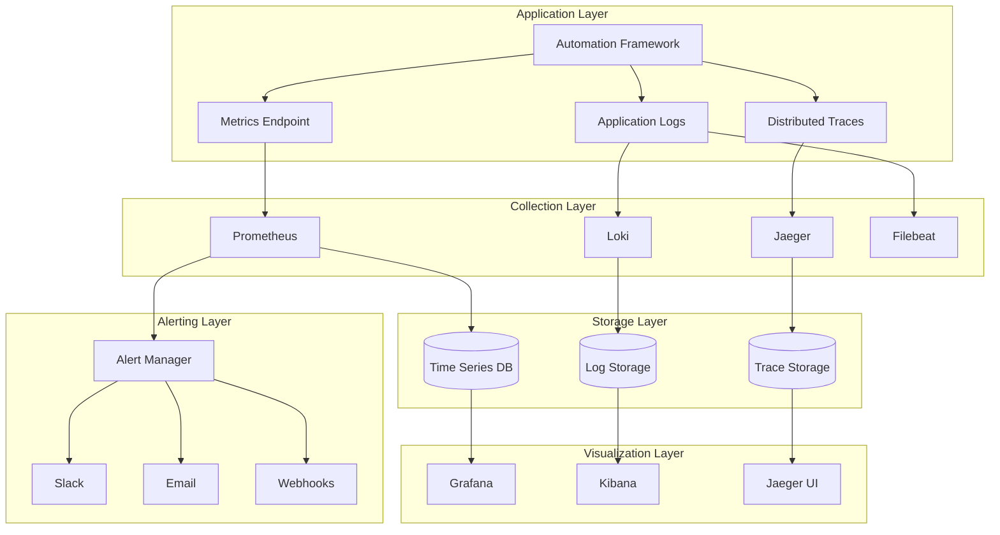

# Monitoring & Alerting Guide

Comprehensive monitoring and alerting setup for the Browser Automation Framework in production environments.

## 🎯 Monitoring Overview

### Monitoring Architecture



### Key Monitoring Areas

1. **Application Metrics** - Performance, throughput, errors
2. **Infrastructure Metrics** - CPU, memory, disk, network
3. **Business Metrics** - Workflow success rates, user activity
4. **Security Metrics** - Authentication failures, suspicious activity
5. **External Dependencies** - Database, Redis, LLM APIs

## 📊 Metrics Collection

### Prometheus Configuration

```yaml
# prometheus.yml
global:
  scrape_interval: 15s
  evaluation_interval: 15s
  external_labels:
    cluster: 'automation-framework'
    environment: 'production'

rule_files:
  - "rules/*.yml"

scrape_configs:
  # Application metrics
  - job_name: 'automation-framework'
    static_configs:
      - targets: ['api-server:8000']
    metrics_path: /metrics
    scrape_interval: 10s
    scrape_timeout: 5s
    
  # System metrics
  - job_name: 'node-exporter'
    static_configs:
      - targets: ['node-exporter:9100']
    scrape_interval: 15s
    
  # Database metrics
  - job_name: 'postgres-exporter'
    static_configs:
      - targets: ['postgres-exporter:9187']
    scrape_interval: 30s
    
  # Redis metrics
  - job_name: 'redis-exporter'
    static_configs:
      - targets: ['redis-exporter:9121']
    scrape_interval: 30s
    
  # Browser metrics
  - job_name: 'browser-pool'
    static_configs:
      - targets: ['browser-pool:9200']
    scrape_interval: 30s

alerting:
  alertmanagers:
    - static_configs:
        - targets:
          - alertmanager:9093

remote_write:
  - url: "https://prometheus-remote-write-endpoint"
    basic_auth:
      username: "prometheus"
      password: "secure-password"
```

### Application Metrics

```python
# src/monitoring/metrics.py
from prometheus_client import Counter, Histogram, Gauge, Info
import time
from functools import wraps

# Application metrics
workflow_executions_total = Counter(
    'workflow_executions_total',
    'Total number of workflow executions',
    ['workflow_type', 'status']
)

workflow_duration_seconds = Histogram(
    'workflow_duration_seconds',
    'Workflow execution duration in seconds',
    ['workflow_type'],
    buckets=[1, 5, 10, 30, 60, 300, 600, 1800, 3600]
)

active_workflows = Gauge(
    'active_workflows',
    'Number of currently active workflows'
)

browser_pool_size = Gauge(
    'browser_pool_size',
    'Current browser pool size',
    ['status']  # available, busy, failed
)

llm_requests_total = Counter(
    'llm_requests_total',
    'Total LLM API requests',
    ['provider', 'model', 'status']
)

llm_response_time_seconds = Histogram(
    'llm_response_time_seconds',
    'LLM API response time in seconds',
    ['provider', 'model'],
    buckets=[0.1, 0.5, 1, 2, 5, 10, 30]
)

# Business metrics
user_sessions_total = Counter(
    'user_sessions_total',
    'Total user sessions',
    ['user_type']
)

api_requests_total = Counter(
    'api_requests_total',
    'Total API requests',
    ['method', 'endpoint', 'status_code']
)

api_request_duration_seconds = Histogram(
    'api_request_duration_seconds',
    'API request duration in seconds',
    ['method', 'endpoint'],
    buckets=[0.01, 0.05, 0.1, 0.5, 1, 2, 5]
)

# System info
app_info = Info(
    'app_info',
    'Application information'
)

def track_workflow_execution(workflow_type: str):
    """Decorator to track workflow execution metrics."""
    def decorator(func):
        @wraps(func)
        async def wrapper(*args, **kwargs):
            start_time = time.time()
            active_workflows.inc()
            
            try:
                result = await func(*args, **kwargs)
                
                # Track success
                workflow_executions_total.labels(
                    workflow_type=workflow_type,
                    status='success'
                ).inc()
                
                return result
                
            except Exception as e:
                # Track failure
                workflow_executions_total.labels(
                    workflow_type=workflow_type,
                    status='failure'
                ).inc()
                raise
                
            finally:
                # Track duration
                duration = time.time() - start_time
                workflow_duration_seconds.labels(
                    workflow_type=workflow_type
                ).observe(duration)
                
                active_workflows.dec()
        
        return wrapper
    return decorator

def track_llm_request(provider: str, model: str):
    """Decorator to track LLM request metrics."""
    def decorator(func):
        @wraps(func)
        async def wrapper(*args, **kwargs):
            start_time = time.time()
            
            try:
                result = await func(*args, **kwargs)
                
                # Track success
                llm_requests_total.labels(
                    provider=provider,
                    model=model,
                    status='success'
                ).inc()
                
                return result
                
            except Exception as e:
                # Track failure
                llm_requests_total.labels(
                    provider=provider,
                    model=model,
                    status='failure'
                ).inc()
                raise
                
            finally:
                # Track response time
                duration = time.time() - start_time
                llm_response_time_seconds.labels(
                    provider=provider,
                    model=model
                ).observe(duration)
        
        return wrapper
    return decorator
```

### Custom Metrics Exporter

```python
# src/monitoring/exporter.py
from prometheus_client import start_http_server, REGISTRY
import asyncio
import psutil
import time

class CustomMetricsExporter:
    """Export custom application metrics."""
    
    def __init__(self, port: int = 9090):
        self.port = port
        self.running = False
        
    async def start(self):
        """Start metrics exporter."""
        # Start Prometheus HTTP server
        start_http_server(self.port)
        
        # Start custom metrics collection
        self.running = True
        asyncio.create_task(self._collect_system_metrics())
        asyncio.create_task(self._collect_business_metrics())
        
    async def stop(self):
        """Stop metrics exporter."""
        self.running = False
        
    async def _collect_system_metrics(self):
        """Collect system-level metrics."""
        system_cpu_usage = Gauge('system_cpu_usage_percent', 'System CPU usage')
        system_memory_usage = Gauge('system_memory_usage_percent', 'System memory usage')
        system_disk_usage = Gauge('system_disk_usage_percent', 'System disk usage')
        
        while self.running:
            try:
                # CPU usage
                cpu_percent = psutil.cpu_percent(interval=1)
                system_cpu_usage.set(cpu_percent)
                
                # Memory usage
                memory = psutil.virtual_memory()
                system_memory_usage.set(memory.percent)
                
                # Disk usage
                disk = psutil.disk_usage('/')
                disk_percent = (disk.used / disk.total) * 100
                system_disk_usage.set(disk_percent)
                
                await asyncio.sleep(15)  # Collect every 15 seconds
                
            except Exception as e:
                print(f"Error collecting system metrics: {e}")
                await asyncio.sleep(60)
    
    async def _collect_business_metrics(self):
        """Collect business-specific metrics."""
        from src.database import get_database_session
        
        total_users = Gauge('total_users', 'Total number of users')
        total_workflows = Gauge('total_workflows', 'Total number of workflows')
        
        while self.running:
            try:
                async with get_database_session() as session:
                    # Count total users
                    user_count = await session.execute(
                        "SELECT COUNT(*) FROM users"
                    )
                    total_users.set(user_count.scalar())
                    
                    # Count total workflows
                    workflow_count = await session.execute(
                        "SELECT COUNT(*) FROM workflows"
                    )
                    total_workflows.set(workflow_count.scalar())
                
                await asyncio.sleep(300)  # Collect every 5 minutes
                
            except Exception as e:
                print(f"Error collecting business metrics: {e}")
                await asyncio.sleep(600)
```

## 📋 Logging Configuration

### Structured Logging

```python
# src/monitoring/logging.py
import logging
import json
import sys
from datetime import datetime
from typing import Dict, Any
import uuid

class StructuredLogger:
    """Structured JSON logger with correlation IDs."""
    
    def __init__(self, name: str):
        self.logger = logging.getLogger(name)
        self.correlation_id = None
        
        # Configure JSON formatter
        handler = logging.StreamHandler(sys.stdout)
        handler.setFormatter(JSONFormatter())
        self.logger.addHandler(handler)
        self.logger.setLevel(logging.INFO)
    
    def set_correlation_id(self, correlation_id: str):
        """Set correlation ID for request tracking."""
        self.correlation_id = correlation_id
    
    def info(self, message: str, **kwargs):
        """Log info message with structured data."""
        self._log(logging.INFO, message, **kwargs)
    
    def warning(self, message: str, **kwargs):
        """Log warning message with structured data."""
        self._log(logging.WARNING, message, **kwargs)
    
    def error(self, message: str, **kwargs):
        """Log error message with structured data."""
        self._log(logging.ERROR, message, **kwargs)
    
    def _log(self, level: int, message: str, **kwargs):
        """Internal logging method."""
        extra_data = {
            'correlation_id': self.correlation_id or str(uuid.uuid4()),
            'timestamp': datetime.utcnow().isoformat(),
            **kwargs
        }
        
        self.logger.log(level, message, extra=extra_data)

class JSONFormatter(logging.Formatter):
    """JSON log formatter."""
    
    def format(self, record):
        log_entry = {
            'timestamp': datetime.utcnow().isoformat(),
            'level': record.levelname,
            'logger': record.name,
            'message': record.getMessage(),
            'module': record.module,
            'function': record.funcName,
            'line': record.lineno
        }
        
        # Add extra fields
        if hasattr(record, 'correlation_id'):
            log_entry['correlation_id'] = record.correlation_id
        
        # Add any additional fields from extra
        for key, value in record.__dict__.items():
            if key not in ['name', 'msg', 'args', 'levelname', 'levelno', 
                          'pathname', 'filename', 'module', 'lineno', 
                          'funcName', 'created', 'msecs', 'relativeCreated',
                          'thread', 'threadName', 'processName', 'process',
                          'getMessage', 'exc_info', 'exc_text', 'stack_info']:
                log_entry[key] = value
        
        return json.dumps(log_entry)
```

### Log Aggregation with ELK Stack

```yaml
# docker-compose.monitoring.yml
version: '3.8'

services:
  elasticsearch:
    image: docker.elastic.co/elasticsearch/elasticsearch:8.8.0
    environment:
      - discovery.type=single-node
      - xpack.security.enabled=false
      - "ES_JAVA_OPTS=-Xms1g -Xmx1g"
    volumes:
      - elasticsearch_data:/usr/share/elasticsearch/data
    ports:
      - "9200:9200"
    
  logstash:
    image: docker.elastic.co/logstash/logstash:8.8.0
    volumes:
      - ./logstash.conf:/usr/share/logstash/pipeline/logstash.conf
    ports:
      - "5044:5044"
    depends_on:
      - elasticsearch
    
  kibana:
    image: docker.elastic.co/kibana/kibana:8.8.0
    environment:
      - ELASTICSEARCH_HOSTS=http://elasticsearch:9200
    ports:
      - "5601:5601"
    depends_on:
      - elasticsearch
    
  filebeat:
    image: docker.elastic.co/beats/filebeat:8.8.0
    user: root
    volumes:
      - ./filebeat.yml:/usr/share/filebeat/filebeat.yml:ro
      - /var/lib/docker/containers:/var/lib/docker/containers:ro
      - /var/run/docker.sock:/var/run/docker.sock:ro
    depends_on:
      - logstash

volumes:
  elasticsearch_data:
```

## 🚨 Alerting Configuration

### Alert Rules

```yaml
# rules/automation_alerts.yml
groups:
  - name: automation_framework_alerts
    rules:
      # High error rate
      - alert: HighErrorRate
        expr: rate(workflow_executions_total{status="failure"}[5m]) / rate(workflow_executions_total[5m]) > 0.1
        for: 5m
        labels:
          severity: critical
          service: automation-framework
        annotations:
          summary: "High workflow error rate detected"
          description: "Error rate is {{ $value | humanizePercentage }} for the last 5 minutes"
          
      # High response time
      - alert: HighResponseTime
        expr: histogram_quantile(0.95, rate(api_request_duration_seconds_bucket[5m])) > 5
        for: 10m
        labels:
          severity: warning
          service: automation-framework
        annotations:
          summary: "High API response time"
          description: "95th percentile response time is {{ $value }}s"
          
      # Low browser pool availability
      - alert: LowBrowserPoolAvailability
        expr: browser_pool_size{status="available"} / (browser_pool_size{status="available"} + browser_pool_size{status="busy"}) < 0.2
        for: 5m
        labels:
          severity: warning
          service: automation-framework
        annotations:
          summary: "Low browser pool availability"
          description: "Only {{ $value | humanizePercentage }} of browsers are available"
          
      # Database connection issues
      - alert: DatabaseConnectionFailure
        expr: up{job="postgres-exporter"} == 0
        for: 2m
        labels:
          severity: critical
          service: database
        annotations:
          summary: "Database connection failure"
          description: "Cannot connect to PostgreSQL database"
          
      # Redis connection issues
      - alert: RedisConnectionFailure
        expr: up{job="redis-exporter"} == 0
        for: 2m
        labels:
          severity: critical
          service: redis
        annotations:
          summary: "Redis connection failure"
          description: "Cannot connect to Redis server"
          
      # High memory usage
      - alert: HighMemoryUsage
        expr: system_memory_usage_percent > 85
        for: 10m
        labels:
          severity: warning
          service: system
        annotations:
          summary: "High memory usage"
          description: "Memory usage is {{ $value }}%"
          
      # High CPU usage
      - alert: HighCPUUsage
        expr: system_cpu_usage_percent > 80
        for: 15m
        labels:
          severity: warning
          service: system
        annotations:
          summary: "High CPU usage"
          description: "CPU usage is {{ $value }}%"
          
      # LLM API failures
      - alert: LLMAPIFailures
        expr: rate(llm_requests_total{status="failure"}[5m]) > 0.1
        for: 5m
        labels:
          severity: warning
          service: llm
        annotations:
          summary: "High LLM API failure rate"
          description: "LLM API failure rate is {{ $value }} requests/second"
```

### Alert Manager Configuration

```yaml
# alertmanager.yml
global:
  smtp_smarthost: 'smtp.company.com:587'
  smtp_from: 'alerts@company.com'
  smtp_auth_username: 'alerts@company.com'
  smtp_auth_password: 'smtp-password'

route:
  group_by: ['alertname', 'service']
  group_wait: 10s
  group_interval: 10s
  repeat_interval: 1h
  receiver: 'default'
  routes:
    - match:
        severity: critical
      receiver: 'critical-alerts'
    - match:
        severity: warning
      receiver: 'warning-alerts'

receivers:
  - name: 'default'
    email_configs:
      - to: 'admin@company.com'
        subject: 'Automation Framework Alert'
        body: |
          {{ range .Alerts }}
          Alert: {{ .Annotations.summary }}
          Description: {{ .Annotations.description }}
          {{ end }}
        
  - name: 'critical-alerts'
    email_configs:
      - to: 'admin@company.com,ops@company.com'
        subject: 'CRITICAL: Automation Framework Alert'
        body: |
          {{ range .Alerts }}
          CRITICAL ALERT: {{ .Annotations.summary }}
          Description: {{ .Annotations.description }}
          Time: {{ .StartsAt }}
          {{ end }}
    slack_configs:
      - api_url: 'https://hooks.slack.com/services/YOUR/SLACK/WEBHOOK'
        channel: '#critical-alerts'
        title: 'Critical Alert: Automation Framework'
        text: |
          {{ range .Alerts }}
          *{{ .Annotations.summary }}*
          {{ .Annotations.description }}
          {{ end }}
        
  - name: 'warning-alerts'
    slack_configs:
      - api_url: 'https://hooks.slack.com/services/YOUR/SLACK/WEBHOOK'
        channel: '#automation-alerts'
        title: 'Warning: Automation Framework'
        text: |
          {{ range .Alerts }}
          {{ .Annotations.summary }}
          {{ .Annotations.description }}
          {{ end }}

inhibit_rules:
  - source_match:
      severity: 'critical'
    target_match:
      severity: 'warning'
    equal: ['alertname', 'service']
```

## 📊 Grafana Dashboards

### Main Dashboard Configuration

```json
{
  "dashboard": {
    "id": null,
    "title": "Browser Automation Framework - Overview",
    "tags": ["automation", "overview"],
    "timezone": "browser",
    "panels": [
      {
        "id": 1,
        "title": "Workflow Execution Rate",
        "type": "graph",
        "targets": [
          {
            "expr": "rate(workflow_executions_total[5m])",
            "legendFormat": "Executions/sec"
          }
        ],
        "yAxes": [
          {
            "label": "Executions/sec",
            "min": 0
          }
        ],
        "gridPos": {
          "h": 8,
          "w": 12,
          "x": 0,
          "y": 0
        }
      },
      {
        "id": 2,
        "title": "Success Rate",
        "type": "singlestat",
        "targets": [
          {
            "expr": "rate(workflow_executions_total{status=\"success\"}[5m]) / rate(workflow_executions_total[5m]) * 100",
            "legendFormat": "Success Rate"
          }
        ],
        "valueName": "current",
        "format": "percent",
        "thresholds": "80,95",
        "colorBackground": true,
        "gridPos": {
          "h": 8,
          "w": 12,
          "x": 12,
          "y": 0
        }
      },
      {
        "id": 3,
        "title": "Active Workflows",
        "type": "graph",
        "targets": [
          {
            "expr": "active_workflows",
            "legendFormat": "Active Workflows"
          }
        ],
        "gridPos": {
          "h": 8,
          "w": 24,
          "x": 0,
          "y": 8
        }
      },
      {
        "id": 4,
        "title": "Browser Pool Status",
        "type": "piechart",
        "targets": [
          {
            "expr": "browser_pool_size",
            "legendFormat": "{{ status }}"
          }
        ],
        "gridPos": {
          "h": 8,
          "w": 12,
          "x": 0,
          "y": 16
        }
      },
      {
        "id": 5,
        "title": "API Response Time",
        "type": "graph",
        "targets": [
          {
            "expr": "histogram_quantile(0.50, rate(api_request_duration_seconds_bucket[5m]))",
            "legendFormat": "50th percentile"
          },
          {
            "expr": "histogram_quantile(0.95, rate(api_request_duration_seconds_bucket[5m]))",
            "legendFormat": "95th percentile"
          },
          {
            "expr": "histogram_quantile(0.99, rate(api_request_duration_seconds_bucket[5m]))",
            "legendFormat": "99th percentile"
          }
        ],
        "yAxes": [
          {
            "label": "Response Time (s)",
            "min": 0
          }
        ],
        "gridPos": {
          "h": 8,
          "w": 12,
          "x": 12,
          "y": 16
        }
      }
    ],
    "time": {
      "from": "now-1h",
      "to": "now"
    },
    "refresh": "30s"
  }
}
```

## 🔍 Distributed Tracing

### Jaeger Configuration

```yaml
# jaeger.yml
apiVersion: apps/v1
kind: Deployment
metadata:
  name: jaeger
spec:
  replicas: 1
  selector:
    matchLabels:
      app: jaeger
  template:
    metadata:
      labels:
        app: jaeger
    spec:
      containers:
      - name: jaeger
        image: jaegertracing/all-in-one:latest
        ports:
        - containerPort: 16686
        - containerPort: 14268
        env:
        - name: COLLECTOR_ZIPKIN_HTTP_PORT
          value: "9411"
        - name: SPAN_STORAGE_TYPE
          value: "elasticsearch"
        - name: ES_SERVER_URLS
          value: "http://elasticsearch:9200"

---
apiVersion: v1
kind: Service
metadata:
  name: jaeger
spec:
  selector:
    app: jaeger
  ports:
  - name: ui
    port: 16686
    targetPort: 16686
  - name: collector
    port: 14268
    targetPort: 14268
```

### Application Tracing

```python
# src/monitoring/tracing.py
from opentelemetry import trace
from opentelemetry.exporter.jaeger.thrift import JaegerExporter
from opentelemetry.sdk.trace import TracerProvider
from opentelemetry.sdk.trace.export import BatchSpanProcessor
from opentelemetry.instrumentation.fastapi import FastAPIInstrumentor
from opentelemetry.instrumentation.asyncpg import AsyncPGInstrumentor
from opentelemetry.instrumentation.redis import RedisInstrumentor

def setup_tracing(app, service_name: str = "automation-framework"):
    """Setup distributed tracing."""
    
    # Configure tracer provider
    trace.set_tracer_provider(TracerProvider())
    tracer = trace.get_tracer(__name__)
    
    # Configure Jaeger exporter
    jaeger_exporter = JaegerExporter(
        agent_host_name="jaeger",
        agent_port=6831,
    )
    
    # Add span processor
    span_processor = BatchSpanProcessor(jaeger_exporter)
    trace.get_tracer_provider().add_span_processor(span_processor)
    
    # Instrument FastAPI
    FastAPIInstrumentor.instrument_app(app)
    
    # Instrument database
    AsyncPGInstrumentor().instrument()
    
    # Instrument Redis
    RedisInstrumentor().instrument()
    
    return tracer

def trace_workflow_execution(workflow_id: str):
    """Decorator to trace workflow execution."""
    def decorator(func):
        @wraps(func)
        async def wrapper(*args, **kwargs):
            tracer = trace.get_tracer(__name__)
            
            with tracer.start_as_current_span(
                "workflow_execution",
                attributes={
                    "workflow.id": workflow_id,
                    "workflow.type": kwargs.get("workflow_type", "unknown")
                }
            ) as span:
                try:
                    result = await func(*args, **kwargs)
                    span.set_attribute("workflow.status", "success")
                    return result
                except Exception as e:
                    span.set_attribute("workflow.status", "failure")
                    span.set_attribute("workflow.error", str(e))
                    raise
        
        return wrapper
    return decorator
```

## 🔗 Next Steps

- **[Security Guide](security.md)** - Implement security monitoring
- **[Backup & Recovery](backup-recovery.md)** - Monitor backup processes
- **[Scaling Guide](scaling.md)** - Monitor scaling metrics
- **[Troubleshooting](../user/troubleshooting.md)** - Use monitoring for troubleshooting
