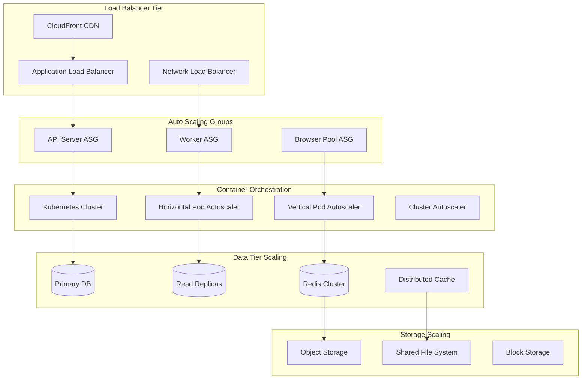

# Scaling Guide

Comprehensive guide for scaling the Browser Automation Framework to handle high loads and ensure high availability.

## 🎯 Scaling Overview

### Scaling Architecture



### Scaling Strategies

| Component | Horizontal Scaling | Vertical Scaling | Auto Scaling |
|-----------|-------------------|------------------|--------------|
| **API Servers** | ✅ Multiple instances | ✅ Larger instances | ✅ Load-based |
| **Workers** | ✅ Worker pools | ✅ More CPU/Memory | ✅ Queue-based |
| **Browser Pool** | ✅ Distributed pools | ✅ More resources | ✅ Demand-based |
| **Database** | ✅ Read replicas | ✅ Larger instances | ⚠️ Manual |
| **Redis** | ✅ Cluster mode | ✅ More memory | ✅ Memory-based |

## 🚀 Horizontal Scaling

### Kubernetes Horizontal Pod Autoscaler

```yaml
# k8s/hpa-api.yaml
apiVersion: autoscaling/v2
kind: HorizontalPodAutoscaler
metadata:
  name: api-server-hpa
  namespace: automation-framework
spec:
  scaleTargetRef:
    apiVersion: apps/v1
    kind: Deployment
    name: api-server
  minReplicas: 3
  maxReplicas: 20
  metrics:
  - type: Resource
    resource:
      name: cpu
      target:
        type: Utilization
        averageUtilization: 70
  - type: Resource
    resource:
      name: memory
      target:
        type: Utilization
        averageUtilization: 80
  - type: Pods
    pods:
      metric:
        name: active_requests
      target:
        type: AverageValue
        averageValue: "10"
  behavior:
    scaleUp:
      stabilizationWindowSeconds: 60
      policies:
      - type: Percent
        value: 100
        periodSeconds: 15
      - type: Pods
        value: 4
        periodSeconds: 15
      selectPolicy: Max
    scaleDown:
      stabilizationWindowSeconds: 300
      policies:
      - type: Percent
        value: 10
        periodSeconds: 60

---
# k8s/hpa-worker.yaml
apiVersion: autoscaling/v2
kind: HorizontalPodAutoscaler
metadata:
  name: worker-hpa
  namespace: automation-framework
spec:
  scaleTargetRef:
    apiVersion: apps/v1
    kind: Deployment
    name: worker
  minReplicas: 2
  maxReplicas: 50
  metrics:
  - type: External
    external:
      metric:
        name: redis_queue_length
        selector:
          matchLabels:
            queue: "workflow_queue"
      target:
        type: AverageValue
        averageValue: "5"
  - type: Resource
    resource:
      name: cpu
      target:
        type: Utilization
        averageUtilization: 80
```

### Custom Metrics for Scaling

```python
# src/scaling/metrics.py
from prometheus_client import Gauge, Counter
import asyncio
import redis.asyncio as redis

class ScalingMetrics:
    """Custom metrics for auto-scaling decisions."""
    
    def __init__(self):
        # Queue metrics
        self.queue_length = Gauge(
            'queue_length',
            'Number of items in queue',
            ['queue_name']
        )
        
        self.queue_processing_rate = Gauge(
            'queue_processing_rate',
            'Items processed per second',
            ['queue_name']
        )
        
        # Browser pool metrics
        self.browser_pool_utilization = Gauge(
            'browser_pool_utilization',
            'Browser pool utilization percentage'
        )
        
        self.browser_wait_time = Gauge(
            'browser_wait_time_seconds',
            'Average wait time for browser allocation'
        )
        
        # API metrics
        self.active_requests = Gauge(
            'active_requests',
            'Number of active API requests'
        )
        
        self.request_queue_time = Gauge(
            'request_queue_time_seconds',
            'Time requests spend in queue'
        )
        
        # Worker metrics
        self.worker_utilization = Gauge(
            'worker_utilization',
            'Worker utilization percentage',
            ['worker_id']
        )
        
        self.workflow_backlog = Gauge(
            'workflow_backlog',
            'Number of workflows waiting to be processed'
        )
    
    async def collect_queue_metrics(self):
        """Collect queue-related metrics."""
        redis_client = redis.Redis.from_url("redis://redis:6379")
        
        # Workflow queue
        workflow_queue_length = await redis_client.llen("workflow_queue")
        self.queue_length.labels(queue_name="workflow_queue").set(workflow_queue_length)
        
        # Task queue
        task_queue_length = await redis_client.llen("task_queue")
        self.queue_length.labels(queue_name="task_queue").set(task_queue_length)
        
        # Calculate processing rate
        # This would typically be calculated over time
        processing_rate = await self._calculate_processing_rate()
        self.queue_processing_rate.labels(queue_name="workflow_queue").set(processing_rate)
    
    async def collect_browser_metrics(self):
        """Collect browser pool metrics."""
        from src.infrastructure.browser_pool import BrowserPool
        
        pool = BrowserPool()
        stats = await pool.get_pool_stats()
        
        total_browsers = stats['active'] + stats['available']
        if total_browsers > 0:
            utilization = (stats['active'] / total_browsers) * 100
            self.browser_pool_utilization.set(utilization)
        
        # Average wait time (would be tracked separately)
        avg_wait_time = await pool.get_average_wait_time()
        self.browser_wait_time.set(avg_wait_time)
    
    async def collect_worker_metrics(self):
        """Collect worker-related metrics."""
        # This would integrate with your worker management system
        # to get actual utilization metrics
        pass
    
    async def _calculate_processing_rate(self) -> float:
        """Calculate queue processing rate."""
        # Implementation would track processed items over time
        # This is a placeholder
        return 5.0

# Global metrics collector
scaling_metrics = ScalingMetrics()

async def start_metrics_collection():
    """Start collecting scaling metrics."""
    while True:
        try:
            await scaling_metrics.collect_queue_metrics()
            await scaling_metrics.collect_browser_metrics()
            await scaling_metrics.collect_worker_metrics()
            
            await asyncio.sleep(10)  # Collect every 10 seconds
            
        except Exception as e:
            print(f"Error collecting scaling metrics: {e}")
            await asyncio.sleep(30)
```

### Load Balancer Configuration

```yaml
# aws-alb.yaml
apiVersion: v1
kind: Service
metadata:
  name: api-service-alb
  namespace: automation-framework
  annotations:
    service.beta.kubernetes.io/aws-load-balancer-type: "nlb"
    service.beta.kubernetes.io/aws-load-balancer-backend-protocol: "http"
    service.beta.kubernetes.io/aws-load-balancer-healthcheck-path: "/health"
    service.beta.kubernetes.io/aws-load-balancer-healthcheck-interval: "10"
    service.beta.kubernetes.io/aws-load-balancer-healthcheck-timeout: "5"
    service.beta.kubernetes.io/aws-load-balancer-healthy-threshold: "2"
    service.beta.kubernetes.io/aws-load-balancer-unhealthy-threshold: "3"
spec:
  type: LoadBalancer
  selector:
    app: api-server
  ports:
  - port: 80
    targetPort: 8000
    protocol: TCP
```

## 📈 Vertical Scaling

### Vertical Pod Autoscaler

```yaml
# k8s/vpa.yaml
apiVersion: autoscaling.k8s.io/v1
kind: VerticalPodAutoscaler
metadata:
  name: api-server-vpa
  namespace: automation-framework
spec:
  targetRef:
    apiVersion: apps/v1
    kind: Deployment
    name: api-server
  updatePolicy:
    updateMode: "Auto"
  resourcePolicy:
    containerPolicies:
    - containerName: api
      minAllowed:
        cpu: 100m
        memory: 128Mi
      maxAllowed:
        cpu: 4
        memory: 8Gi
      controlledResources: ["cpu", "memory"]
      controlledValues: RequestsAndLimits

---
apiVersion: autoscaling.k8s.io/v1
kind: VerticalPodAutoscaler
metadata:
  name: worker-vpa
  namespace: automation-framework
spec:
  targetRef:
    apiVersion: apps/v1
    kind: Deployment
    name: worker
  updatePolicy:
    updateMode: "Auto"
  resourcePolicy:
    containerPolicies:
    - containerName: worker
      minAllowed:
        cpu: 500m
        memory: 1Gi
      maxAllowed:
        cpu: 8
        memory: 16Gi
      controlledResources: ["cpu", "memory"]
```

### Resource Optimization

```python
# src/scaling/resource_optimizer.py
import psutil
import asyncio
from typing import Dict, Any
from dataclasses import dataclass

@dataclass
class ResourceRecommendation:
    """Resource scaling recommendation."""
    component: str
    current_cpu: float
    current_memory: float
    recommended_cpu: float
    recommended_memory: float
    confidence: float
    reason: str

class ResourceOptimizer:
    """Optimize resource allocation based on usage patterns."""
    
    def __init__(self):
        self.cpu_history = []
        self.memory_history = []
        self.max_history = 1000
    
    async def collect_resource_usage(self):
        """Collect current resource usage."""
        cpu_percent = psutil.cpu_percent(interval=1)
        memory = psutil.virtual_memory()
        
        self.cpu_history.append(cpu_percent)
        self.memory_history.append(memory.percent)
        
        # Keep only recent history
        if len(self.cpu_history) > self.max_history:
            self.cpu_history.pop(0)
        if len(self.memory_history) > self.max_history:
            self.memory_history.pop(0)
    
    def get_scaling_recommendations(self) -> list[ResourceRecommendation]:
        """Get resource scaling recommendations."""
        recommendations = []
        
        if len(self.cpu_history) < 100:  # Need enough data
            return recommendations
        
        # Calculate statistics
        avg_cpu = sum(self.cpu_history) / len(self.cpu_history)
        max_cpu = max(self.cpu_history)
        avg_memory = sum(self.memory_history) / len(self.memory_history)
        max_memory = max(self.memory_history)
        
        # CPU recommendations
        if avg_cpu > 80:
            recommendations.append(ResourceRecommendation(
                component="api-server",
                current_cpu=avg_cpu,
                current_memory=avg_memory,
                recommended_cpu=avg_cpu * 1.5,
                recommended_memory=avg_memory,
                confidence=0.9,
                reason="High average CPU usage"
            ))
        elif avg_cpu < 30 and max_cpu < 50:
            recommendations.append(ResourceRecommendation(
                component="api-server",
                current_cpu=avg_cpu,
                current_memory=avg_memory,
                recommended_cpu=avg_cpu * 0.8,
                recommended_memory=avg_memory,
                confidence=0.7,
                reason="Low CPU usage, can scale down"
            ))
        
        # Memory recommendations
        if avg_memory > 85:
            recommendations.append(ResourceRecommendation(
                component="api-server",
                current_cpu=avg_cpu,
                current_memory=avg_memory,
                recommended_cpu=avg_cpu,
                recommended_memory=avg_memory * 1.3,
                confidence=0.9,
                reason="High memory usage"
            ))
        
        return recommendations
```

## 🗄️ Database Scaling

### Read Replica Configuration

```yaml
# k8s/postgres-replica.yaml
apiVersion: apps/v1
kind: Deployment
metadata:
  name: postgres-replica
  namespace: automation-framework
spec:
  replicas: 2
  selector:
    matchLabels:
      app: postgres-replica
  template:
    metadata:
      labels:
        app: postgres-replica
    spec:
      containers:
      - name: postgres
        image: postgres:15
        env:
        - name: POSTGRES_USER
          value: "replica_user"
        - name: POSTGRES_PASSWORD
          valueFrom:
            secretKeyRef:
              name: postgres-secrets
              key: replica-password
        - name: PGUSER
          value: "replica_user"
        - name: POSTGRES_PRIMARY_HOST
          value: "postgres-primary"
        - name: POSTGRES_PRIMARY_PORT
          value: "5432"
        command:
        - /bin/bash
        - -c
        - |
          # Wait for primary to be ready
          until pg_isready -h $POSTGRES_PRIMARY_HOST -p $POSTGRES_PRIMARY_PORT; do
            sleep 5
          done
          
          # Create base backup
          pg_basebackup -h $POSTGRES_PRIMARY_HOST -D /var/lib/postgresql/data -U replica_user -v -P -W
          
          # Configure recovery
          echo "standby_mode = 'on'" >> /var/lib/postgresql/data/recovery.conf
          echo "primary_conninfo = 'host=$POSTGRES_PRIMARY_HOST port=$POSTGRES_PRIMARY_PORT user=replica_user'" >> /var/lib/postgresql/data/recovery.conf
          
          # Start PostgreSQL
          postgres
        resources:
          requests:
            cpu: 500m
            memory: 1Gi
          limits:
            cpu: 2
            memory: 4Gi

---
apiVersion: v1
kind: Service
metadata:
  name: postgres-replica-service
  namespace: automation-framework
spec:
  selector:
    app: postgres-replica
  ports:
  - port: 5432
    targetPort: 5432
  type: ClusterIP
```

### Database Connection Pooling

```python
# src/database/connection_pool.py
import asyncio
import asyncpg
from typing import Optional, Dict, Any
import random

class DatabaseConnectionManager:
    """Manage database connections with read/write splitting."""
    
    def __init__(self, config: Dict[str, Any]):
        self.primary_url = config['primary_url']
        self.replica_urls = config['replica_urls']
        self.pool_size = config.get('pool_size', 20)
        
        self.primary_pool = None
        self.replica_pools = []
        
    async def initialize(self):
        """Initialize connection pools."""
        # Primary pool for writes
        self.primary_pool = await asyncpg.create_pool(
            self.primary_url,
            min_size=5,
            max_size=self.pool_size,
            command_timeout=30
        )
        
        # Replica pools for reads
        for replica_url in self.replica_urls:
            replica_pool = await asyncpg.create_pool(
                replica_url,
                min_size=2,
                max_size=self.pool_size // 2,
                command_timeout=30
            )
            self.replica_pools.append(replica_pool)
    
    async def get_connection(self, read_only: bool = False):
        """Get database connection."""
        if read_only and self.replica_pools:
            # Use random replica for load balancing
            pool = random.choice(self.replica_pools)
            return await pool.acquire()
        else:
            # Use primary for writes or if no replicas
            return await self.primary_pool.acquire()
    
    async def release_connection(self, connection, read_only: bool = False):
        """Release database connection."""
        if read_only and self.replica_pools:
            # Find which pool this connection belongs to
            for pool in self.replica_pools:
                try:
                    await pool.release(connection)
                    return
                except:
                    continue
        
        # Release to primary pool
        await self.primary_pool.release(connection)
    
    async def close(self):
        """Close all connection pools."""
        if self.primary_pool:
            await self.primary_pool.close()
        
        for pool in self.replica_pools:
            await pool.close()

# Usage example
async def execute_query(query: str, read_only: bool = False):
    """Execute database query with connection pooling."""
    connection = await db_manager.get_connection(read_only=read_only)
    
    try:
        if read_only:
            result = await connection.fetch(query)
        else:
            result = await connection.execute(query)
        
        return result
        
    finally:
        await db_manager.release_connection(connection, read_only=read_only)
```

## 🔴 Redis Scaling

### Redis Cluster Configuration

```yaml
# k8s/redis-cluster.yaml
apiVersion: apps/v1
kind: StatefulSet
metadata:
  name: redis-cluster
  namespace: automation-framework
spec:
  serviceName: redis-cluster
  replicas: 6
  selector:
    matchLabels:
      app: redis-cluster
  template:
    metadata:
      labels:
        app: redis-cluster
    spec:
      containers:
      - name: redis
        image: redis:7-alpine
        ports:
        - containerPort: 6379
        - containerPort: 16379
        command:
        - redis-server
        - /etc/redis/redis.conf
        - --cluster-enabled
        - "yes"
        - --cluster-config-file
        - nodes.conf
        - --cluster-node-timeout
        - "5000"
        - --appendonly
        - "yes"
        volumeMounts:
        - name: redis-data
          mountPath: /data
        - name: redis-config
          mountPath: /etc/redis
        resources:
          requests:
            cpu: 250m
            memory: 512Mi
          limits:
            cpu: 1
            memory: 2Gi
      volumes:
      - name: redis-config
        configMap:
          name: redis-config
  volumeClaimTemplates:
  - metadata:
      name: redis-data
    spec:
      accessModes: ["ReadWriteOnce"]
      resources:
        requests:
          storage: 10Gi

---
apiVersion: v1
kind: ConfigMap
metadata:
  name: redis-config
  namespace: automation-framework
data:
  redis.conf: |
    bind 0.0.0.0
    port 6379
    cluster-enabled yes
    cluster-config-file nodes.conf
    cluster-node-timeout 5000
    appendonly yes
    appendfsync everysec
    maxmemory 1gb
    maxmemory-policy allkeys-lru
```

### Redis Cluster Initialization

```bash
#!/bin/bash
# scripts/init-redis-cluster.sh

set -euo pipefail

NAMESPACE="automation-framework"
REPLICAS=6

echo "Waiting for Redis pods to be ready..."
kubectl wait --for=condition=ready pod -l app=redis-cluster -n $NAMESPACE --timeout=300s

# Get pod IPs
REDIS_IPS=$(kubectl get pods -l app=redis-cluster -n $NAMESPACE -o jsonpath='{range .items[*]}{.status.podIP}:6379 {end}')

echo "Redis pod IPs: $REDIS_IPS"

# Create cluster
kubectl exec -n $NAMESPACE redis-cluster-0 -- redis-cli --cluster create $REDIS_IPS --cluster-replicas 1 --cluster-yes

echo "Redis cluster initialized successfully"

# Verify cluster
kubectl exec -n $NAMESPACE redis-cluster-0 -- redis-cli cluster info
kubectl exec -n $NAMESPACE redis-cluster-0 -- redis-cli cluster nodes
```

## 🌐 Browser Pool Scaling

### Distributed Browser Pool

```python
# src/infrastructure/distributed_browser_pool.py
import asyncio
import aiohttp
from typing import Dict, List, Optional
import random

class DistributedBrowserPool:
    """Distributed browser pool across multiple nodes."""
    
    def __init__(self, pool_nodes: List[str]):
        self.pool_nodes = pool_nodes
        self.node_stats = {}
        self.session = None
    
    async def initialize(self):
        """Initialize HTTP session for node communication."""
        self.session = aiohttp.ClientSession()
        
        # Initialize node stats
        for node in self.pool_nodes:
            self.node_stats[node] = {
                "available_browsers": 0,
                "total_browsers": 0,
                "load": 0.0,
                "healthy": True
            }
    
    async def get_browser(self, requirements: Optional[Dict] = None):
        """Get browser from least loaded node."""
        # Update node stats
        await self._update_node_stats()
        
        # Find best node
        best_node = self._select_best_node()
        
        if not best_node:
            raise Exception("No available browser nodes")
        
        # Request browser from selected node
        browser = await self._request_browser_from_node(best_node, requirements)
        
        return browser
    
    async def _update_node_stats(self):
        """Update statistics for all nodes."""
        tasks = []
        
        for node in self.pool_nodes:
            task = self._get_node_stats(node)
            tasks.append(task)
        
        results = await asyncio.gather(*tasks, return_exceptions=True)
        
        for node, result in zip(self.pool_nodes, results):
            if isinstance(result, Exception):
                self.node_stats[node]["healthy"] = False
            else:
                self.node_stats[node].update(result)
                self.node_stats[node]["healthy"] = True
    
    async def _get_node_stats(self, node: str) -> Dict:
        """Get statistics from a specific node."""
        try:
            async with self.session.get(f"http://{node}/browser-pool/stats") as response:
                if response.status == 200:
                    return await response.json()
                else:
                    raise Exception(f"HTTP {response.status}")
        except Exception as e:
            print(f"Error getting stats from {node}: {e}")
            raise
    
    def _select_best_node(self) -> Optional[str]:
        """Select the best node based on load and availability."""
        healthy_nodes = [
            node for node, stats in self.node_stats.items()
            if stats["healthy"] and stats["available_browsers"] > 0
        ]
        
        if not healthy_nodes:
            return None
        
        # Select node with lowest load
        best_node = min(
            healthy_nodes,
            key=lambda node: self.node_stats[node]["load"]
        )
        
        return best_node
    
    async def _request_browser_from_node(self, node: str, requirements: Optional[Dict]):
        """Request browser from specific node."""
        payload = {"requirements": requirements or {}}
        
        async with self.session.post(
            f"http://{node}/browser-pool/acquire",
            json=payload
        ) as response:
            if response.status == 200:
                return await response.json()
            else:
                raise Exception(f"Failed to acquire browser from {node}")
    
    async def release_browser(self, browser_id: str, node: str):
        """Release browser back to node."""
        async with self.session.post(
            f"http://{node}/browser-pool/release",
            json={"browser_id": browser_id}
        ) as response:
            return response.status == 200
    
    async def close(self):
        """Close HTTP session."""
        if self.session:
            await self.session.close()
```

## 📊 Scaling Monitoring

### Scaling Metrics Dashboard

```python
# src/monitoring/scaling_dashboard.py
from prometheus_client import Gauge, Counter, Histogram
import time

class ScalingDashboard:
    """Monitor scaling activities and performance."""
    
    def __init__(self):
        # Scaling events
        self.scaling_events = Counter(
            'scaling_events_total',
            'Total scaling events',
            ['component', 'direction', 'trigger']
        )
        
        # Current scale
        self.current_replicas = Gauge(
            'current_replicas',
            'Current number of replicas',
            ['component']
        )
        
        # Scaling latency
        self.scaling_duration = Histogram(
            'scaling_duration_seconds',
            'Time taken for scaling operations',
            ['component', 'direction']
        )
        
        # Resource utilization
        self.resource_utilization = Gauge(
            'resource_utilization_percent',
            'Resource utilization percentage',
            ['component', 'resource']
        )
        
        # Queue metrics
        self.queue_depth = Gauge(
            'queue_depth',
            'Current queue depth',
            ['queue_name']
        )
        
        # Performance impact
        self.response_time_impact = Gauge(
            'response_time_impact_percent',
            'Response time impact during scaling',
            ['component']
        )
    
    def record_scaling_event(
        self,
        component: str,
        direction: str,  # up, down
        trigger: str,    # cpu, memory, queue, manual
        duration: float
    ):
        """Record a scaling event."""
        self.scaling_events.labels(
            component=component,
            direction=direction,
            trigger=trigger
        ).inc()
        
        self.scaling_duration.labels(
            component=component,
            direction=direction
        ).observe(duration)
    
    def update_current_scale(self, component: str, replicas: int):
        """Update current replica count."""
        self.current_replicas.labels(component=component).set(replicas)
    
    def update_resource_utilization(
        self,
        component: str,
        cpu_percent: float,
        memory_percent: float
    ):
        """Update resource utilization metrics."""
        self.resource_utilization.labels(
            component=component,
            resource="cpu"
        ).set(cpu_percent)
        
        self.resource_utilization.labels(
            component=component,
            resource="memory"
        ).set(memory_percent)

# Global dashboard instance
scaling_dashboard = ScalingDashboard()
```

## 🔗 Next Steps

- **[Performance Tuning](../developer/performance.md)** - Optimize for scaling
- **[Monitoring Guide](monitoring.md)** - Monitor scaling metrics
- **[Security Guide](security.md)** - Secure scaled deployments
- **[Backup & Recovery](backup-recovery.md)** - Scale backup infrastructure
