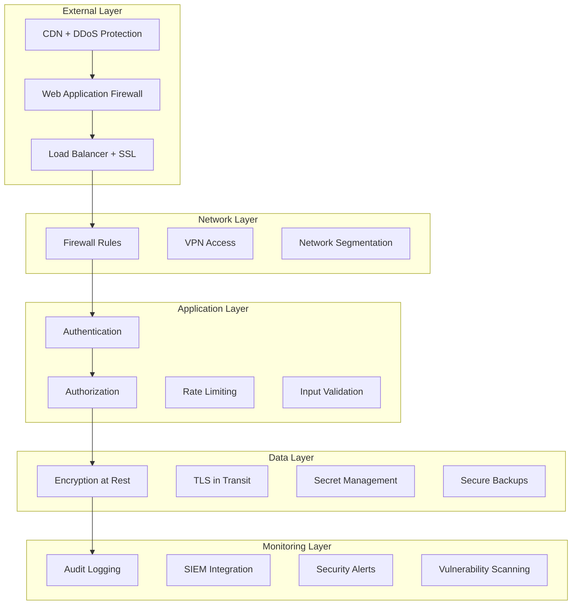

# Security Guide

Comprehensive security implementation guide for the Browser Automation Framework in production environments.

## 🎯 Security Overview

### Security Architecture



### Security Principles

1. **Defense in Depth** - Multiple security layers
2. **Least Privilege** - Minimal required permissions
3. **Zero Trust** - Verify everything, trust nothing
4. **Fail Secure** - Secure defaults and failure modes
5. **Security by Design** - Built-in security controls

## 🔐 Authentication & Authorization

### JWT Authentication

```python
# src/security/auth.py
import jwt
from datetime import datetime, timedelta
from typing import Optional, Dict, Any
from fastapi import HTTPException, Depends
from fastapi.security import HTTPBearer, HTTPAuthorizationCredentials
import bcrypt
import secrets

class AuthenticationManager:
    """Secure authentication management."""
    
    def __init__(self, secret_key: str, algorithm: str = "HS256"):
        self.secret_key = secret_key
        self.algorithm = algorithm
        self.token_expiry = timedelta(hours=1)
        self.refresh_expiry = timedelta(days=7)
        
    def hash_password(self, password: str) -> str:
        """Hash password using bcrypt."""
        salt = bcrypt.gensalt()
        return bcrypt.hashpw(password.encode('utf-8'), salt).decode('utf-8')
    
    def verify_password(self, password: str, hashed: str) -> bool:
        """Verify password against hash."""
        return bcrypt.checkpw(password.encode('utf-8'), hashed.encode('utf-8'))
    
    def create_access_token(self, user_id: str, roles: list = None) -> str:
        """Create JWT access token."""
        payload = {
            "user_id": user_id,
            "roles": roles or [],
            "exp": datetime.utcnow() + self.token_expiry,
            "iat": datetime.utcnow(),
            "jti": secrets.token_urlsafe(32)  # JWT ID for revocation
        }
        
        return jwt.encode(payload, self.secret_key, algorithm=self.algorithm)
    
    def create_refresh_token(self, user_id: str) -> str:
        """Create JWT refresh token."""
        payload = {
            "user_id": user_id,
            "type": "refresh",
            "exp": datetime.utcnow() + self.refresh_expiry,
            "iat": datetime.utcnow(),
            "jti": secrets.token_urlsafe(32)
        }
        
        return jwt.encode(payload, self.secret_key, algorithm=self.algorithm)
    
    def verify_token(self, token: str) -> Dict[str, Any]:
        """Verify and decode JWT token."""
        try:
            payload = jwt.decode(
                token, 
                self.secret_key, 
                algorithms=[self.algorithm],
                options={"verify_exp": True}
            )
            
            # Check if token is revoked
            if await self._is_token_revoked(payload.get("jti")):
                raise HTTPException(status_code=401, detail="Token revoked")
            
            return payload
            
        except jwt.ExpiredSignatureError:
            raise HTTPException(status_code=401, detail="Token expired")
        except jwt.InvalidTokenError:
            raise HTTPException(status_code=401, detail="Invalid token")
    
    async def _is_token_revoked(self, jti: str) -> bool:
        """Check if token is in revocation list."""
        # Implementation depends on your storage (Redis, database, etc.)
        # This is a placeholder
        return False

class RoleBasedAccessControl:
    """Role-based access control system."""
    
    def __init__(self):
        self.permissions = {
            "admin": [
                "workflow:create", "workflow:read", "workflow:update", "workflow:delete",
                "user:create", "user:read", "user:update", "user:delete",
                "system:configure", "system:monitor"
            ],
            "operator": [
                "workflow:create", "workflow:read", "workflow:update",
                "system:monitor"
            ],
            "viewer": [
                "workflow:read", "system:monitor"
            ]
        }
    
    def check_permission(self, user_roles: list, required_permission: str) -> bool:
        """Check if user has required permission."""
        user_permissions = set()
        
        for role in user_roles:
            if role in self.permissions:
                user_permissions.update(self.permissions[role])
        
        return required_permission in user_permissions
    
    def require_permission(self, permission: str):
        """Decorator to require specific permission."""
        def decorator(func):
            @wraps(func)
            async def wrapper(*args, **kwargs):
                # Get current user from context
                current_user = get_current_user()
                
                if not self.check_permission(current_user.roles, permission):
                    raise HTTPException(
                        status_code=403, 
                        detail=f"Permission denied: {permission} required"
                    )
                
                return await func(*args, **kwargs)
            return wrapper
        return decorator

# FastAPI dependencies
security = HTTPBearer()
auth_manager = AuthenticationManager(secret_key=os.getenv("JWT_SECRET"))
rbac = RoleBasedAccessControl()

async def get_current_user(credentials: HTTPAuthorizationCredentials = Depends(security)):
    """Get current authenticated user."""
    token = credentials.credentials
    payload = auth_manager.verify_token(token)
    
    # Load user from database
    user = await get_user_by_id(payload["user_id"])
    if not user:
        raise HTTPException(status_code=401, detail="User not found")
    
    return user
```

### API Key Authentication

```python
# src/security/api_keys.py
import secrets
import hashlib
from datetime import datetime, timedelta
from typing import Optional

class APIKeyManager:
    """Secure API key management."""
    
    def __init__(self):
        self.key_prefix = "ak_"
        self.key_length = 32
    
    def generate_api_key(self, user_id: str, name: str, expires_at: Optional[datetime] = None) -> tuple:
        """Generate new API key."""
        # Generate random key
        raw_key = secrets.token_urlsafe(self.key_length)
        api_key = f"{self.key_prefix}{raw_key}"
        
        # Hash for storage
        key_hash = self._hash_key(api_key)
        
        # Store in database
        key_record = {
            "user_id": user_id,
            "name": name,
            "key_hash": key_hash,
            "created_at": datetime.utcnow(),
            "expires_at": expires_at,
            "last_used": None,
            "is_active": True
        }
        
        # Return the raw key (only time it's visible)
        return api_key, key_record
    
    def _hash_key(self, api_key: str) -> str:
        """Hash API key for secure storage."""
        return hashlib.sha256(api_key.encode()).hexdigest()
    
    async def verify_api_key(self, api_key: str) -> Optional[dict]:
        """Verify API key and return user info."""
        if not api_key.startswith(self.key_prefix):
            return None
        
        key_hash = self._hash_key(api_key)
        
        # Look up key in database
        key_record = await self._get_key_record(key_hash)
        
        if not key_record:
            return None
        
        # Check if key is active and not expired
        if not key_record["is_active"]:
            return None
        
        if key_record["expires_at"] and key_record["expires_at"] < datetime.utcnow():
            return None
        
        # Update last used timestamp
        await self._update_last_used(key_record["id"])
        
        return key_record
    
    async def revoke_api_key(self, key_id: str):
        """Revoke API key."""
        await self._update_key_status(key_id, is_active=False)
```

## 🔒 Input Validation & Sanitization

### Request Validation

```python
# src/security/validation.py
from pydantic import BaseModel, validator, Field
from typing import Optional, List, Dict, Any
import re
import html
import bleach

class SecureWorkflowRequest(BaseModel):
    """Secure workflow request validation."""
    
    name: str = Field(..., min_length=1, max_length=100)
    description: Optional[str] = Field(None, max_length=500)
    workflow_type: str = Field(..., regex=r'^[a-zA-Z_][a-zA-Z0-9_]*$')
    tasks: List[Dict[str, Any]] = Field(..., min_items=1, max_items=50)
    
    @validator('name')
    def validate_name(cls, v):
        """Validate and sanitize workflow name."""
        # Remove HTML tags
        v = bleach.clean(v, tags=[], strip=True)
        
        # Check for SQL injection patterns
        sql_patterns = [
            r'(\b(SELECT|INSERT|UPDATE|DELETE|DROP|CREATE|ALTER)\b)',
            r'(--|#|/\*|\*/)',
            r'(\bUNION\b|\bOR\b|\bAND\b).*(\b=\b|\bLIKE\b)'
        ]
        
        for pattern in sql_patterns:
            if re.search(pattern, v, re.IGNORECASE):
                raise ValueError("Invalid characters in name")
        
        return v
    
    @validator('description')
    def validate_description(cls, v):
        """Validate and sanitize description."""
        if v:
            # Allow basic HTML tags but sanitize
            allowed_tags = ['b', 'i', 'em', 'strong', 'p', 'br']
            v = bleach.clean(v, tags=allowed_tags, strip=True)
        
        return v
    
    @validator('tasks')
    def validate_tasks(cls, v):
        """Validate task definitions."""
        for task in v:
            # Validate task structure
            if 'id' not in task or 'type' not in task:
                raise ValueError("Task must have 'id' and 'type' fields")
            
            # Validate task ID format
            if not re.match(r'^[a-zA-Z_][a-zA-Z0-9_]*$', task['id']):
                raise ValueError("Invalid task ID format")
            
            # Validate task type
            allowed_types = [
                'navigate', 'click', 'type', 'extract', 'wait',
                'screenshot', 'scroll', 'select', 'upload'
            ]
            if task['type'] not in allowed_types:
                raise ValueError(f"Invalid task type: {task['type']}")
        
        return v

class InputSanitizer:
    """Input sanitization utilities."""
    
    @staticmethod
    def sanitize_html(content: str, allowed_tags: List[str] = None) -> str:
        """Sanitize HTML content."""
        if allowed_tags is None:
            allowed_tags = []
        
        return bleach.clean(content, tags=allowed_tags, strip=True)
    
    @staticmethod
    def sanitize_sql(value: str) -> str:
        """Basic SQL injection prevention."""
        # This is a basic example - use parameterized queries instead
        dangerous_chars = ["'", '"', ';', '--', '/*', '*/', 'xp_', 'sp_']
        
        for char in dangerous_chars:
            value = value.replace(char, '')
        
        return value
    
    @staticmethod
    def sanitize_path(path: str) -> str:
        """Sanitize file paths to prevent directory traversal."""
        # Remove directory traversal attempts
        path = path.replace('..', '').replace('//', '/')
        
        # Remove null bytes
        path = path.replace('\x00', '')
        
        # Ensure path doesn't start with /
        if path.startswith('/'):
            path = path[1:]
        
        return path
```

## 🛡️ Security Headers & Middleware

### Security Middleware

```python
# src/security/middleware.py
from fastapi import Request, Response
from fastapi.middleware.base import BaseHTTPMiddleware
import time
import hashlib
import secrets

class SecurityHeadersMiddleware(BaseHTTPMiddleware):
    """Add security headers to all responses."""
    
    async def dispatch(self, request: Request, call_next):
        response = await call_next(request)
        
        # Security headers
        response.headers["X-Content-Type-Options"] = "nosniff"
        response.headers["X-Frame-Options"] = "DENY"
        response.headers["X-XSS-Protection"] = "1; mode=block"
        response.headers["Strict-Transport-Security"] = "max-age=31536000; includeSubDomains"
        response.headers["Referrer-Policy"] = "strict-origin-when-cross-origin"
        response.headers["Permissions-Policy"] = "geolocation=(), microphone=(), camera=()"
        
        # Content Security Policy
        csp = (
            "default-src 'self'; "
            "script-src 'self' 'unsafe-inline'; "
            "style-src 'self' 'unsafe-inline'; "
            "img-src 'self' data: https:; "
            "font-src 'self'; "
            "connect-src 'self'; "
            "frame-ancestors 'none'"
        )
        response.headers["Content-Security-Policy"] = csp
        
        # Remove server information
        response.headers.pop("Server", None)
        
        return response

class RateLimitMiddleware(BaseHTTPMiddleware):
    """Rate limiting middleware."""
    
    def __init__(self, app, calls: int = 100, period: int = 60):
        super().__init__(app)
        self.calls = calls
        self.period = period
        self.clients = {}
    
    async def dispatch(self, request: Request, call_next):
        client_ip = self._get_client_ip(request)
        current_time = time.time()
        
        # Clean old entries
        self._cleanup_old_entries(current_time)
        
        # Check rate limit
        if self._is_rate_limited(client_ip, current_time):
            return Response(
                content="Rate limit exceeded",
                status_code=429,
                headers={"Retry-After": str(self.period)}
            )
        
        # Record request
        self._record_request(client_ip, current_time)
        
        response = await call_next(request)
        return response
    
    def _get_client_ip(self, request: Request) -> str:
        """Get client IP address."""
        # Check for forwarded headers
        forwarded_for = request.headers.get("X-Forwarded-For")
        if forwarded_for:
            return forwarded_for.split(",")[0].strip()
        
        real_ip = request.headers.get("X-Real-IP")
        if real_ip:
            return real_ip
        
        return request.client.host
    
    def _is_rate_limited(self, client_ip: str, current_time: float) -> bool:
        """Check if client is rate limited."""
        if client_ip not in self.clients:
            return False
        
        client_requests = self.clients[client_ip]
        recent_requests = [
            req_time for req_time in client_requests
            if current_time - req_time < self.period
        ]
        
        return len(recent_requests) >= self.calls
    
    def _record_request(self, client_ip: str, current_time: float):
        """Record client request."""
        if client_ip not in self.clients:
            self.clients[client_ip] = []
        
        self.clients[client_ip].append(current_time)
    
    def _cleanup_old_entries(self, current_time: float):
        """Clean up old rate limit entries."""
        for client_ip in list(self.clients.keys()):
            self.clients[client_ip] = [
                req_time for req_time in self.clients[client_ip]
                if current_time - req_time < self.period
            ]
            
            if not self.clients[client_ip]:
                del self.clients[client_ip]

class CSRFProtectionMiddleware(BaseHTTPMiddleware):
    """CSRF protection middleware."""
    
    def __init__(self, app, secret_key: str):
        super().__init__(app)
        self.secret_key = secret_key
    
    async def dispatch(self, request: Request, call_next):
        # Skip CSRF for safe methods
        if request.method in ["GET", "HEAD", "OPTIONS"]:
            response = await call_next(request)
            # Add CSRF token to response
            csrf_token = self._generate_csrf_token()
            response.headers["X-CSRF-Token"] = csrf_token
            return response
        
        # Verify CSRF token for unsafe methods
        csrf_token = request.headers.get("X-CSRF-Token")
        if not csrf_token or not self._verify_csrf_token(csrf_token):
            return Response(
                content="CSRF token missing or invalid",
                status_code=403
            )
        
        return await call_next(request)
    
    def _generate_csrf_token(self) -> str:
        """Generate CSRF token."""
        timestamp = str(int(time.time()))
        random_value = secrets.token_urlsafe(16)
        
        # Create HMAC
        message = f"{timestamp}:{random_value}"
        signature = hashlib.hmac.new(
            self.secret_key.encode(),
            message.encode(),
            hashlib.sha256
        ).hexdigest()
        
        return f"{timestamp}:{random_value}:{signature}"
    
    def _verify_csrf_token(self, token: str) -> bool:
        """Verify CSRF token."""
        try:
            parts = token.split(":")
            if len(parts) != 3:
                return False
            
            timestamp, random_value, signature = parts
            
            # Check if token is not too old (1 hour)
            if int(time.time()) - int(timestamp) > 3600:
                return False
            
            # Verify signature
            message = f"{timestamp}:{random_value}"
            expected_signature = hashlib.hmac.new(
                self.secret_key.encode(),
                message.encode(),
                hashlib.sha256
            ).hexdigest()
            
            return secrets.compare_digest(signature, expected_signature)
            
        except (ValueError, TypeError):
            return False
```

## 🔐 Secrets Management

### Secure Configuration

```python
# src/security/secrets.py
import os
import base64
from cryptography.fernet import Fernet
from typing import Optional, Dict, Any
import boto3
from azure.keyvault.secrets import SecretClient
from azure.identity import DefaultAzureCredential

class SecretsManager:
    """Secure secrets management."""
    
    def __init__(self, provider: str = "env"):
        self.provider = provider
        self._init_provider()
    
    def _init_provider(self):
        """Initialize secrets provider."""
        if self.provider == "aws":
            self.client = boto3.client('secretsmanager')
        elif self.provider == "azure":
            vault_url = os.getenv("AZURE_KEY_VAULT_URL")
            credential = DefaultAzureCredential()
            self.client = SecretClient(vault_url=vault_url, credential=credential)
        elif self.provider == "file":
            self.encryption_key = self._get_encryption_key()
            self.cipher = Fernet(self.encryption_key)
    
    def get_secret(self, secret_name: str) -> Optional[str]:
        """Get secret value."""
        if self.provider == "env":
            return os.getenv(secret_name)
        elif self.provider == "aws":
            return self._get_aws_secret(secret_name)
        elif self.provider == "azure":
            return self._get_azure_secret(secret_name)
        elif self.provider == "file":
            return self._get_file_secret(secret_name)
    
    def _get_aws_secret(self, secret_name: str) -> Optional[str]:
        """Get secret from AWS Secrets Manager."""
        try:
            response = self.client.get_secret_value(SecretId=secret_name)
            return response['SecretString']
        except Exception as e:
            print(f"Error getting AWS secret {secret_name}: {e}")
            return None
    
    def _get_azure_secret(self, secret_name: str) -> Optional[str]:
        """Get secret from Azure Key Vault."""
        try:
            secret = self.client.get_secret(secret_name)
            return secret.value
        except Exception as e:
            print(f"Error getting Azure secret {secret_name}: {e}")
            return None
    
    def _get_file_secret(self, secret_name: str) -> Optional[str]:
        """Get encrypted secret from file."""
        try:
            secret_file = f"/etc/secrets/{secret_name}"
            if os.path.exists(secret_file):
                with open(secret_file, 'rb') as f:
                    encrypted_data = f.read()
                
                decrypted_data = self.cipher.decrypt(encrypted_data)
                return decrypted_data.decode()
        except Exception as e:
            print(f"Error getting file secret {secret_name}: {e}")
            return None
    
    def _get_encryption_key(self) -> bytes:
        """Get encryption key for file-based secrets."""
        key_env = os.getenv("SECRETS_ENCRYPTION_KEY")
        if key_env:
            return base64.urlsafe_b64decode(key_env)
        
        # Generate new key if not exists
        key = Fernet.generate_key()
        print(f"Generated new encryption key: {base64.urlsafe_b64encode(key).decode()}")
        return key

# Global secrets manager instance
secrets_manager = SecretsManager(provider=os.getenv("SECRETS_PROVIDER", "env"))

def get_secret(name: str, default: Optional[str] = None) -> str:
    """Get secret with fallback to default."""
    value = secrets_manager.get_secret(name)
    if value is None:
        if default is not None:
            return default
        raise ValueError(f"Secret {name} not found and no default provided")
    return value
```

## 🔍 Security Monitoring

### Security Event Logging

```python
# src/security/monitoring.py
import json
import time
from datetime import datetime
from typing import Dict, Any, Optional
from enum import Enum

class SecurityEventType(Enum):
    """Security event types."""
    LOGIN_SUCCESS = "login_success"
    LOGIN_FAILURE = "login_failure"
    PERMISSION_DENIED = "permission_denied"
    RATE_LIMIT_EXCEEDED = "rate_limit_exceeded"
    SUSPICIOUS_ACTIVITY = "suspicious_activity"
    DATA_ACCESS = "data_access"
    CONFIGURATION_CHANGE = "configuration_change"
    API_KEY_USAGE = "api_key_usage"

class SecurityLogger:
    """Security event logger."""
    
    def __init__(self):
        self.logger = logging.getLogger("security")
    
    def log_security_event(
        self,
        event_type: SecurityEventType,
        user_id: Optional[str] = None,
        ip_address: Optional[str] = None,
        user_agent: Optional[str] = None,
        details: Optional[Dict[str, Any]] = None
    ):
        """Log security event."""
        event = {
            "timestamp": datetime.utcnow().isoformat(),
            "event_type": event_type.value,
            "user_id": user_id,
            "ip_address": ip_address,
            "user_agent": user_agent,
            "details": details or {}
        }
        
        self.logger.info(
            f"Security Event: {event_type.value}",
            extra={"security_event": event}
        )
    
    def log_login_attempt(
        self,
        success: bool,
        user_id: Optional[str],
        ip_address: str,
        user_agent: str,
        failure_reason: Optional[str] = None
    ):
        """Log login attempt."""
        event_type = SecurityEventType.LOGIN_SUCCESS if success else SecurityEventType.LOGIN_FAILURE
        details = {}
        
        if not success and failure_reason:
            details["failure_reason"] = failure_reason
        
        self.log_security_event(
            event_type=event_type,
            user_id=user_id,
            ip_address=ip_address,
            user_agent=user_agent,
            details=details
        )
    
    def log_permission_denied(
        self,
        user_id: str,
        required_permission: str,
        resource: str,
        ip_address: str
    ):
        """Log permission denied event."""
        self.log_security_event(
            event_type=SecurityEventType.PERMISSION_DENIED,
            user_id=user_id,
            ip_address=ip_address,
            details={
                "required_permission": required_permission,
                "resource": resource
            }
        )

class SecurityMetrics:
    """Security metrics collection."""
    
    def __init__(self):
        from prometheus_client import Counter, Histogram, Gauge
        
        self.login_attempts = Counter(
            'security_login_attempts_total',
            'Total login attempts',
            ['status', 'user_type']
        )
        
        self.permission_denials = Counter(
            'security_permission_denials_total',
            'Total permission denials',
            ['permission', 'user_type']
        )
        
        self.rate_limit_hits = Counter(
            'security_rate_limit_hits_total',
            'Total rate limit hits',
            ['endpoint']
        )
        
        self.suspicious_activities = Counter(
            'security_suspicious_activities_total',
            'Total suspicious activities',
            ['activity_type']
        )
    
    def record_login_attempt(self, success: bool, user_type: str = "user"):
        """Record login attempt metric."""
        status = "success" if success else "failure"
        self.login_attempts.labels(status=status, user_type=user_type).inc()
    
    def record_permission_denial(self, permission: str, user_type: str = "user"):
        """Record permission denial metric."""
        self.permission_denials.labels(permission=permission, user_type=user_type).inc()
    
    def record_rate_limit_hit(self, endpoint: str):
        """Record rate limit hit metric."""
        self.rate_limit_hits.labels(endpoint=endpoint).inc()
    
    def record_suspicious_activity(self, activity_type: str):
        """Record suspicious activity metric."""
        self.suspicious_activities.labels(activity_type=activity_type).inc()

# Global instances
security_logger = SecurityLogger()
security_metrics = SecurityMetrics()
```

## 🔒 Data Protection

### Encryption Configuration

```python
# src/security/encryption.py
from cryptography.fernet import Fernet
from cryptography.hazmat.primitives import hashes
from cryptography.hazmat.primitives.kdf.pbkdf2 import PBKDF2HMAC
import base64
import os

class DataEncryption:
    """Data encryption utilities."""
    
    def __init__(self, password: str):
        self.password = password.encode()
        self.salt = os.urandom(16)
        self.key = self._derive_key()
        self.cipher = Fernet(self.key)
    
    def _derive_key(self) -> bytes:
        """Derive encryption key from password."""
        kdf = PBKDF2HMAC(
            algorithm=hashes.SHA256(),
            length=32,
            salt=self.salt,
            iterations=100000,
        )
        key = base64.urlsafe_b64encode(kdf.derive(self.password))
        return key
    
    def encrypt(self, data: str) -> str:
        """Encrypt string data."""
        encrypted_data = self.cipher.encrypt(data.encode())
        return base64.urlsafe_b64encode(encrypted_data).decode()
    
    def decrypt(self, encrypted_data: str) -> str:
        """Decrypt string data."""
        encrypted_bytes = base64.urlsafe_b64decode(encrypted_data.encode())
        decrypted_data = self.cipher.decrypt(encrypted_bytes)
        return decrypted_data.decode()

# Database field encryption
class EncryptedField:
    """Encrypted database field."""
    
    def __init__(self, encryption_key: str):
        self.cipher = Fernet(encryption_key.encode())
    
    def encrypt_value(self, value: str) -> str:
        """Encrypt field value."""
        if value is None:
            return None
        
        encrypted = self.cipher.encrypt(value.encode())
        return base64.urlsafe_b64encode(encrypted).decode()
    
    def decrypt_value(self, encrypted_value: str) -> str:
        """Decrypt field value."""
        if encrypted_value is None:
            return None
        
        encrypted_bytes = base64.urlsafe_b64decode(encrypted_value.encode())
        decrypted = self.cipher.decrypt(encrypted_bytes)
        return decrypted.decode()
```

## 🔗 Next Steps

- **[Backup & Recovery](backup-recovery.md)** - Secure backup strategies
- **[Scaling Guide](scaling.md)** - Secure scaling practices
- **[Monitoring Guide](monitoring.md)** - Security monitoring setup
- **[Configuration Guide](configuration.md)** - Secure configuration management
