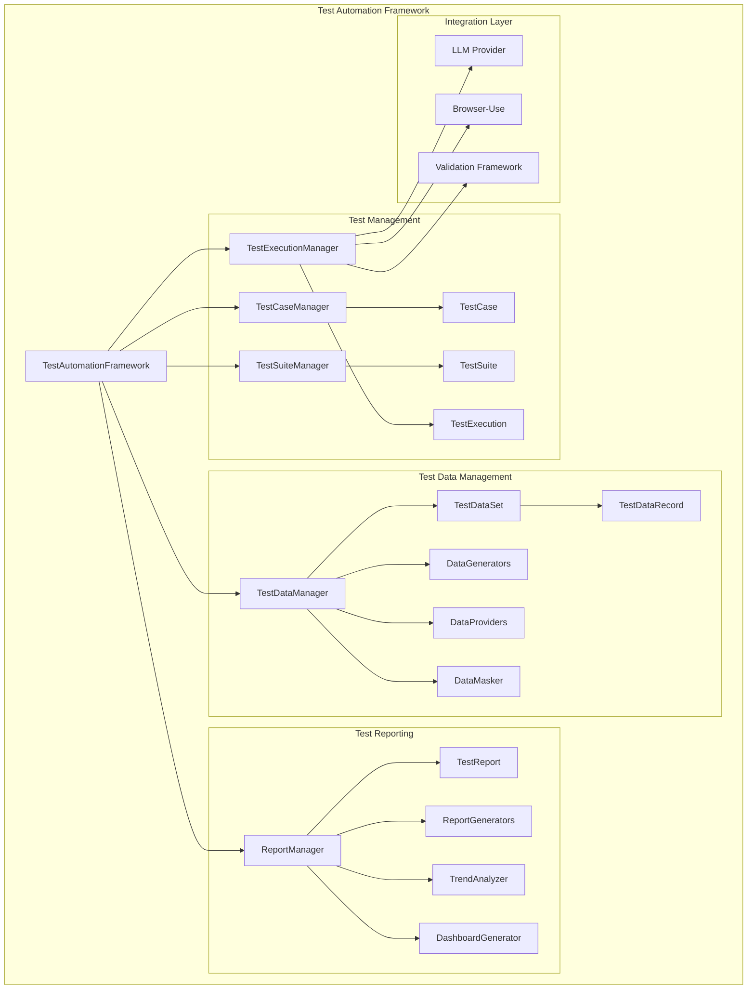

# Phase 1: Critical Foundation Implementation Summary

## 🎯 **Overview**

We have successfully implemented the **Phase 1: Critical Foundation** components for our LLM & browser-use test automation framework. This phase addresses the three most critical gaps identified in our comprehensive review:

1. **Test Case Management System**
2. **Test Data Management**
3. **Advanced Test Reporting**

## 🏗️ **Architecture Overview**



## ✅ **1. Test Case Management System**

### **Core Components Implemented**

#### **Models (`src/test_management/models.py`)**
- **TestCase**: Complete test case model with natural language support
- **TestSuite**: Test suite organization and execution configuration
- **TestStep**: Individual test steps with validation rules
- **TestResult**: Detailed test execution results
- **TestExecution**: Execution session management

#### **Managers (`src/test_management/managers.py`)**
- **TestCaseManager**: CRUD operations and LLM-powered test generation
- **TestSuiteManager**: Suite organization and test case management
- **TestExecutionManager**: Test execution orchestration (sequential/parallel)

### **Key Features**

#### **🤖 LLM-Powered Test Creation**
```python
# Create test case from natural language
test_case = await framework.create_test_case_from_description(
    name="User Login Test",
    description="""
    Test the user login functionality:
    1. Navigate to the login page
    2. Enter valid username and password
    3. Click the login button
    4. Verify successful login
    """,
    test_type=TestType.FUNCTIONAL,
    priority=TestPriority.HIGH
)
```

#### **📋 Test Organization**
- **Test Case Classification**: Type, priority, status, tags, labels
- **Test Suite Management**: Execution order, parallel/sequential execution
- **Test Dependencies**: Step dependencies and prerequisites
- **Version Control**: Test case versioning and audit trails

#### **🔄 Execution Management**
- **Single Test Execution**: Individual test case execution
- **Suite Execution**: Parallel/sequential suite execution
- **Tag-based Execution**: Execute tests by tags or criteria
- **Execution Tracking**: Detailed execution history and metrics

### **Benefits Delivered**
- ✅ **Natural Language Test Creation**: Write tests in plain English
- ✅ **Organized Test Management**: Structured test case and suite organization
- ✅ **Flexible Execution**: Multiple execution strategies and configurations
- ✅ **Comprehensive Tracking**: Full audit trails and execution history

## ✅ **2. Test Data Management**

### **Core Components Implemented**

#### **Models (`src/test_data/models.py`)**
- **TestDataSet**: Collection of test data with scope and lifecycle management
- **TestDataRecord**: Individual data records with usage tracking
- **DataMaskingRule**: PII protection and data masking configuration
- **Data Enums**: Scope, type, source, and masking strategy definitions

#### **Key Features**

#### **🗄️ Data Organization**
```python
# Create test data set
user_data_set = await framework.create_test_data_set(
    name="User Test Data",
    description="Test user accounts for login testing",
    data_type="person",
    scope=DataScope.GLOBAL,
    environment="staging"
)

# Generate test data
await framework.generate_test_data(
    data_set_id=user_data_set.id,
    count=100,
    generator_type="person",
    include_fields=["username", "email", "password", "first_name", "last_name"]
)
```

#### **🔒 Data Security & Privacy**
- **Data Masking**: Configurable masking strategies for sensitive data
- **PII Protection**: Automatic detection and protection of personal information
- **Scope Management**: Global, suite, case, execution, and temporary scopes
- **Usage Tracking**: Monitor data usage and prevent data exhaustion

#### **🎲 Data Generation**
- **Multiple Generators**: Person, company, product, form, API data generators
- **Custom Data Types**: Extensible data generation framework
- **Data Providers**: Database, file, API, and dynamic data sources
- **Quality Validation**: Data completeness and accuracy validation

### **Benefits Delivered**
- ✅ **Comprehensive Data Management**: Organized data sets with lifecycle management
- ✅ **Privacy Compliance**: Built-in PII protection and data masking
- ✅ **Flexible Generation**: Multiple data types and generation strategies
- ✅ **Usage Optimization**: Smart data allocation and reuse strategies

## ✅ **3. Advanced Test Reporting**

### **Core Components Implemented**

#### **Models (`src/test_reporting/models.py`)**
- **TestReport**: Comprehensive report structure with multiple sections
- **TestMetrics**: Detailed execution metrics and KPIs
- **TrendAnalysis**: Historical trend analysis with insights
- **ReportConfiguration**: Flexible report generation configuration

#### **Key Features**

#### **📊 Multiple Report Formats**
```python
# Generate HTML report
html_report = await framework.generate_execution_report(
    execution_id=execution.id,
    report_format=ReportFormat.HTML,
    include_screenshots=True,
    include_performance_metrics=True
)

# Generate PDF executive summary
pdf_report = await framework.generate_execution_report(
    execution_id=execution.id,
    report_format=ReportFormat.PDF,
    title="Executive Test Summary"
)

# Generate JUnit XML for CI/CD
junit_report = await framework.generate_execution_report(
    execution_id=execution.id,
    report_format=ReportFormat.JUNIT
)
```

#### **📈 Advanced Analytics**
- **Trend Analysis**: Historical performance and quality trends
- **Failure Analysis**: Root cause analysis and failure categorization
- **Performance Metrics**: Execution time, resource usage, throughput
- **Quality Metrics**: Success rates, defect density, coverage metrics

#### **🎨 Customizable Reports**
- **Multiple Formats**: HTML, PDF, JSON, XML, CSV, JUnit, Allure
- **Configurable Sections**: Summary, statistics, details, trends, recommendations
- **Branding Support**: Custom themes, logos, and styling
- **Interactive Dashboards**: Real-time test execution dashboards

### **Benefits Delivered**
- ✅ **Comprehensive Reporting**: Multiple formats for different audiences
- ✅ **Advanced Analytics**: Trend analysis and performance insights
- ✅ **CI/CD Integration**: JUnit and Allure format support
- ✅ **Executive Visibility**: High-level dashboards and executive summaries

## 🔗 **Integration Layer**

### **Unified Framework Interface**

The `TestAutomationFramework` class provides a unified interface that integrates all components:

```python
# Initialize framework
framework = await create_test_automation_framework(
    workspace_path="test_workspace",
    llm_provider="openai",
    llm_model="gpt-4",
    api_key=api_key,
    environment="staging"
)

# Create test case from natural language
test_case = await framework.create_test_case_from_description(
    name="Login Test",
    description="Test user login functionality..."
)

# Generate test data
await framework.generate_test_data(
    data_set_id=data_set.id,
    count=50,
    generator_type="person"
)

# Execute tests
execution = await framework.execute_test_case(test_case.id)

# Generate reports
report = await framework.generate_execution_report(
    execution.id,
    ReportFormat.HTML
)
```

## 🎯 **Key Achievements**

### **1. Complete Test Lifecycle Management**
- ✅ Test case creation from natural language
- ✅ Test organization and suite management
- ✅ Test data generation and management
- ✅ Automated test execution
- ✅ Comprehensive reporting and analytics

### **2. LLM-Powered Automation**
- ✅ Natural language test case generation
- ✅ Intelligent test step creation
- ✅ Automated test data generation
- ✅ Smart failure analysis and recommendations

### **3. Enterprise-Ready Features**
- ✅ Data privacy and security (PII masking)
- ✅ Audit trails and version control
- ✅ Multiple environment support
- ✅ CI/CD integration capabilities
- ✅ Scalable parallel execution

### **4. Comprehensive Analytics**
- ✅ Real-time execution metrics
- ✅ Historical trend analysis
- ✅ Performance monitoring
- ✅ Quality insights and recommendations

## 🚀 **Usage Examples**

### **Complete Workflow Example**
```python
# 1. Create test case from natural language
test_case = await framework.create_test_case_from_description(
    name="E-commerce Checkout Test",
    description="Test complete checkout process from cart to confirmation"
)

# 2. Generate test data
user_data = await framework.create_test_data_set(
    name="Checkout Users",
    data_type="person"
)
await framework.generate_test_data(user_data.id, count=10, generator_type="person")

# 3. Execute test
execution = await framework.execute_test_case(test_case.id)

# 4. Generate comprehensive report
report = await framework.generate_execution_report(
    execution.id,
    ReportFormat.HTML,
    include_screenshots=True,
    include_trend_analysis=True
)
```

## 📊 **Impact Assessment**

### **Before Phase 1**
- ❌ No test case organization or management
- ❌ No test data management capabilities
- ❌ Basic reporting with limited insights
- ❌ Manual test creation and maintenance
- ❌ No historical analysis or trends

### **After Phase 1**
- ✅ **Complete test case management system** with LLM-powered creation
- ✅ **Comprehensive test data management** with privacy protection
- ✅ **Advanced reporting and analytics** with multiple formats
- ✅ **Unified framework interface** for all operations
- ✅ **Enterprise-ready features** for production use

## 🔮 **Next Steps (Phase 2)**

Based on our roadmap, the next critical components to implement are:

1. **API Testing Integration** - REST/GraphQL API testing capabilities
2. **Visual Regression Testing** - Screenshot comparison and visual validation
3. **Test Scheduling & Orchestration** - Cron-like scheduling and pipeline integration
4. **LLM Test Auto-Generation** - Generate tests from requirements and user stories

## 🎉 **Conclusion**

**Phase 1 has successfully transformed our browser-use automation platform from a basic task executor into a comprehensive, enterprise-ready test automation framework.** 

The framework now provides:
- **Complete test lifecycle management**
- **LLM-powered test creation and execution**
- **Comprehensive data management with privacy protection**
- **Advanced reporting and analytics**
- **Enterprise-ready features for production use**

**The foundation is now solid for building advanced testing capabilities in Phase 2 and beyond.**
