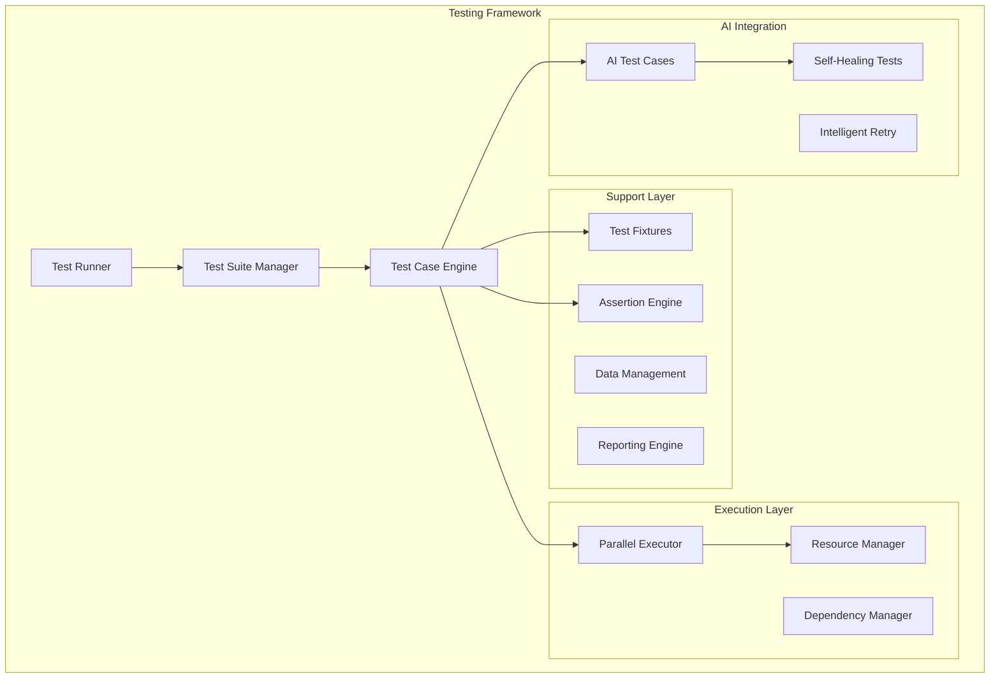

# Testing Framework Implementation Guide

## 🏗️ Overview

This guide provides comprehensive instructions for implementing and extending the Browser Automation Framework's testing system. It covers the core framework components, extension points, and best practices for building robust testing infrastructure.

## 📋 Table of Contents

- [Framework Architecture](#framework-architecture)
- [Core Components](#core-components)
- [Implementation Steps](#implementation-steps)
- [Extension Points](#extension-points)
- [Advanced Features](#advanced-features)
- [Integration Patterns](#integration-patterns)
- [Best Practices](#best-practices)

## 🏛️ Framework Architecture

### Testing Framework Structure



## 🔧 Core Components

### 1. Test Framework Base Classes

```python
# src/testing/test_framework.py
import asyncio
import uuid
from abc import ABC, abstractmethod
from typing import Dict, List, Any, Optional, Callable
from dataclasses import dataclass
from datetime import datetime
import logging

@dataclass
class TestResult:
    """Test execution result."""
    test_id: str
    test_name: str
    status: str  # passed, failed, skipped, error
    execution_time: float
    error_message: Optional[str] = None
    stack_trace: Optional[str] = None
    artifacts: Dict[str, Any] = None
    metadata: Dict[str, Any] = None

@dataclass
class TestConfiguration:
    """Test configuration settings."""
    name: str
    description: str
    tags: List[str]
    priority: str
    timeout: int
    retry_count: int
    parallel_safe: bool
    environment_requirements: Dict[str, Any]
    browser_requirements: Dict[str, Any]

class TestCase(ABC):
    """Base test case class."""
    
    def __init__(self, **config):
        self.id = str(uuid.uuid4())
        self.config = TestConfiguration(**config)
        self.logger = logging.getLogger(f"test.{self.config.name}")
        self.artifacts = {}
        self.metadata = {}
        self.start_time = None
        self.end_time = None
    
    async def setup(self):
        """Setup before test execution."""
        pass
    
    async def teardown(self):
        """Cleanup after test execution."""
        pass
    
    async def setup_class(self):
        """Setup before all test methods in this class."""
        pass
    
    async def teardown_class(self):
        """Cleanup after all test methods in this class."""
        pass
    
    @abstractmethod
    async def execute(self) -> TestResult:
        """Execute the test case."""
        pass
    
    async def capture_screenshot(self, name: str):
        """Capture screenshot for evidence."""
        if hasattr(self, 'page'):
            screenshot_path = f"screenshots/{self.id}_{name}.png"
            await self.page.screenshot(path=screenshot_path)
            self.artifacts[f"screenshot_{name}"] = screenshot_path
    
    async def save_page_content(self, name: str):
        """Save page content for analysis."""
        if hasattr(self, 'page'):
            content_path = f"content/{self.id}_{name}.html"
            content = await self.page.content()
            with open(content_path, 'w') as f:
                f.write(content)
            self.artifacts[f"content_{name}"] = content_path
    
    def log_performance_metrics(self, metrics: Dict[str, Any]):
        """Log performance metrics."""
        self.metadata["performance"] = metrics
        self.logger.info(f"Performance metrics: {metrics}")

class TestSuite:
    """Test suite for organizing and executing multiple test cases."""
    
    def __init__(self, name: str, description: str, **config):
        self.id = str(uuid.uuid4())
        self.name = name
        self.description = description
        self.config = config
        self.test_cases = []
        self.dependencies = []
        self.logger = logging.getLogger(f"suite.{name}")
        
    def add_test_case(self, test_case: TestCase):
        """Add a test case to the suite."""
        self.test_cases.append(test_case)
        self.logger.info(f"Added test case: {test_case.config.name}")
    
    def add_dependency(self, source: str, target: str):
        """Add dependency between test cases."""
        self.dependencies.append((source, target))
        self.logger.info(f"Added dependency: {source} -> {target}")
    
    async def setup_suite(self):
        """Setup before running the entire suite."""
        pass
    
    async def teardown_suite(self):
        """Cleanup after running the entire suite."""
        pass
    
    def get_execution_plan(self) -> Dict[str, Any]:
        """Get execution plan for the suite."""
        return {
            "execution_mode": self.config.get("execution_mode", "sequential"),
            "max_workers": self.config.get("max_workers", 1),
            "timeout": self.config.get("timeout", 3600),
            "retry_failed": self.config.get("retry_failed", False)
        }

class AITestCase(TestCase):
    """AI-powered test case with intelligent capabilities."""
    
    def __init__(self, **config):
        super().__init__(**config)
        self.ai_config = config.get("ai_config", {})
        self.ai_provider = None
        self.self_healing_enabled = self.ai_config.get("enable_self_healing", False)
    
    async def setup(self):
        """Setup AI components."""
        await super().setup()
        
        # Initialize AI provider
        from src.llm.conversation_manager import ConversationManager
        self.ai_provider = ConversationManager(
            provider=self.ai_config.get("llm_provider", "openai"),
            model=self.ai_config.get("model", "gpt-4")
        )
    
    async def execute_with_ai_assistance(self, test_method: Callable):
        """Execute test with AI assistance and self-healing."""
        max_attempts = 3
        
        for attempt in range(max_attempts):
            try:
                result = await test_method()
                return result
            except Exception as e:
                if self.self_healing_enabled and attempt < max_attempts - 1:
                    self.logger.warning(f"Test failed, attempting AI-powered healing: {e}")
                    
                    # Use AI to analyze failure and suggest fixes
                    healing_result = await self._attempt_self_healing(e)
                    
                    if healing_result.success:
                        self.logger.info("Self-healing successful, retrying test")
                        continue
                    else:
                        self.logger.error("Self-healing failed")
                
                raise e
    
    async def _attempt_self_healing(self, error: Exception):
        """Attempt to heal test failure using AI."""
        # Capture current page state
        page_screenshot = await self.page.screenshot()
        page_content = await self.page.content()
        
        # Ask AI to analyze the failure
        healing_prompt = f"""
        Test failed with error: {error}
        
        Page content: {page_content[:1000]}...
        
        Please analyze the failure and suggest specific actions to fix it.
        Consider common issues like:
        - Element selectors that may have changed
        - Timing issues requiring waits
        - Page structure changes
        - Network or loading issues
        
        Provide specific code fixes or alternative approaches.
        """
        
        ai_response = await self.ai_provider.get_response(healing_prompt)
        
        # Parse AI response and attempt fixes
        # This would contain logic to interpret AI suggestions
        # and apply them to the test
        
        return {"success": False, "suggestions": ai_response}

class PerformanceTestCase(TestCase):
    """Performance-focused test case with monitoring."""
    
    def __init__(self, **config):
        super().__init__(**config)
        self.performance_config = config.get("performance_config", {})
        self.performance_monitor = None
    
    async def setup(self):
        """Setup performance monitoring."""
        await super().setup()
        
        from src.testing.performance import PerformanceMonitor
        self.performance_monitor = PerformanceMonitor(
            max_response_time=self.performance_config.get("max_response_time", 5000),
            max_memory_usage=self.performance_config.get("max_memory_usage", 512),
            min_throughput=self.performance_config.get("min_throughput", 10)
        )
    
    async def execute_with_performance_monitoring(self, test_method: Callable):
        """Execute test with performance monitoring."""
        # Start performance monitoring
        await self.performance_monitor.start_monitoring()
        
        try:
            # Execute the test
            result = await test_method()
            
            # Get performance metrics
            metrics = await self.performance_monitor.get_metrics()
            
            # Validate performance requirements
            await self._validate_performance_requirements(metrics)
            
            # Log performance data
            self.log_performance_metrics(metrics)
            
            return result
            
        finally:
            await self.performance_monitor.stop_monitoring()
    
    async def _validate_performance_requirements(self, metrics: Dict[str, Any]):
        """Validate that performance requirements are met."""
        max_response_time = self.performance_config.get("max_response_time", 5000)
        if metrics.get("response_time", 0) > max_response_time:
            raise AssertionError(
                f"Response time {metrics['response_time']}ms exceeds limit {max_response_time}ms"
            )
        
        max_memory = self.performance_config.get("max_memory_usage", 512)
        if metrics.get("memory_usage_mb", 0) > max_memory:
            raise AssertionError(
                f"Memory usage {metrics['memory_usage_mb']}MB exceeds limit {max_memory}MB"
            )

class ChainedTestCase(TestCase):
    """Test case with support for chained execution and shared state."""
    
    def __init__(self, **config):
        super().__init__(**config)
        self.test_chain = []
        self.shared_state = {}
        self.dependencies = []
    
    async def execute_chain(self):
        """Execute the test chain in order."""
        results = []
        
        for test_method in self.test_chain:
            try:
                # Check dependencies
                await self._check_dependencies(test_method)
                
                # Execute test method
                result = await test_method()
                results.append({
                    "method": test_method.__name__,
                    "status": "passed",
                    "result": result
                })
                
                self.logger.info(f"Chain step {test_method.__name__} completed successfully")
                
            except Exception as e:
                results.append({
                    "method": test_method.__name__,
                    "status": "failed",
                    "error": str(e)
                })
                
                self.logger.error(f"Chain step {test_method.__name__} failed: {e}")
                
                # Stop chain execution on failure
                break
        
        return results
    
    async def _check_dependencies(self, test_method: Callable):
        """Check if dependencies for test method are satisfied."""
        method_name = test_method.__name__
        
        for dependency in self.dependencies:
            if dependency.test == method_name:
                for required_state in dependency.requires:
                    if required_state not in self.shared_state:
                        raise RuntimeError(
                            f"Test {method_name} requires {required_state} but it's not available"
                        )
```
