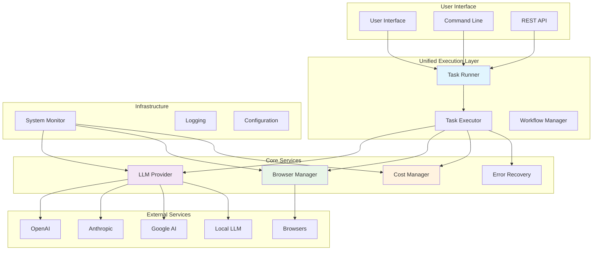
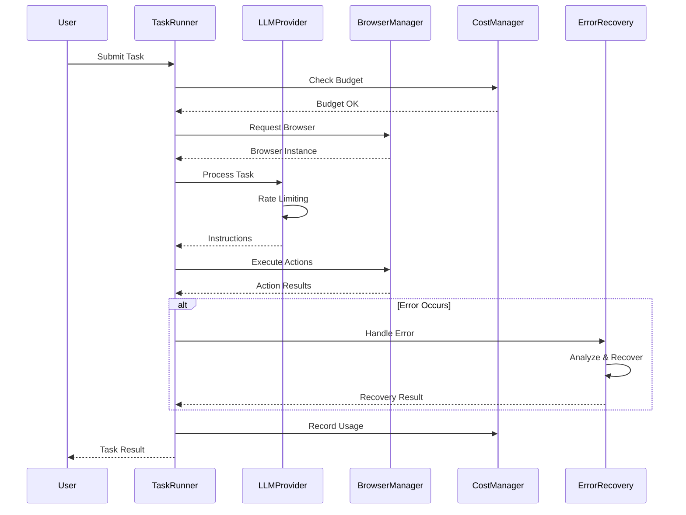
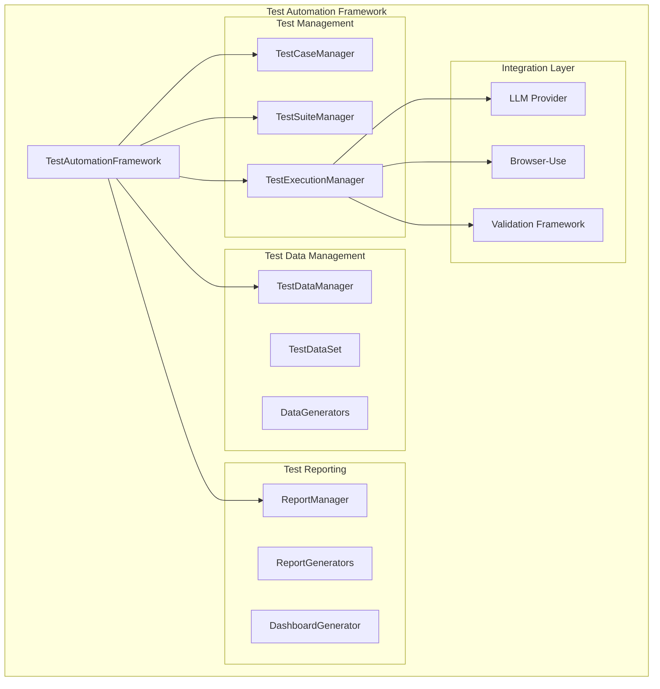
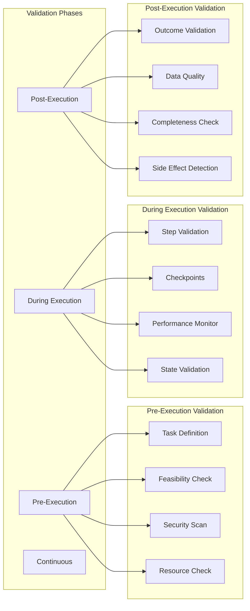
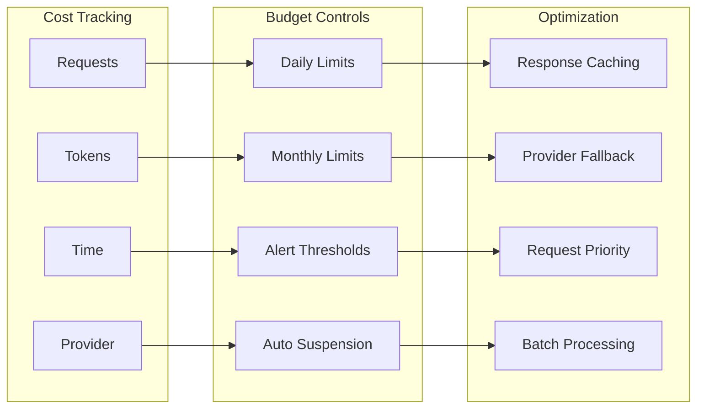
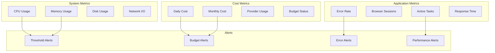

# Browser Use Automation - User Guide

Welcome to the Browser Use Automation platform! This guide will help you get started with automating browser tasks using our advanced platform.

## 🚀 Quick Start

### Prerequisites

- Python 3.12 or higher
- UV package manager (recommended) or pip
- API keys for LLM providers (OpenAI, Anthropic, or Google)

### Installation

#### Option 1: Automated Setup (Recommended)

**Unix/macOS:**
```bash
git clone <repository-url>
cd browser-use-automation
./scripts/setup-uv.sh
```

**Windows:**
```cmd
git clone <repository-url>
cd browser-use-automation
scripts\setup-uv.bat
```

#### Option 2: Manual Setup

```bash
# Install UV if not already installed
curl -LsSf https://astral.sh/uv/install.sh | sh

# Clone and setup
git clone <repository-url>
cd browser-use-automation
uv sync
uv run playwright install
cp .env.example .env
# Edit .env with your API keys
```

### Configuration

Edit the `.env` file with your settings:

```bash
# LLM Provider API Keys (at least one required)
OPENAI_API_KEY=your_openai_api_key_here
ANTHROPIC_API_KEY=your_anthropic_api_key_here
GOOGLE_API_KEY=your_google_api_key_here

# Application Settings
LOG_LEVEL=INFO
ENVIRONMENT=development

# Browser Settings
HEADLESS=false
BROWSER_TIMEOUT=30

# Cost Management
ENABLE_COST_TRACKING=true
DAILY_BUDGET_LIMIT=100.0
MONTHLY_BUDGET_LIMIT=1000.0
```

## 🏗️ Platform Architecture



## 📋 Basic Usage

### Framework Quick Start

```python
import asyncio
from src.test_automation_framework import create_test_automation_framework

async def quick_start():
    # Initialize the complete test automation framework
    framework = await create_test_automation_framework(
        workspace_path="my_tests",
        llm_provider="openai",
        llm_model="gpt-4",
        api_key="your-api-key",
        environment="staging"
    )

    # Create a test case from natural language
    test_case = await framework.create_test_case_from_description(
        name="Login Test",
        description="""
        Test the login functionality:
        1. Navigate to the login page
        2. Enter username and password
        3. Click login button
        4. Verify successful login
        """,
        priority="high",
        tags=["login", "authentication"]
    )

    # Execute the test
    execution = await framework.execute_test_case(test_case.id)

    # Generate a report
    report = await framework.generate_execution_report(
        execution.id,
        format="html"
    )

    print(f"Test completed: {execution.status}")
    print(f"Report generated: {report.file_path}")

if __name__ == "__main__":
    asyncio.run(quick_start())
```

### Advanced LLM Test Features (NEW)

The framework now includes advanced LLM-powered features for intelligent test automation:

#### Test Case Auto-Generation from Requirements

```python
import asyncio
from src.test_automation_framework import create_test_automation_framework

async def generate_tests_from_requirements():
    # Initialize framework
    framework = await create_test_automation_framework(
        workspace_path="my_tests",
        llm_provider="openai",
        llm_model="gpt-4",
        api_key="your-api-key"
    )

    # Requirements document
    requirements = """
    User Authentication System:
    - Users can register with email and password
    - Users can login with valid credentials
    - Account locks after 3 failed attempts
    - Password reset functionality via email

    Shopping Cart:
    - Users can add products to cart
    - Cart persists across sessions
    - Users can modify quantities
    - Automatic total calculation
    """

    # Generate comprehensive test cases from requirements
    test_cases = await framework.generate_test_cases_from_requirements(
        requirements_document=requirements,
        test_coverage_level="comprehensive",  # basic, standard, comprehensive, exhaustive
        target_url="https://myapp.com"
    )

    print(f"Generated {len(test_cases)} test cases from requirements")
    for test_case in test_cases:
        print(f"- {test_case.name} ({test_case.test_type.value})")

asyncio.run(generate_tests_from_requirements())
```

#### Test Maintenance for UI Changes

```python
async def maintain_tests_for_ui_changes():
    framework = await create_test_automation_framework(
        workspace_path="my_tests",
        llm_provider="openai",
        llm_model="gpt-4",
        api_key="your-api-key"
    )

    # Describe UI changes
    ui_changes = """
    Login Page Updates:
    - Email field ID changed from 'email' to 'user-email-input'
    - Login button text changed from 'Login' to 'Sign In'
    - Added 'Remember Me' checkbox
    - Added social login buttons
    """

    # Analyze impact on existing test cases
    impact_analysis = await framework.analyze_ui_changes_impact(
        ui_changes_description=ui_changes,
        affected_test_case_ids=["tc_001", "tc_002"]  # Optional: specific test cases
    )

    print(f"Overall Impact: {impact_analysis['overall_impact']}")
    print(f"Affected Tests: {len(impact_analysis['test_case_impacts'])}")

    # Update specific test case for changes
    updated_test_case = await framework.update_test_case_for_changes(
        test_case_id="tc_001",
        change_description=ui_changes,
        update_strategy="smart"  # smart, conservative, aggressive
    )

    print(f"Updated: {updated_test_case.name} (v{updated_test_case.version})")

    # Bulk update multiple test cases
    updated_cases = await framework.bulk_update_test_cases_for_changes(
        test_case_ids=["tc_001", "tc_002", "tc_003"],
        change_description=ui_changes,
        update_strategy="smart"
    )

    print(f"Bulk updated {len(updated_cases)} test cases")

asyncio.run(maintain_tests_for_ui_changes())
```

### Running Simple Tasks (Legacy)

```bash
# Run a basic browser automation task
uv run python main.py

# Run with specific task
uv run python -c "
from utils.task_runner import run_task
from src.execution.llm_provider import create_llm_provider
import asyncio

async def main():
    llm = await create_llm_provider('openai', 'gpt-4')
    result = await run_task(
        'Navigate to google.com and search for \"browser automation\"',
        llm,
        'logs/search_task'
    )
    print(result)

asyncio.run(main())
"
```

### Task Execution Flow



## 🧪 Test Automation Framework

The platform now includes a comprehensive test automation framework that provides enterprise-grade test management, data management, and reporting capabilities.

### Framework Architecture



### Test Case Management

#### Creating Test Cases from Natural Language

```python
# Create test case from natural language description
test_case = await framework.create_test_case_from_description(
    name="E-commerce Checkout Test",
    description="""
    Test the complete checkout process:
    1. Navigate to the product page
    2. Add items to cart
    3. Proceed to checkout
    4. Fill in shipping information
    5. Select payment method
    6. Complete the purchase
    7. Verify order confirmation
    """,
    test_type="e2e",
    priority="critical",
    target_url="https://shop.example.com",
    tags=["checkout", "e2e", "payment"],
    environment="staging"
)
```

#### Test Suite Management

```python
# Create test suite
regression_suite = await framework.create_test_suite(
    name="Regression Test Suite",
    description="Core functionality regression tests",
    test_case_ids=[login_test.id, search_test.id, checkout_test.id],
    parallel_execution=True,
    max_parallel_workers=3,
    stop_on_failure=False
)

# Add more test cases to suite
await framework.add_test_cases_to_suite(
    regression_suite.id,
    [new_test_case.id]
)
```

#### Test Execution

```python
# Execute single test case
execution = await framework.execute_test_case(
    test_case_id=test_case.id,
    environment="staging",
    validation_config=get_validation_config("comprehensive")
)

# Execute test suite
suite_execution = await framework.execute_test_suite(
    test_suite_id=regression_suite.id,
    environment="production"
)

# Execute tests by tags
critical_execution = await framework.execute_test_cases_by_tags(
    tags=["critical", "smoke"],
    environment="staging"
)
```

### Test Data Management

#### Creating and Managing Test Data

```python
# Create test data set
user_data_set = await framework.create_test_data_set(
    name="User Test Data",
    description="Test user accounts for login testing",
    data_type="person",
    scope="global",  # Available to all tests
    environment="staging"
)

# Generate test data
await framework.generate_test_data(
    data_set_id=user_data_set.id,
    count=100,
    generator_type="person",
    include_fields=["username", "email", "password", "first_name", "last_name"]
)

# Get test data for use in tests
user_data = await framework.get_test_data(
    data_set_id=user_data_set.id,
    criteria={"role": "admin"}  # Get specific data
)
```

#### Data Scopes and Privacy

```python
# Different data scopes
global_data = await framework.create_test_data_set(
    name="Global Users",
    scope="global"  # Available to all tests
)

suite_data = await framework.create_test_data_set(
    name="Suite-specific Data",
    scope="suite"  # Available only to specific test suite
)

execution_data = await framework.create_test_data_set(
    name="Execution Data",
    scope="execution"  # Available only during specific execution
)

# Data masking for privacy
sensitive_data = await framework.create_test_data_set(
    name="Sensitive Data",
    masking_enabled=True,
    masking_rules=[
        {"field": "ssn", "strategy": "partial"},
        {"field": "credit_card", "strategy": "tokenize"}
    ]
)
```

### Advanced Test Reporting

#### Multiple Report Formats

```python
# Generate HTML report with full details
html_report = await framework.generate_execution_report(
    execution_id=execution.id,
    report_format="html",
    title="Comprehensive Test Report",
    include_screenshots=True,
    include_performance_metrics=True,
    include_failure_analysis=True
)

# Generate PDF executive summary
pdf_report = await framework.generate_execution_report(
    execution_id=execution.id,
    report_format="pdf",
    title="Executive Test Summary",
    include_screenshots=False,
    include_logs=False
)

# Generate JUnit XML for CI/CD integration
junit_report = await framework.generate_execution_report(
    execution_id=execution.id,
    report_format="junit",
    title="CI/CD Integration Report"
)
```

#### Trend Analysis and Dashboards

```python
# Generate trend analysis report
trend_report = await framework.generate_trend_report(
    days=30,
    environment="staging",
    report_format="html",
    title="30-Day Quality Trends"
)

# Generate real-time dashboard
dashboard_url = await framework.generate_dashboard(
    title="Test Automation Dashboard",
    environment="staging",
    auto_refresh=True,
    refresh_interval=30
)
```

## 🎯 Common Use Cases

### 1. Web Scraping

```python
from utils.task_runner import run_task
from src.execution.llm_provider import create_llm_provider

async def scrape_website():
    llm = await create_llm_provider('openai', 'gpt-4')
    
    task = """
    Navigate to https://example.com
    Extract all product names and prices
    Save the data to a JSON file
    """
    
    result = await run_task(task, llm, 'logs/scraping')
    return result
```

### 2. Form Automation

```python
async def fill_form():
    llm = await create_llm_provider('anthropic', 'claude-3-sonnet')
    
    task = """
    Navigate to https://forms.example.com
    Fill out the contact form with:
    - Name: John Doe
    - Email: john@example.com
    - Message: Test automation message
    Submit the form and confirm success
    """
    
    result = await run_task(task, llm, 'logs/form_filling')
    return result
```

### 3. Testing Workflows

```python
async def test_login_flow():
    llm = await create_llm_provider('google', 'gemini-pro')

    task = """
    Navigate to https://app.example.com/login
    Enter username: testuser@example.com
    Enter password: testpassword123
    Click login button
    Verify successful login by checking for dashboard elements
    Take a screenshot of the dashboard
    """

    result = await run_task(task, llm, 'logs/login_test')
    return result
```

### 4. Validation-Enhanced Workflows

```python
from src.validation import ValidationConfig, get_validation_config

async def validated_scraping():
    llm = await create_llm_provider('openai', 'gpt-4')

    # Use comprehensive validation
    validation_config = get_validation_config('comprehensive')

    task = """
    Navigate to https://example.com/products
    Extract product data with validation:
    - Ensure all required fields are present
    - Validate data formats and types
    - Check for completeness and accuracy
    - Monitor performance metrics
    """

    result = await run_task(task, llm, 'logs/validated_scraping', validation_config)
    return result
```

## ✅ Validation Framework

The platform includes a comprehensive validation framework that ensures task execution quality and correctness across multiple phases and dimensions.

### Validation Levels

```python
from src.validation import get_validation_config

# Basic validation (minimal overhead)
basic_config = get_validation_config('basic')

# Standard validation (recommended)
standard_config = get_validation_config('standard')

# Comprehensive validation (maximum assurance)
comprehensive_config = get_validation_config('comprehensive')

# Paranoid validation (maximum validation)
paranoid_config = get_validation_config('paranoid')
```

### Validation Phases



### Custom Validation Configuration

```python
from src.validation import ValidationConfig, ValidationLevel, ValidationType

# Create custom validation configuration
custom_config = ValidationConfig(
    validation_level=ValidationLevel.STANDARD,
    enabled_types=[
        ValidationType.FUNCTIONAL,
        ValidationType.DATA_QUALITY,
        ValidationType.PERFORMANCE
    ],

    # Evidence collection
    collect_evidence=True,
    evidence_types=[
        "screenshots", "execution_logs",
        "performance_metrics", "dom_snapshots"
    ],

    # LLM validation
    enable_llm_validation=True,
    llm_self_validation=True,

    # Data quality thresholds
    data_completeness_threshold=0.95,
    data_accuracy_threshold=0.90,

    # Performance monitoring
    performance_monitoring=True,
    max_execution_time=60.0,
    memory_threshold=0.80
)

# Use custom validation
result = await run_task(task, llm, save_path, custom_config)
```

### Validation Types

#### 1. Functional Validation
- Task completion verification
- Expected outcome validation
- Business rule compliance
- Error detection and handling

#### 2. Data Quality Validation
- Completeness assessment
- Accuracy verification
- Consistency checking
- Format compliance
- Uniqueness validation

#### 3. Performance Validation
- Execution time monitoring
- Resource usage tracking
- Throughput measurement
- Baseline comparison

#### 4. Security Validation
- URL safety checking
- Sensitive data detection
- Input sanitization
- Privacy compliance

#### 5. LLM Validation
- Task understanding verification
- Response quality assessment
- Self-validation capabilities
- Cross-validation support

### Evidence Collection

The validation framework automatically collects evidence during execution:

```python
# Evidence types collected
evidence_types = [
    "screenshots",        # Visual evidence of execution
    "dom_snapshots",     # HTML snapshots at key points
    "execution_logs",    # Detailed step-by-step logs
    "network_logs",      # Network request/response data
    "performance_metrics", # System and task performance
    "validation_results"  # Validation outcomes and issues
]

# Access collected evidence
validation_result = await engine.complete_validation()
evidence_paths = validation_result.evidence_paths
print(f"Evidence collected: {len(evidence_paths)} files")
```

### Validation Results

```python
# Get validation summary
summary = validation_result.get_summary()
print(f"Overall status: {summary['overall_status']}")
print(f"Success rate: {summary['success_rate']:.2%}")
print(f"Total issues: {summary['total_issues']}")

# Get detailed issues
all_issues = validation_result.get_all_issues()
for issue in all_issues:
    print(f"{issue.severity.value}: {issue.message}")
    if issue.suggestion:
        print(f"  Suggestion: {issue.suggestion}")

# Check validation success
if validation_result.is_successful:
    print("✅ Validation passed")
else:
    print("❌ Validation failed")
    print(f"Errors: {len(validation_result.get_issues_by_severity(ValidationSeverity.ERROR))}")
```

## 💰 Cost Management

### Understanding Costs

The platform tracks costs across multiple dimensions:



### Setting Budgets

```python
from src.infrastructure.cost_management import CostManager, CostBudget, CostPeriod

# Configure cost management
cost_manager = CostManager()

# Set daily budget
cost_manager.set_budget("daily", CostBudget(
    period=CostPeriod.DAILY,
    limit=50.0,  # $50 per day
    warning_threshold=0.8,  # Alert at 80%
    auto_suspend=True
))

# Set monthly budget
cost_manager.set_budget("monthly", CostBudget(
    period=CostPeriod.MONTHLY,
    limit=1000.0,  # $1000 per month
    warning_threshold=0.9,  # Alert at 90%
    auto_suspend=True
))
```

### Monitoring Usage

```bash
# Check current usage
uv run python -c "
from src.infrastructure.cost_management import CostManager
cm = CostManager()
print('Daily usage:', cm.get_usage_summary('daily'))
print('Monthly usage:', cm.get_usage_summary('monthly'))
"
```

## 🔧 Configuration Options

### LLM Provider Configuration

```python
# Primary provider with fallback
llm = await create_llm_provider(
    primary_provider="openai",
    primary_model="gpt-4",
    primary_config={"api_key": "your-key"},
    fallback_provider="anthropic",
    fallback_model="claude-3-sonnet",
    fallback_config={"api_key": "your-key"}
)
```

### Browser Configuration

```python
from src.execution.browser_manager import EnhancedBrowserManager

browser_manager = EnhancedBrowserManager(
    memory_threshold=0.8,  # Cleanup at 80% memory
    cleanup_interval=300,  # Cleanup every 5 minutes
    max_session_duration=3600  # 1 hour max session
)
```

### Rate Limiting Configuration

```python
from src.infrastructure.cost_management import AdvancedRateLimiter

rate_limiter = AdvancedRateLimiter(
    requests_per_minute=60,
    tokens_per_minute=90000,
    cost_per_minute=10.0,
    adaptive=True  # Automatically adjust based on performance
)
```

## 📊 Monitoring and Alerts

### System Health Dashboard



### Setting Up Monitoring

```python
from src.monitoring.system_monitor import SystemMonitor

# Create monitor with custom thresholds
monitor = SystemMonitor(
    monitoring_interval=30,  # Check every 30 seconds
    alert_thresholds={
        "memory_usage": 0.85,      # 85% memory
        "error_rate": 0.1,         # 10% error rate
        "response_time": 10.0,     # 10 seconds
        "cost_budget": 0.9,        # 90% of budget
        "browser_sessions": 50     # Max 50 sessions
    }
)

# Add alert callback
def handle_alert(alert_type, alert_data):
    print(f"ALERT: {alert_type} - {alert_data['message']}")

monitor.add_alert_callback(handle_alert)

# Start monitoring
await monitor.start_monitoring()
```

## 🚨 Troubleshooting

### Common Issues

#### 1. API Key Issues
```bash
# Check API key configuration
uv run python -c "
import os
from dotenv import load_dotenv
load_dotenv()
print('OpenAI:', 'SET' if os.getenv('OPENAI_API_KEY') else 'NOT SET')
print('Anthropic:', 'SET' if os.getenv('ANTHROPIC_API_KEY') else 'NOT SET')
print('Google:', 'SET' if os.getenv('GOOGLE_API_KEY') else 'NOT SET')
"
```

#### 2. Browser Issues
```bash
# Reinstall browser dependencies
uv run playwright install
```

#### 3. Memory Issues
```bash
# Check system resources
uv run python -c "
from src.execution.browser_manager import EnhancedBrowserManager
bm = EnhancedBrowserManager()
print(bm.get_resource_stats())
"
```

#### 4. Cost Limit Reached
```bash
# Check cost status
uv run python -c "
from src.infrastructure.cost_management import CostManager
cm = CostManager()
print('Suspended providers:', list(cm.suspended_providers.keys()))
"
```

### Getting Help

1. **Check Logs**: Look in the `logs/` directory for detailed error information
2. **Run Diagnostics**: Use `uv run python scripts/verify-setup.py`
3. **Monitor System**: Check the monitoring dashboard for system health
4. **Review Documentation**: Check the `docs/` directory for detailed guides

## 📚 Next Steps

- **Developer Guide**: See `docs/developer-guide.md` for development information
- **API Reference**: Check `docs/api/` for detailed API documentation
- **Examples**: Explore `examples/` directory for sample workflows
- **Advanced Configuration**: See `docs/configuration.md` for advanced options

## 🆘 Support

- **Documentation**: Complete guides in `docs/` directory
- **Issues**: Report bugs via GitHub Issues
- **Discussions**: Join community discussions
- **Examples**: Check `examples/` for sample code
