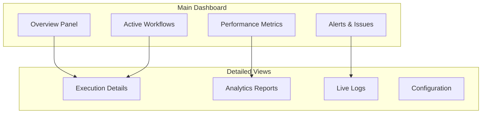

# Dashboard & Monitoring Guide

Monitor, analyze, and optimize your browser automation workflows with comprehensive real-time dashboards and advanced analytics.

## 🎯 Overview

The Browser Automation Framework provides enterprise-grade monitoring and analytics through:

- **Real-Time Dashboards**: Live workflow execution monitoring
- **Performance Analytics**: Detailed metrics and trend analysis  
- **AI Insights**: Intelligent recommendations and optimization suggestions
- **Custom Reporting**: Automated reports and alerts

## 🚀 Quick Start

### Accessing the Dashboard

```bash
# Start the framework with dashboard enabled
docker-compose up -d

# Access the web dashboard
open http://localhost:8001/dashboard

# Or use the CLI dashboard
python -m src.cli dashboard --live
```

### Dashboard Overview

The main dashboard provides:



## 📊 Real-Time Monitoring

### Workflow Execution Dashboard

```python
# Access real-time workflow data
from src.analytics.dashboard import DashboardAPI

dashboard = DashboardAPI()

# Get live workflow status
live_data = await dashboard.get_live_workflows()
print(f"Active workflows: {live_data['active_count']}")
print(f"Queued workflows: {live_data['queued_count']}")
print(f"Success rate: {live_data['success_rate']}%")
```

### Performance Metrics

Key metrics displayed in real-time:

| Metric | Description | Threshold |
|--------|-------------|-----------|
| **Throughput** | Workflows/minute | >10 (Good) |
| **Response Time** | Average execution time | <30s (Good) |
| **Success Rate** | Successful completions | >95% (Good) |
| **Error Rate** | Failed executions | <5% (Good) |
| **Resource Usage** | CPU/Memory utilization | <80% (Good) |
| **Queue Depth** | Pending workflows | <50 (Good) |

### Live Execution Tracking

```python
# Track individual workflow execution
execution_id = "workflow_123"
tracker = await dashboard.track_execution(execution_id)

# Real-time updates
async for update in tracker.stream_updates():
    print(f"Task: {update['task_name']}")
    print(f"Status: {update['status']}")
    print(f"Progress: {update['progress']}%")
    print(f"Duration: {update['duration']}s")
```

## 📈 Analytics & Reporting

### Performance Analytics

```python
# Generate performance reports
from src.analytics.reporting_engine import AnalyticsEngine

analytics = AnalyticsEngine()

# Daily performance report
daily_report = await analytics.generate_report(
    report_type="performance",
    time_range="last_24_hours",
    include_trends=True
)

print(f"Total executions: {daily_report['total_executions']}")
print(f"Average duration: {daily_report['avg_duration']}s")
print(f"Peak throughput: {daily_report['peak_throughput']} workflows/min")
```

### Trend Analysis

```python
# Analyze performance trends
trend_analysis = await analytics.analyze_trends(
    metrics=["throughput", "success_rate", "response_time"],
    time_range="last_7_days",
    granularity="hourly"
)

# Identify patterns
patterns = trend_analysis['patterns']
for pattern in patterns:
    print(f"Pattern: {pattern['type']}")
    print(f"Confidence: {pattern['confidence']}%")
    print(f"Recommendation: {pattern['recommendation']}")
```

### Custom Dashboards

```python
# Create custom dashboard widgets
custom_dashboard = {
    "name": "E-commerce Monitoring",
    "widgets": [
        {
            "type": "metric_card",
            "title": "Product Scraping Success Rate",
            "metric": "workflow_success_rate",
            "filter": {"workflow_type": "product_scraping"}
        },
        {
            "type": "time_series",
            "title": "Hourly Throughput",
            "metrics": ["completed_workflows"],
            "time_range": "last_24_hours"
        },
        {
            "type": "error_breakdown",
            "title": "Error Analysis",
            "group_by": "error_type"
        }
    ]
}

await dashboard.create_custom_dashboard(custom_dashboard)
```

## 🤖 AI-Powered Insights

### Intelligent Recommendations

```python
# Get AI-powered optimization suggestions
from src.intelligence.analytics_ai import AnalyticsAI

ai_analytics = AnalyticsAI()

recommendations = await ai_analytics.get_recommendations(
    workflow_id="product_scraping_workflow",
    analysis_period="last_week"
)

for rec in recommendations:
    print(f"Category: {rec['category']}")
    print(f"Suggestion: {rec['suggestion']}")
    print(f"Expected Impact: {rec['expected_impact']}")
    print(f"Implementation: {rec['implementation_guide']}")
```

### Anomaly Detection

```python
# Detect performance anomalies
anomalies = await ai_analytics.detect_anomalies(
    metrics=["response_time", "error_rate", "throughput"],
    sensitivity="medium",
    time_range="last_24_hours"
)

for anomaly in anomalies:
    print(f"Anomaly Type: {anomaly['type']}")
    print(f"Severity: {anomaly['severity']}")
    print(f"Time: {anomaly['timestamp']}")
    print(f"Description: {anomaly['description']}")
    print(f"Suggested Action: {anomaly['suggested_action']}")
```

### Predictive Analytics

```python
# Forecast future performance
forecast = await ai_analytics.generate_forecast(
    metric="throughput",
    forecast_horizon="next_7_days",
    confidence_interval=0.95
)

print(f"Predicted peak load: {forecast['peak_load']}")
print(f"Recommended scaling: {forecast['scaling_recommendation']}")
print(f"Resource requirements: {forecast['resource_forecast']}")
```

## 🚨 Alerting & Notifications

### Alert Configuration

```yaml
# Configure alerts in dashboard_config.yaml
alerts:
  performance:
    - name: "High Error Rate"
      condition: "error_rate > 10%"
      duration: "5 minutes"
      severity: "critical"
      
    - name: "Slow Response Time"
      condition: "avg_response_time > 60s"
      duration: "10 minutes"
      severity: "warning"
      
  resource:
    - name: "High Memory Usage"
      condition: "memory_usage > 85%"
      duration: "5 minutes"
      severity: "warning"
      
  business:
    - name: "Low Success Rate"
      condition: "success_rate < 90%"
      duration: "15 minutes"
      severity: "critical"

notification_channels:
  email:
    enabled: true
    recipients: ["admin@company.com"]
    
  slack:
    enabled: true
    webhook_url: "${SLACK_WEBHOOK_URL}"
    channel: "#automation-alerts"
    
  webhook:
    enabled: true
    url: "https://your-system.com/webhooks/alerts"
```

### Real-Time Alerts

```python
# Set up real-time alert monitoring
from src.monitoring.alert_manager import AlertManager

alert_manager = AlertManager()

# Subscribe to alerts
async for alert in alert_manager.stream_alerts():
    print(f"Alert: {alert['name']}")
    print(f"Severity: {alert['severity']}")
    print(f"Message: {alert['message']}")
    print(f"Timestamp: {alert['timestamp']}")
    
    # Auto-respond to critical alerts
    if alert['severity'] == 'critical':
        await alert_manager.trigger_auto_response(alert)
```

## 📊 Dashboard Widgets

### Available Widget Types

```python
# Standard dashboard widgets
widget_types = {
    "metric_cards": {
        "description": "Key performance indicators",
        "examples": ["success_rate", "throughput", "response_time"]
    },
    "time_series": {
        "description": "Metrics over time",
        "examples": ["execution_trends", "error_patterns"]
    },
    "pie_charts": {
        "description": "Distribution analysis", 
        "examples": ["workflow_types", "error_breakdown"]
    },
    "heat_maps": {
        "description": "Activity patterns",
        "examples": ["execution_schedule", "resource_usage"]
    },
    "tables": {
        "description": "Detailed data views",
        "examples": ["recent_executions", "error_logs"]
    },
    "gauges": {
        "description": "Current status indicators",
        "examples": ["system_health", "queue_depth"]
    }
}
```

### Custom Widget Creation

```python
# Create custom widgets
custom_widget = {
    "type": "custom_metric",
    "title": "Business KPI Dashboard",
    "data_source": "custom_query",
    "query": """
        SELECT 
            DATE(created_at) as date,
            COUNT(*) as total_workflows,
            AVG(duration) as avg_duration,
            SUM(CASE WHEN status = 'success' THEN 1 ELSE 0 END) as successful
        FROM workflow_executions 
        WHERE created_at >= NOW() - INTERVAL 7 DAY
        GROUP BY DATE(created_at)
    """,
    "visualization": {
        "type": "multi_line_chart",
        "x_axis": "date",
        "y_axes": ["total_workflows", "avg_duration"],
        "colors": ["#007bff", "#28a745"]
    }
}

await dashboard.add_widget(custom_widget)
```

## 🔧 Configuration

### Dashboard Settings

```yaml
# dashboard_config.yaml
dashboard:
  refresh_interval: 5  # seconds
  max_data_points: 1000
  timezone: "UTC"
  
  theme:
    primary_color: "#007bff"
    secondary_color: "#6c757d"
    success_color: "#28a745"
    warning_color: "#ffc107"
    danger_color: "#dc3545"
    
  layout:
    sidebar_collapsed: false
    show_breadcrumbs: true
    enable_dark_mode: true
    
  performance:
    enable_caching: true
    cache_ttl: 60  # seconds
    max_concurrent_queries: 10
```

### Data Retention

```yaml
data_retention:
  metrics:
    high_resolution: "24 hours"    # 1-second intervals
    medium_resolution: "7 days"    # 1-minute intervals  
    low_resolution: "90 days"      # 1-hour intervals
    
  logs:
    detailed_logs: "7 days"
    summary_logs: "30 days"
    archived_logs: "1 year"
    
  reports:
    daily_reports: "90 days"
    weekly_reports: "1 year"
    monthly_reports: "5 years"
```

## 📱 Mobile Dashboard

### Mobile Access

```python
# Configure mobile-responsive dashboard
mobile_config = {
    "responsive_design": True,
    "mobile_widgets": [
        "key_metrics_summary",
        "active_workflows_count", 
        "recent_alerts",
        "quick_actions"
    ],
    "touch_optimized": True,
    "offline_mode": True
}
```

## 🔗 API Integration

### Dashboard API

```python
# Integrate dashboard data with external systems
from src.api.dashboard_api import DashboardAPI

api = DashboardAPI()

# Export dashboard data
export_data = await api.export_dashboard_data(
    dashboard_id="main_dashboard",
    format="json",  # json, csv, excel
    time_range="last_24_hours"
)

# Embed dashboard widgets
embed_code = await api.generate_embed_code(
    widget_id="performance_metrics",
    theme="light",
    auto_refresh=True
)
```

## 🚀 Best Practices

### 1. Dashboard Organization

```python
# Organize dashboards by purpose
dashboard_structure = {
    "operational": ["system_health", "active_workflows", "alerts"],
    "performance": ["throughput", "response_times", "success_rates"],
    "business": ["workflow_outcomes", "cost_analysis", "roi_metrics"],
    "troubleshooting": ["error_analysis", "debug_logs", "system_diagnostics"]
}
```

### 2. Alert Tuning

```python
# Avoid alert fatigue
alert_best_practices = {
    "use_appropriate_thresholds": True,
    "implement_alert_escalation": True,
    "group_related_alerts": True,
    "provide_actionable_information": True,
    "include_auto_resolution": True
}
```

### 3. Performance Optimization

```python
# Optimize dashboard performance
optimization_tips = {
    "use_data_aggregation": True,
    "implement_caching": True,
    "limit_real_time_updates": True,
    "optimize_queries": True,
    "use_pagination": True
}
```

## 🔗 Next Steps

- **[Troubleshooting](troubleshooting.md)** - Solve monitoring and dashboard issues
- **[LLM Integration](llm-integration.md)** - AI-powered analytics features
- **[Multi-Modal Processing](multimodal.md)** - Monitor multi-modal workflows

## 📚 Additional Resources

- **[Dashboard Examples](https://github.com/your-org/browser-automation-framework/tree/main/examples/dashboards)**
- **[Custom Widget Development](https://docs.automation-framework.com/custom-widgets)**
- **[Analytics API Reference](https://docs.automation-framework.com/analytics-api)**
