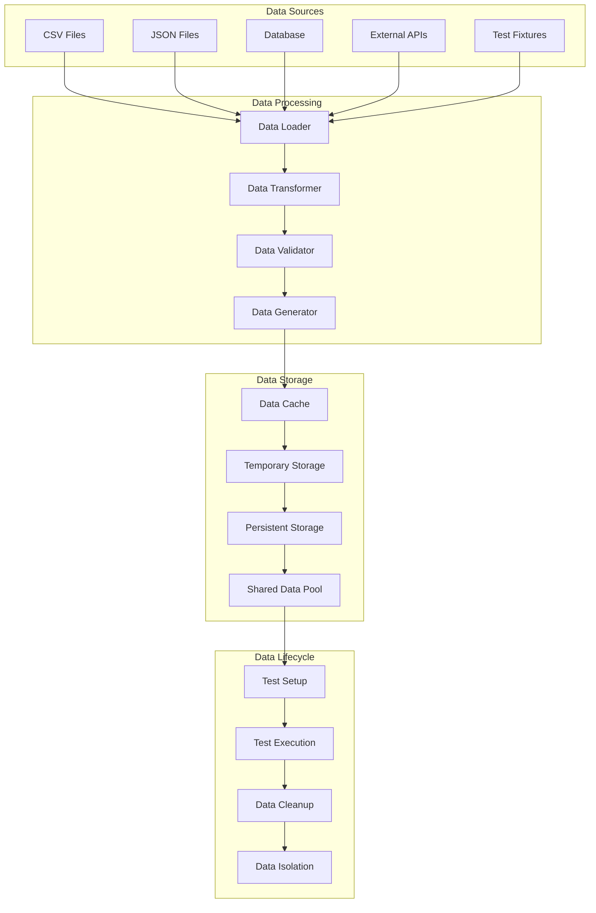

# Test Data Management Guide

Comprehensive guide for managing test data, environments, and data-driven testing in the Browser Automation Framework.

## 🎯 Test Data Overview

### Data Management Architecture



### Data Management Principles

1. **Data Isolation** - Each test has independent data
2. **Data Consistency** - Reliable and predictable test data
3. **Data Cleanup** - Automatic cleanup after test execution
4. **Data Reusability** - Shared data pools for common scenarios
5. **Data Security** - Secure handling of sensitive test data

## 📊 Data Providers

### CSV Data Provider

```python
# src/testing/data_providers/csv_provider.py
import csv
import os
from typing import List, Dict, Any, Iterator
from pathlib import Path

class CSVDataProvider:
    """Provide test data from CSV files."""
    
    def __init__(self, file_path: str, encoding: str = 'utf-8'):
        self.file_path = Path(file_path)
        self.encoding = encoding
        self._data = None
    
    def load_data(self) -> List[Dict[str, Any]]:
        """Load data from CSV file."""
        if self._data is None:
            self._data = []
            
            if not self.file_path.exists():
                raise FileNotFoundError(f"CSV file not found: {self.file_path}")
            
            with open(self.file_path, 'r', encoding=self.encoding) as file:
                reader = csv.DictReader(file)
                for row in reader:
                    # Convert string values to appropriate types
                    processed_row = self._process_row(row)
                    self._data.append(processed_row)
        
        return self._data
    
    def _process_row(self, row: Dict[str, str]) -> Dict[str, Any]:
        """Process CSV row and convert data types."""
        processed = {}
        
        for key, value in row.items():
            # Handle empty values
            if value.strip() == '':
                processed[key] = None
                continue
            
            # Try to convert to appropriate type
            processed[key] = self._convert_value(value)
        
        return processed
    
    def _convert_value(self, value: str) -> Any:
        """Convert string value to appropriate type."""
        value = value.strip()
        
        # Boolean conversion
        if value.lower() in ('true', 'false'):
            return value.lower() == 'true'
        
        # Integer conversion
        try:
            if '.' not in value:
                return int(value)
        except ValueError:
            pass
        
        # Float conversion
        try:
            return float(value)
        except ValueError:
            pass
        
        # Return as string
        return value
    
    def get_data_by_filter(self, **filters) -> List[Dict[str, Any]]:
        """Get data filtered by criteria."""
        data = self.load_data()
        filtered_data = []
        
        for row in data:
            match = True
            for key, value in filters.items():
                if key not in row or row[key] != value:
                    match = False
                    break
            
            if match:
                filtered_data.append(row)
        
        return filtered_data
    
    def __iter__(self) -> Iterator[Dict[str, Any]]:
        """Make provider iterable."""
        return iter(self.load_data())

# Example CSV data file: test_data/user_credentials.csv
"""
username,password,expected_result,user_type,description
admin,admin123,success,admin,Valid admin credentials
user1,password123,success,user,Valid user credentials
invalid_user,wrong_pass,failure,user,Invalid credentials
empty_user,,failure,user,Empty username
user2,expired_pass,failure,user,Expired password
"""

# Usage in tests
@pytest.mark.parametrize("test_data", CSVDataProvider("test_data/user_credentials.csv"))
async def test_login_scenarios(browser_fixture, test_data):
    """Test login with various credential combinations."""
    page = await browser_fixture.new_page()
    
    await page.goto("https://example.com/login")
    
    if test_data['username']:
        await page.fill("#username", test_data['username'])
    if test_data['password']:
        await page.fill("#password", test_data['password'])
    
    await page.click("#login-button")
    
    if test_data['expected_result'] == 'success':
        await WebAssertions(page).assert_url_contains("/dashboard")
    else:
        await WebAssertions(page).assert_text_visible("Invalid credentials")
```

### JSON Data Provider

```python
# src/testing/data_providers/json_provider.py
import json
from typing import List, Dict, Any, Union
from pathlib import Path

class JSONDataProvider:
    """Provide test data from JSON files."""
    
    def __init__(self, file_path: str):
        self.file_path = Path(file_path)
        self._data = None
    
    def load_data(self) -> Union[List[Dict[str, Any]], Dict[str, Any]]:
        """Load data from JSON file."""
        if self._data is None:
            if not self.file_path.exists():
                raise FileNotFoundError(f"JSON file not found: {self.file_path}")
            
            with open(self.file_path, 'r', encoding='utf-8') as file:
                self._data = json.load(file)
        
        return self._data
    
    def get_test_cases(self) -> List[Dict[str, Any]]:
        """Get test cases from JSON data."""
        data = self.load_data()
        
        if isinstance(data, list):
            return data
        elif isinstance(data, dict) and 'test_cases' in data:
            return data['test_cases']
        else:
            raise ValueError("JSON data must be a list or contain 'test_cases' key")
    
    def get_test_case_by_id(self, test_id: str) -> Dict[str, Any]:
        """Get specific test case by ID."""
        test_cases = self.get_test_cases()
        
        for test_case in test_cases:
            if test_case.get('id') == test_id:
                return test_case
        
        raise ValueError(f"Test case with ID '{test_id}' not found")
    
    def get_test_cases_by_tag(self, tag: str) -> List[Dict[str, Any]]:
        """Get test cases filtered by tag."""
        test_cases = self.get_test_cases()
        
        return [
            test_case for test_case in test_cases
            if tag in test_case.get('tags', [])
        ]

# Example JSON data file: test_data/form_validation.json
"""
{
  "test_cases": [
    {
      "id": "valid_form",
      "description": "Valid form submission",
      "tags": ["positive", "form"],
      "input": {
        "name": "John Doe",
        "email": "john@example.com",
        "phone": "+1234567890",
        "message": "Test message"
      },
      "expected": {
        "valid": true,
        "success_message": "Form submitted successfully"
      }
    },
    {
      "id": "invalid_email",
      "description": "Invalid email format",
      "tags": ["negative", "validation"],
      "input": {
        "name": "John Doe",
        "email": "invalid-email",
        "phone": "+1234567890",
        "message": "Test message"
      },
      "expected": {
        "valid": false,
        "error_messages": ["Please enter a valid email address"]
      }
    }
  ]
}
"""

# Usage in tests
@pytest.mark.parametrize("test_case", JSONDataProvider("test_data/form_validation.json").get_test_cases())
async def test_form_validation(browser_fixture, test_case):
    """Test form validation with JSON test cases."""
    page = await browser_fixture.new_page()
    
    await page.goto("https://example.com/contact")
    
    # Fill form with test data
    for field, value in test_case['input'].items():
        await page.fill(f"#{field}", value)
    
    await page.click("#submit-button")
    
    # Validate expected results
    if test_case['expected']['valid']:
        await WebAssertions(page).assert_text_visible(
            test_case['expected']['success_message']
        )
    else:
        for error_message in test_case['expected']['error_messages']:
            await WebAssertions(page).assert_text_visible(error_message)
```

### Database Data Provider

```python
# src/testing/data_providers/database_provider.py
import asyncio
import asyncpg
from typing import List, Dict, Any, Optional
from dataclasses import dataclass

@dataclass
class DatabaseConfig:
    """Database connection configuration."""
    host: str
    port: int
    database: str
    username: str
    password: str
    ssl_mode: str = 'prefer'

class DatabaseDataProvider:
    """Provide test data from database queries."""
    
    def __init__(self, config: DatabaseConfig):
        self.config = config
        self.connection_pool = None
    
    async def initialize(self):
        """Initialize database connection pool."""
        if self.connection_pool is None:
            self.connection_pool = await asyncpg.create_pool(
                host=self.config.host,
                port=self.config.port,
                database=self.config.database,
                user=self.config.username,
                password=self.config.password,
                ssl=self.config.ssl_mode,
                min_size=1,
                max_size=5
            )
    
    async def execute_query(self, query: str, params: Optional[List] = None) -> List[Dict[str, Any]]:
        """Execute query and return results."""
        await self.initialize()
        
        async with self.connection_pool.acquire() as connection:
            if params:
                rows = await connection.fetch(query, *params)
            else:
                rows = await connection.fetch(query)
            
            # Convert rows to dictionaries
            return [dict(row) for row in rows]
    
    async def get_test_users(self, user_type: Optional[str] = None) -> List[Dict[str, Any]]:
        """Get test users from database."""
        query = "SELECT * FROM test_users WHERE active = true"
        params = []
        
        if user_type:
            query += " AND user_type = $1"
            params.append(user_type)
        
        return await self.execute_query(query, params)
    
    async def get_test_data_by_scenario(self, scenario: str) -> List[Dict[str, Any]]:
        """Get test data for specific scenario."""
        query = """
            SELECT * FROM test_scenarios ts
            JOIN test_data td ON ts.id = td.scenario_id
            WHERE ts.name = $1 AND ts.active = true
        """
        
        return await self.execute_query(query, [scenario])
    
    async def create_test_data(self, table: str, data: Dict[str, Any]) -> int:
        """Create test data record."""
        await self.initialize()
        
        columns = list(data.keys())
        values = list(data.values())
        placeholders = [f"${i+1}" for i in range(len(values))]
        
        query = f"""
            INSERT INTO {table} ({', '.join(columns)})
            VALUES ({', '.join(placeholders)})
            RETURNING id
        """
        
        async with self.connection_pool.acquire() as connection:
            result = await connection.fetchval(query, *values)
            return result
    
    async def cleanup_test_data(self, table: str, test_run_id: str):
        """Clean up test data after test execution."""
        query = f"DELETE FROM {table} WHERE test_run_id = $1"
        
        async with self.connection_pool.acquire() as connection:
            await connection.execute(query, test_run_id)
    
    async def close(self):
        """Close database connection pool."""
        if self.connection_pool:
            await self.connection_pool.close()

# Usage in tests
@pytest.fixture
async def db_provider():
    """Database provider fixture."""
    config = DatabaseConfig(
        host="localhost",
        port=5432,
        database="test_db",
        username="test_user",
        password="test_password"
    )
    
    provider = DatabaseDataProvider(config)
    yield provider
    await provider.close()

@pytest.mark.asyncio
async def test_user_profiles(browser_fixture, db_provider):
    """Test user profiles with database data."""
    # Get test users from database
    test_users = await db_provider.get_test_users(user_type="premium")
    
    for user in test_users:
        page = await browser_fixture.new_page()
        
        # Login as test user
        await login_as_user(page, user['username'], user['password'])
        
        # Navigate to profile
        await page.goto("https://example.com/profile")
        
        # Verify profile data matches database
        await WebAssertions(page).assert_input_value("#name", user['full_name'])
        await WebAssertions(page).assert_input_value("#email", user['email'])
        
        await page.close()
```

## 🏭 Test Data Factories

### Data Factory Pattern

```python
# src/testing/factories/user_factory.py
import random
import string
from datetime import datetime, timedelta
from typing import Dict, Any, Optional
from faker import Faker

class UserFactory:
    """Factory for generating user test data."""
    
    def __init__(self, locale: str = 'en_US'):
        self.fake = Faker(locale)
    
    def create_user(self, **overrides) -> Dict[str, Any]:
        """Create a user with random data."""
        user_data = {
            'username': self._generate_username(),
            'email': self.fake.email(),
            'first_name': self.fake.first_name(),
            'last_name': self.fake.last_name(),
            'password': self._generate_password(),
            'phone': self.fake.phone_number(),
            'date_of_birth': self.fake.date_of_birth(minimum_age=18, maximum_age=80),
            'address': {
                'street': self.fake.street_address(),
                'city': self.fake.city(),
                'state': self.fake.state(),
                'zip_code': self.fake.zipcode(),
                'country': self.fake.country()
            },
            'preferences': {
                'newsletter': random.choice([True, False]),
                'notifications': random.choice([True, False]),
                'theme': random.choice(['light', 'dark'])
            },
            'created_at': datetime.now(),
            'is_active': True
        }
        
        # Apply overrides
        user_data.update(overrides)
        
        return user_data
    
    def create_admin_user(self, **overrides) -> Dict[str, Any]:
        """Create an admin user."""
        admin_overrides = {
            'username': f"admin_{self._generate_random_string(6)}",
            'role': 'admin',
            'permissions': ['read', 'write', 'delete', 'admin']
        }
        admin_overrides.update(overrides)
        
        return self.create_user(**admin_overrides)
    
    def create_premium_user(self, **overrides) -> Dict[str, Any]:
        """Create a premium user."""
        premium_overrides = {
            'subscription_type': 'premium',
            'subscription_expires': datetime.now() + timedelta(days=365),
            'features': ['advanced_analytics', 'priority_support', 'custom_workflows']
        }
        premium_overrides.update(overrides)
        
        return self.create_user(**premium_overrides)
    
    def create_batch_users(self, count: int, user_type: str = 'regular') -> List[Dict[str, Any]]:
        """Create multiple users."""
        users = []
        
        for _ in range(count):
            if user_type == 'admin':
                user = self.create_admin_user()
            elif user_type == 'premium':
                user = self.create_premium_user()
            else:
                user = self.create_user()
            
            users.append(user)
        
        return users
    
    def _generate_username(self) -> str:
        """Generate unique username."""
        base = self.fake.user_name()
        suffix = self._generate_random_string(4)
        return f"{base}_{suffix}"
    
    def _generate_password(self, length: int = 12) -> str:
        """Generate secure password."""
        characters = string.ascii_letters + string.digits + "!@#$%^&*"
        return ''.join(random.choice(characters) for _ in range(length))
    
    def _generate_random_string(self, length: int) -> str:
        """Generate random string."""
        return ''.join(random.choice(string.ascii_lowercase + string.digits) for _ in range(length))

# Usage in tests
@pytest.fixture
def user_factory():
    """User factory fixture."""
    return UserFactory()

async def test_user_registration(browser_fixture, user_factory):
    """Test user registration with factory data."""
    page = await browser_fixture.new_page()
    
    # Generate test user
    user_data = user_factory.create_user()
    
    await page.goto("https://example.com/register")
    
    # Fill registration form
    await page.fill("#username", user_data['username'])
    await page.fill("#email", user_data['email'])
    await page.fill("#first_name", user_data['first_name'])
    await page.fill("#last_name", user_data['last_name'])
    await page.fill("#password", user_data['password'])
    
    await page.click("#register-button")
    
    # Verify registration
    await WebAssertions(page).assert_text_visible("Registration successful")
```

### Workflow Data Factory

```python
# src/testing/factories/workflow_factory.py
from typing import Dict, Any, List
import uuid
from datetime import datetime

class WorkflowFactory:
    """Factory for generating workflow test data."""
    
    def create_workflow(self, **overrides) -> Dict[str, Any]:
        """Create a workflow with random data."""
        workflow_data = {
            'id': str(uuid.uuid4()),
            'name': f"Test Workflow {random.randint(1000, 9999)}",
            'description': "Automated test workflow",
            'type': 'web_scraping',
            'status': 'draft',
            'created_at': datetime.now(),
            'tasks': self._generate_default_tasks(),
            'schedule': None,
            'timeout': 300,
            'retry_attempts': 3,
            'tags': ['test', 'automation']
        }
        
        workflow_data.update(overrides)
        return workflow_data
    
    def create_navigation_workflow(self, url: str, **overrides) -> Dict[str, Any]:
        """Create a navigation workflow."""
        tasks = [
            {
                'id': 'navigate',
                'type': 'navigate',
                'definition': {'url': url},
                'timeout': 30
            },
            {
                'id': 'wait_for_load',
                'type': 'wait',
                'definition': {'condition': 'page_load'},
                'timeout': 10
            },
            {
                'id': 'take_screenshot',
                'type': 'screenshot',
                'definition': {'full_page': True},
                'timeout': 5
            }
        ]
        
        workflow_overrides = {
            'name': f"Navigation Test - {url}",
            'type': 'navigation',
            'tasks': tasks
        }
        workflow_overrides.update(overrides)
        
        return self.create_workflow(**workflow_overrides)
    
    def create_form_submission_workflow(self, form_data: Dict[str, Any], **overrides) -> Dict[str, Any]:
        """Create a form submission workflow."""
        tasks = [
            {
                'id': 'navigate',
                'type': 'navigate',
                'definition': {'url': overrides.get('form_url', 'https://example.com/form')},
                'timeout': 30
            }
        ]
        
        # Add form filling tasks
        for field, value in form_data.items():
            tasks.append({
                'id': f'fill_{field}',
                'type': 'type',
                'definition': {
                    'selector': f'#{field}',
                    'text': value
                },
                'timeout': 10
            })
        
        # Add submit task
        tasks.append({
            'id': 'submit_form',
            'type': 'click',
            'definition': {'selector': '#submit-button'},
            'timeout': 10
        })
        
        workflow_overrides = {
            'name': 'Form Submission Test',
            'type': 'form_submission',
            'tasks': tasks
        }
        workflow_overrides.update(overrides)
        
        return self.create_workflow(**workflow_overrides)
    
    def _generate_default_tasks(self) -> List[Dict[str, Any]]:
        """Generate default task list."""
        return [
            {
                'id': 'start',
                'type': 'navigate',
                'definition': {'url': 'https://example.com'},
                'timeout': 30
            },
            {
                'id': 'verify',
                'type': 'assert',
                'definition': {'condition': 'page_loaded'},
                'timeout': 10
            }
        ]
```

## 🧹 Data Cleanup and Isolation

### Test Data Cleanup

```python
# src/testing/data_management/cleanup.py
import asyncio
from typing import List, Dict, Any, Set
from datetime import datetime, timedelta

class TestDataCleanup:
    """Manage test data cleanup and isolation."""
    
    def __init__(self):
        self.cleanup_registry = {}
        self.test_run_id = None
    
    def register_cleanup(self, resource_type: str, resource_id: str, cleanup_func: callable):
        """Register resource for cleanup."""
        if resource_type not in self.cleanup_registry:
            self.cleanup_registry[resource_type] = []
        
        self.cleanup_registry[resource_type].append({
            'id': resource_id,
            'cleanup_func': cleanup_func,
            'created_at': datetime.now()
        })
    
    async def cleanup_test_data(self, test_run_id: str = None):
        """Clean up all registered test data."""
        if test_run_id:
            self.test_run_id = test_run_id
        
        cleanup_tasks = []
        
        for resource_type, resources in self.cleanup_registry.items():
            for resource in resources:
                task = asyncio.create_task(
                    self._safe_cleanup(resource['cleanup_func'], resource['id'])
                )
                cleanup_tasks.append(task)
        
        # Execute all cleanup tasks
        if cleanup_tasks:
            await asyncio.gather(*cleanup_tasks, return_exceptions=True)
        
        # Clear registry
        self.cleanup_registry.clear()
    
    async def cleanup_expired_data(self, max_age_hours: int = 24):
        """Clean up expired test data."""
        cutoff_time = datetime.now() - timedelta(hours=max_age_hours)
        
        for resource_type, resources in self.cleanup_registry.items():
            expired_resources = [
                resource for resource in resources
                if resource['created_at'] < cutoff_time
            ]
            
            for resource in expired_resources:
                await self._safe_cleanup(resource['cleanup_func'], resource['id'])
                resources.remove(resource)
    
    async def _safe_cleanup(self, cleanup_func: callable, resource_id: str):
        """Safely execute cleanup function."""
        try:
            if asyncio.iscoroutinefunction(cleanup_func):
                await cleanup_func(resource_id)
            else:
                cleanup_func(resource_id)
        except Exception as e:
            print(f"Error cleaning up resource {resource_id}: {e}")

# Global cleanup manager
cleanup_manager = TestDataCleanup()

# Pytest fixtures for data cleanup
@pytest.fixture(autouse=True)
async def test_data_cleanup():
    """Automatic test data cleanup fixture."""
    test_run_id = str(uuid.uuid4())
    cleanup_manager.test_run_id = test_run_id
    
    yield test_run_id
    
    # Cleanup after test
    await cleanup_manager.cleanup_test_data(test_run_id)

# Usage in tests
async def test_user_creation_with_cleanup(browser_fixture, user_factory):
    """Test with automatic data cleanup."""
    page = await browser_fixture.new_page()
    
    # Create test user
    user_data = user_factory.create_user()
    
    # Register for cleanup
    cleanup_manager.register_cleanup(
        'user',
        user_data['username'],
        lambda username: delete_test_user(username)
    )
    
    # Perform test
    await page.goto("https://example.com/register")
    # ... test implementation
```

## 🔗 Next Steps

- **[Test Reporting](test-reporting.md)** - Comprehensive test reporting and analysis
- **[Performance Testing](performance-testing.md)** - Load and performance testing strategies
- **[Test Maintenance](test-maintenance.md)** - Maintaining and updating test suites
- **[Test Best Practices](test-best-practices.md)** - Testing best practices and patterns

## 📚 Additional Resources

- **[Data Provider Examples](https://github.com/your-org/browser-automation-framework/tree/main/examples/data-providers)**
- **[Test Data Templates](https://github.com/your-org/browser-automation-framework/tree/main/test_data)**
- **[Factory Pattern Guide](../developer/patterns.md#factory-pattern)** - Advanced factory patterns
