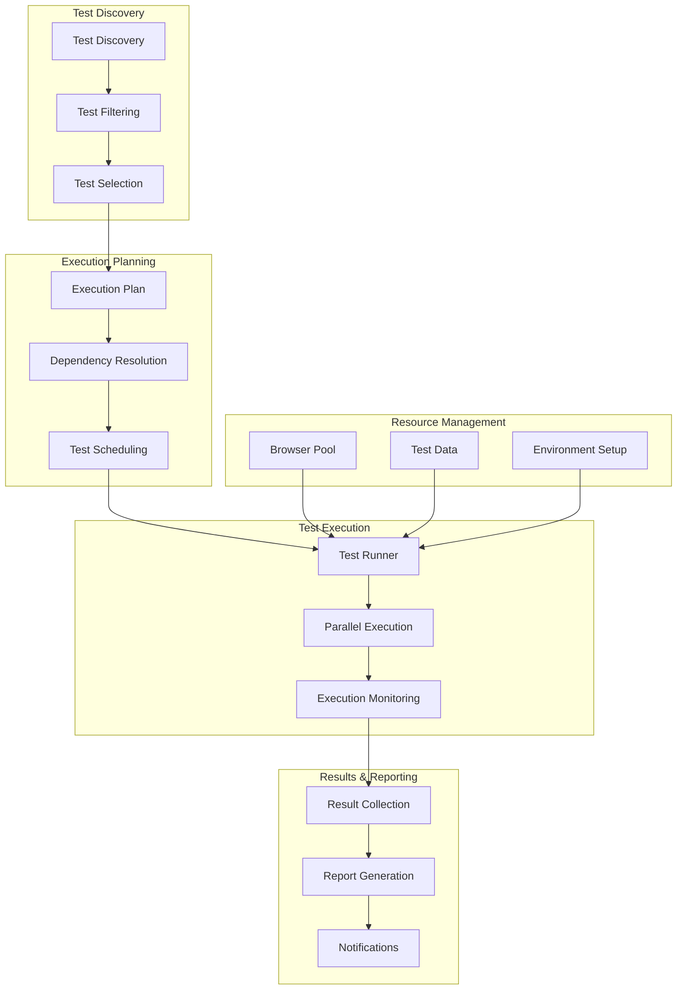

# Test Execution Guide

Comprehensive guide for executing test cases and test suites using the Browser Automation Framework.

## 🎯 Execution Overview

### Test Execution Architecture



## 🚀 Command Line Execution

### Basic Test Execution

```bash
# Run all tests
python -m pytest tests/

# Run specific test file
python -m pytest tests/test_navigation.py

# Run specific test method
python -m pytest tests/test_navigation.py::TestBasicNavigation::test_homepage_loads

# Run tests with specific tags
python -m pytest tests/ -m "smoke"
python -m pytest tests/ -m "smoke and not slow"
python -m pytest tests/ -m "regression or critical"

# Run tests in parallel
python -m pytest tests/ -n auto  # Auto-detect CPU cores
python -m pytest tests/ -n 4     # Use 4 workers

# Run with verbose output
python -m pytest tests/ -v -s

# Run with custom configuration
python -m pytest tests/ --config=test_config.yaml
```

### Framework-Specific Execution

```bash
# Using the automation framework test runner
python -m src.testing.runner \
    --suite smoke \
    --parallel \
    --workers 4 \
    --timeout 1800 \
    --retry-failed \
    --output-dir results/

# Run specific test categories
python -m src.testing.runner \
    --tags "ui,regression" \
    --exclude-tags "slow,manual" \
    --priority "high,critical"

# Run with AI assistance enabled
python -m src.testing.runner \
    --suite regression \
    --enable-ai \
    --llm-provider openai \
    --auto-heal-failures

# Run with custom browser configuration
python -m src.testing.runner \
    --browser-pool-size 10 \
    --headless \
    --viewport 1920x1080 \
    --disable-images

# Run with environment-specific settings
python -m src.testing.runner \
    --environment staging \
    --base-url https://staging.example.com \
    --api-url https://api.staging.example.com
```

## 🔧 Programmatic Execution

### Test Runner API

```python
# src/testing/execution_examples.py
from src.testing.runner import TestRunner, ExecutionConfig
from src.testing.reporting import TestReporter
import asyncio

async def run_smoke_tests():
    """Execute smoke tests programmatically."""
    
    # Configure test execution
    config = ExecutionConfig(
        test_selection={
            "tags": ["smoke"],
            "priority": ["critical", "high"],
            "exclude_tags": ["manual"]
        },
        execution={
            "parallel": True,
            "max_workers": 3,
            "timeout": 600,  # 10 minutes
            "retry_failed": True,
            "max_retries": 2,
            "stop_on_failure": False
        },
        browser={
            "pool_size": 5,
            "headless": True,
            "viewport": {"width": 1920, "height": 1080}
        },
        reporting={
            "formats": ["html", "json"],
            "output_dir": "results/smoke",
            "screenshots_on_failure": True,
            "detailed_logs": True
        }
    )
    
    # Initialize test runner
    runner = TestRunner(config)
    
    try:
        # Execute tests
        results = await runner.run_tests()
        
        # Generate reports
        reporter = TestReporter(results)
        await reporter.generate_reports()
        
        # Print summary
        print(f"Tests executed: {results.total_count}")
        print(f"Passed: {results.passed_count}")
        print(f"Failed: {results.failed_count}")
        print(f"Skipped: {results.skipped_count}")
        print(f"Success rate: {results.success_rate:.2%}")
        
        return results
        
    finally:
        await runner.cleanup()

async def run_regression_suite():
    """Execute comprehensive regression suite."""
    
    config = ExecutionConfig(
        test_selection={
            "suites": ["regression"],
            "include_slow": True
        },
        execution={
            "parallel": True,
            "max_workers": 6,
            "timeout": 7200,  # 2 hours
            "execution_strategy": "staged"
        },
        stages=[
            {
                "name": "Critical Path",
                "tests": {"tags": ["critical"]},
                "parallel": False,
                "stop_on_failure": True
            },
            {
                "name": "Core Features",
                "tests": {"tags": ["core"]},
                "parallel": True,
                "max_workers": 4
            },
            {
                "name": "Extended Features",
                "tests": {"tags": ["extended"]},
                "parallel": True,
                "max_workers": 6
            }
        ]
    )
    
    runner = TestRunner(config)
    results = await runner.run_staged_tests()
    
    return results

# Execute tests
if __name__ == "__main__":
    asyncio.run(run_smoke_tests())
```

### Custom Test Execution

```python
# src/testing/custom_execution.py
from src.testing.runner import BaseTestRunner
from src.testing.filters import TestFilter
from src.testing.schedulers import TestScheduler

class CustomTestRunner(BaseTestRunner):
    """Custom test runner with advanced features."""
    
    def __init__(self, config):
        super().__init__(config)
        self.filter = TestFilter()
        self.scheduler = TestScheduler()
    
    async def run_conditional_tests(self, conditions):
        """Run tests based on runtime conditions."""
        
        # Discover all tests
        all_tests = await self.discover_tests()
        
        # Apply conditional filtering
        filtered_tests = []
        for test in all_tests:
            if await self._evaluate_conditions(test, conditions):
                filtered_tests.append(test)
        
        # Execute filtered tests
        return await self.execute_tests(filtered_tests)
    
    async def run_adaptive_tests(self):
        """Run tests with adaptive execution strategy."""
        
        # Start with smoke tests
        smoke_results = await self.run_tests_by_tag("smoke")
        
        if smoke_results.success_rate < 0.9:
            # If smoke tests fail, run diagnostics
            await self.run_diagnostic_tests()
            return smoke_results
        
        # If smoke tests pass, run regression
        regression_results = await self.run_tests_by_tag("regression")
        
        # Combine results
        return self.combine_results([smoke_results, regression_results])
    
    async def run_performance_aware_tests(self):
        """Run tests with performance monitoring."""
        
        performance_monitor = PerformanceMonitor()
        await performance_monitor.start()
        
        try:
            # Run tests with performance tracking
            results = await self.run_tests()
            
            # Analyze performance impact
            performance_data = await performance_monitor.get_data()
            results.add_performance_data(performance_data)
            
            return results
            
        finally:
            await performance_monitor.stop()
    
    async def _evaluate_conditions(self, test, conditions):
        """Evaluate whether test should run based on conditions."""
        
        for condition in conditions:
            if condition["type"] == "environment":
                if not await self._check_environment_condition(condition):
                    return False
            elif condition["type"] == "feature_flag":
                if not await self._check_feature_flag(condition):
                    return False
            elif condition["type"] == "dependency":
                if not await self._check_dependency(condition):
                    return False
        
        return True
```

## 📊 Test Execution Monitoring

### Real-Time Monitoring

```python
# src/testing/monitoring.py
import asyncio
from datetime import datetime
from typing import Dict, List, Any

class TestExecutionMonitor:
    """Monitor test execution in real-time."""
    
    def __init__(self):
        self.execution_stats = {
            "start_time": None,
            "current_test": None,
            "completed_tests": 0,
            "failed_tests": 0,
            "total_tests": 0,
            "estimated_completion": None
        }
        self.test_history = []
        self.performance_metrics = {}
    
    async def start_monitoring(self, total_tests: int):
        """Start monitoring test execution."""
        self.execution_stats["start_time"] = datetime.now()
        self.execution_stats["total_tests"] = total_tests
        
        # Start monitoring tasks
        asyncio.create_task(self._monitor_system_resources())
        asyncio.create_task(self._monitor_browser_pool())
        asyncio.create_task(self._update_progress())
    
    async def on_test_start(self, test_name: str):
        """Called when a test starts."""
        self.execution_stats["current_test"] = test_name
        
        test_info = {
            "name": test_name,
            "start_time": datetime.now(),
            "status": "running"
        }
        self.test_history.append(test_info)
    
    async def on_test_complete(self, test_name: str, result: str, duration: float):
        """Called when a test completes."""
        self.execution_stats["completed_tests"] += 1
        
        if result == "failed":
            self.execution_stats["failed_tests"] += 1
        
        # Update test history
        for test in self.test_history:
            if test["name"] == test_name and test["status"] == "running":
                test["end_time"] = datetime.now()
                test["status"] = result
                test["duration"] = duration
                break
        
        # Update estimated completion
        await self._update_estimated_completion()
    
    async def _monitor_system_resources(self):
        """Monitor system resource usage."""
        import psutil
        
        while True:
            self.performance_metrics.update({
                "cpu_percent": psutil.cpu_percent(),
                "memory_percent": psutil.virtual_memory().percent,
                "disk_io": psutil.disk_io_counters()._asdict() if psutil.disk_io_counters() else {},
                "network_io": psutil.net_io_counters()._asdict()
            })
            
            await asyncio.sleep(5)  # Update every 5 seconds
    
    async def _monitor_browser_pool(self):
        """Monitor browser pool status."""
        from src.infrastructure.browser_pool import BrowserPool
        
        pool = BrowserPool()
        
        while True:
            try:
                stats = await pool.get_pool_stats()
                self.performance_metrics["browser_pool"] = stats
            except Exception as e:
                print(f"Error monitoring browser pool: {e}")
            
            await asyncio.sleep(10)  # Update every 10 seconds
    
    async def _update_progress(self):
        """Update and display progress."""
        while True:
            progress = self._calculate_progress()
            await self._display_progress(progress)
            await asyncio.sleep(2)  # Update every 2 seconds
    
    def _calculate_progress(self) -> Dict[str, Any]:
        """Calculate current progress."""
        completed = self.execution_stats["completed_tests"]
        total = self.execution_stats["total_tests"]
        failed = self.execution_stats["failed_tests"]
        
        progress_percent = (completed / total * 100) if total > 0 else 0
        success_rate = ((completed - failed) / completed * 100) if completed > 0 else 100
        
        return {
            "completed": completed,
            "total": total,
            "failed": failed,
            "progress_percent": progress_percent,
            "success_rate": success_rate,
            "current_test": self.execution_stats["current_test"],
            "estimated_completion": self.execution_stats["estimated_completion"]
        }
    
    async def _display_progress(self, progress: Dict[str, Any]):
        """Display progress information."""
        print(f"\r[{progress['completed']}/{progress['total']}] "
              f"{progress['progress_percent']:.1f}% "
              f"(Success: {progress['success_rate']:.1f}%) "
              f"Current: {progress['current_test'] or 'None'}", end="")
    
    async def _update_estimated_completion(self):
        """Update estimated completion time."""
        if len(self.test_history) < 2:
            return
        
        # Calculate average test duration
        completed_tests = [t for t in self.test_history if t.get("duration")]
        if not completed_tests:
            return
        
        avg_duration = sum(t["duration"] for t in completed_tests) / len(completed_tests)
        remaining_tests = self.execution_stats["total_tests"] - self.execution_stats["completed_tests"]
        estimated_seconds = remaining_tests * avg_duration
        
        self.execution_stats["estimated_completion"] = datetime.now().timestamp() + estimated_seconds
```

### Execution Metrics

```python
# src/testing/metrics.py
from prometheus_client import Counter, Histogram, Gauge
from dataclasses import dataclass
from typing import Dict, List

@dataclass
class TestMetrics:
    """Test execution metrics."""
    total_tests: int = 0
    passed_tests: int = 0
    failed_tests: int = 0
    skipped_tests: int = 0
    execution_time: float = 0.0
    success_rate: float = 0.0

class TestMetricsCollector:
    """Collect and export test metrics."""
    
    def __init__(self):
        # Prometheus metrics
        self.test_executions_total = Counter(
            'test_executions_total',
            'Total test executions',
            ['suite', 'status']
        )
        
        self.test_duration_seconds = Histogram(
            'test_duration_seconds',
            'Test execution duration',
            ['suite', 'test_name'],
            buckets=[0.1, 0.5, 1, 5, 10, 30, 60, 300]
        )
        
        self.active_tests = Gauge(
            'active_tests',
            'Number of currently running tests'
        )
        
        self.test_success_rate = Gauge(
            'test_success_rate',
            'Test success rate percentage',
            ['suite']
        )
        
        self.browser_pool_utilization = Gauge(
            'browser_pool_utilization',
            'Browser pool utilization during tests'
        )
    
    def record_test_execution(self, suite: str, test_name: str, status: str, duration: float):
        """Record test execution metrics."""
        self.test_executions_total.labels(suite=suite, status=status).inc()
        self.test_duration_seconds.labels(suite=suite, test_name=test_name).observe(duration)
    
    def update_success_rate(self, suite: str, success_rate: float):
        """Update success rate metric."""
        self.test_success_rate.labels(suite=suite).set(success_rate)
    
    def set_active_tests(self, count: int):
        """Set number of active tests."""
        self.active_tests.set(count)
    
    def update_browser_utilization(self, utilization: float):
        """Update browser pool utilization."""
        self.browser_pool_utilization.set(utilization)

# Global metrics collector
test_metrics = TestMetricsCollector()
```

## 🔄 CI/CD Integration

### GitHub Actions Integration

```yaml
# .github/workflows/test-execution.yml
name: Test Execution

on:
  push:
    branches: [main, develop]
  pull_request:
    branches: [main]
  schedule:
    - cron: '0 2 * * *'  # Daily at 2 AM

jobs:
  smoke-tests:
    runs-on: ubuntu-latest
    steps:
    - uses: actions/checkout@v3
    
    - name: Set up Python
      uses: actions/setup-python@v4
      with:
        python-version: '3.11'
    
    - name: Install dependencies
      run: |
        pip install -r requirements.txt
        playwright install chromium
    
    - name: Run smoke tests
      run: |
        python -m src.testing.runner \
          --suite smoke \
          --parallel \
          --workers 2 \
          --output-dir results/smoke \
          --format junit
      env:
        BASE_URL: ${{ secrets.STAGING_URL }}
        API_URL: ${{ secrets.STAGING_API_URL }}
        LLM_API_KEY: ${{ secrets.LLM_API_KEY }}
    
    - name: Upload test results
      uses: actions/upload-artifact@v3
      if: always()
      with:
        name: smoke-test-results
        path: results/smoke/
    
    - name: Publish test results
      uses: dorny/test-reporter@v1
      if: always()
      with:
        name: Smoke Tests
        path: results/smoke/junit.xml
        reporter: java-junit

  regression-tests:
    runs-on: ubuntu-latest
    needs: smoke-tests
    if: github.event_name == 'schedule' || contains(github.event.head_commit.message, '[run-regression]')
    
    strategy:
      matrix:
        test-group: [ui, api, integration, performance]
    
    steps:
    - uses: actions/checkout@v3
    
    - name: Set up Python
      uses: actions/setup-python@v4
      with:
        python-version: '3.11'
    
    - name: Install dependencies
      run: |
        pip install -r requirements.txt
        playwright install chromium
    
    - name: Run regression tests
      run: |
        python -m src.testing.runner \
          --suite regression \
          --tags ${{ matrix.test-group }} \
          --parallel \
          --workers 4 \
          --timeout 3600 \
          --retry-failed \
          --output-dir results/regression-${{ matrix.test-group }}
      env:
        BASE_URL: ${{ secrets.STAGING_URL }}
        API_URL: ${{ secrets.STAGING_API_URL }}
        LLM_API_KEY: ${{ secrets.LLM_API_KEY }}
    
    - name: Upload test results
      uses: actions/upload-artifact@v3
      if: always()
      with:
        name: regression-test-results-${{ matrix.test-group }}
        path: results/regression-${{ matrix.test-group }}/
```

### Jenkins Pipeline

```groovy
// Jenkinsfile
pipeline {
    agent any
    
    parameters {
        choice(
            name: 'TEST_SUITE',
            choices: ['smoke', 'regression', 'performance', 'all'],
            description: 'Test suite to execute'
        )
        booleanParam(
            name: 'PARALLEL_EXECUTION',
            defaultValue: true,
            description: 'Execute tests in parallel'
        )
        string(
            name: 'MAX_WORKERS',
            defaultValue: '4',
            description: 'Maximum number of parallel workers'
        )
    }
    
    environment {
        BASE_URL = credentials('staging-base-url')
        API_URL = credentials('staging-api-url')
        LLM_API_KEY = credentials('llm-api-key')
    }
    
    stages {
        stage('Setup') {
            steps {
                sh 'pip install -r requirements.txt'
                sh 'playwright install chromium'
            }
        }
        
        stage('Execute Tests') {
            parallel {
                stage('Smoke Tests') {
                    when {
                        anyOf {
                            params.TEST_SUITE == 'smoke'
                            params.TEST_SUITE == 'all'
                        }
                    }
                    steps {
                        script {
                            def parallelFlag = params.PARALLEL_EXECUTION ? '--parallel' : ''
                            def workersFlag = params.PARALLEL_EXECUTION ? "--workers ${params.MAX_WORKERS}" : ''
                            
                            sh """
                                python -m src.testing.runner \
                                    --suite smoke \
                                    ${parallelFlag} \
                                    ${workersFlag} \
                                    --output-dir results/smoke \
                                    --format junit,html
                            """
                        }
                    }
                }
                
                stage('Regression Tests') {
                    when {
                        anyOf {
                            params.TEST_SUITE == 'regression'
                            params.TEST_SUITE == 'all'
                        }
                    }
                    steps {
                        script {
                            def parallelFlag = params.PARALLEL_EXECUTION ? '--parallel' : ''
                            def workersFlag = params.PARALLEL_EXECUTION ? "--workers ${params.MAX_WORKERS}" : ''
                            
                            sh """
                                python -m src.testing.runner \
                                    --suite regression \
                                    ${parallelFlag} \
                                    ${workersFlag} \
                                    --timeout 7200 \
                                    --retry-failed \
                                    --output-dir results/regression \
                                    --format junit,html
                            """
                        }
                    }
                }
            }
        }
        
        stage('Publish Results') {
            steps {
                publishHTML([
                    allowMissing: false,
                    alwaysLinkToLastBuild: true,
                    keepAll: true,
                    reportDir: 'results',
                    reportFiles: '*/report.html',
                    reportName: 'Test Results'
                ])
                
                junit 'results/*/junit.xml'
                
                archiveArtifacts artifacts: 'results/**/*', fingerprint: true
            }
        }
    }
    
    post {
        always {
            cleanWs()
        }
        failure {
            emailext (
                subject: "Test Execution Failed: ${env.JOB_NAME} - ${env.BUILD_NUMBER}",
                body: "Test execution failed. Check the build logs for details.",
                to: "${env.CHANGE_AUTHOR_EMAIL}"
            )
        }
    }
}
```

## 🔗 Next Steps

- **[Test Reporting](test-reporting.md)** - Comprehensive test reporting and analysis
- **[Test Data Management](test-data-management.md)** - Managing test data and environments
- **[Performance Testing](performance-testing.md)** - Load and performance testing strategies
- **[Test Maintenance](test-maintenance.md)** - Maintaining and updating test suites

## 📚 Additional Resources

- **[Test Framework API Reference](../developer/api-reference.md#testing-api)** - Complete API documentation
- **[CI/CD Integration Guide](../developer/deployment.md#cicd-integration)** - Advanced CI/CD patterns
- **[Troubleshooting Tests](../user/troubleshooting.md#test-issues)** - Common test execution issues
