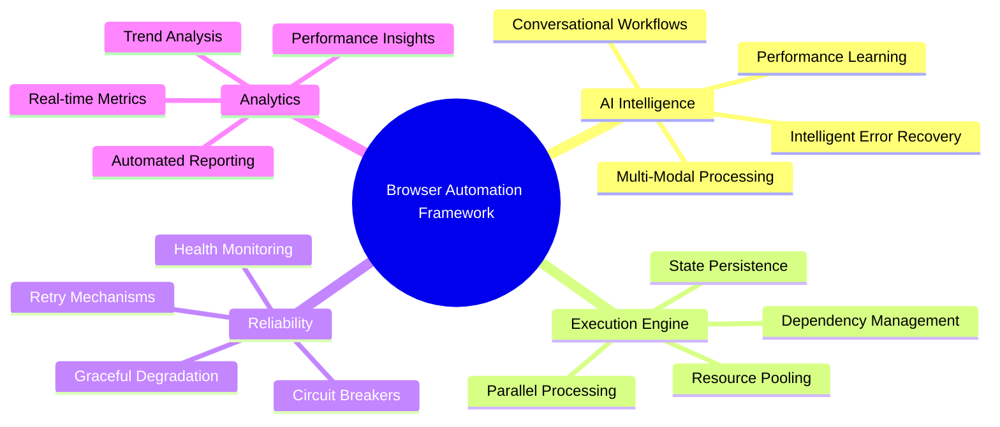
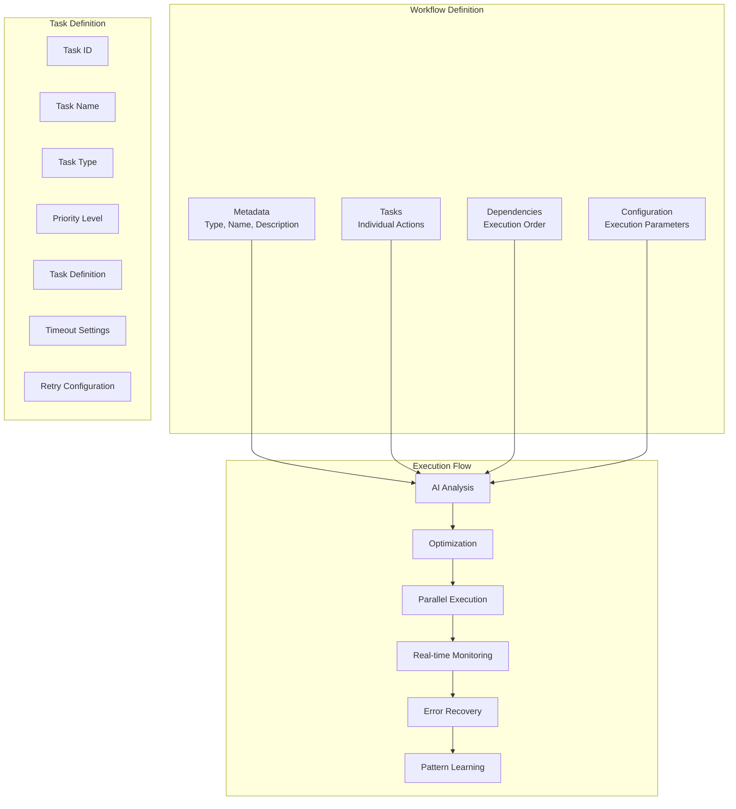
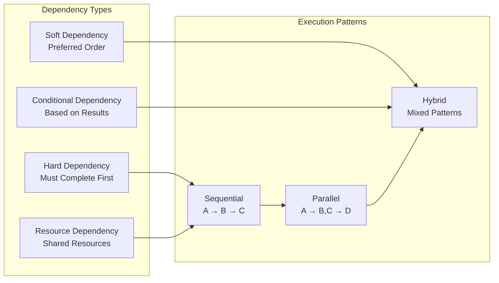
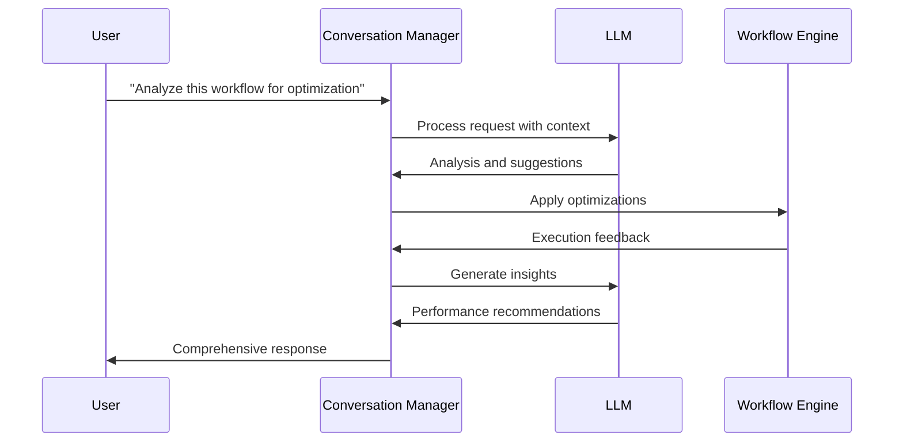
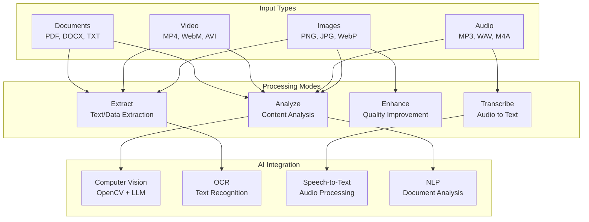
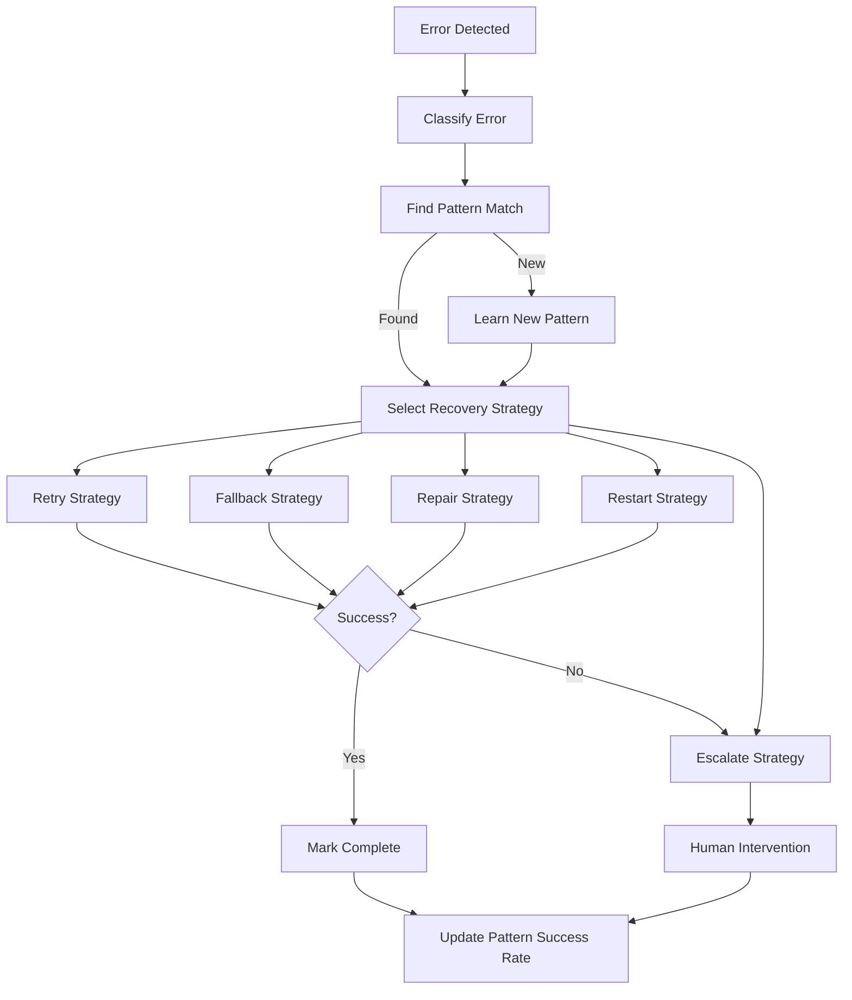
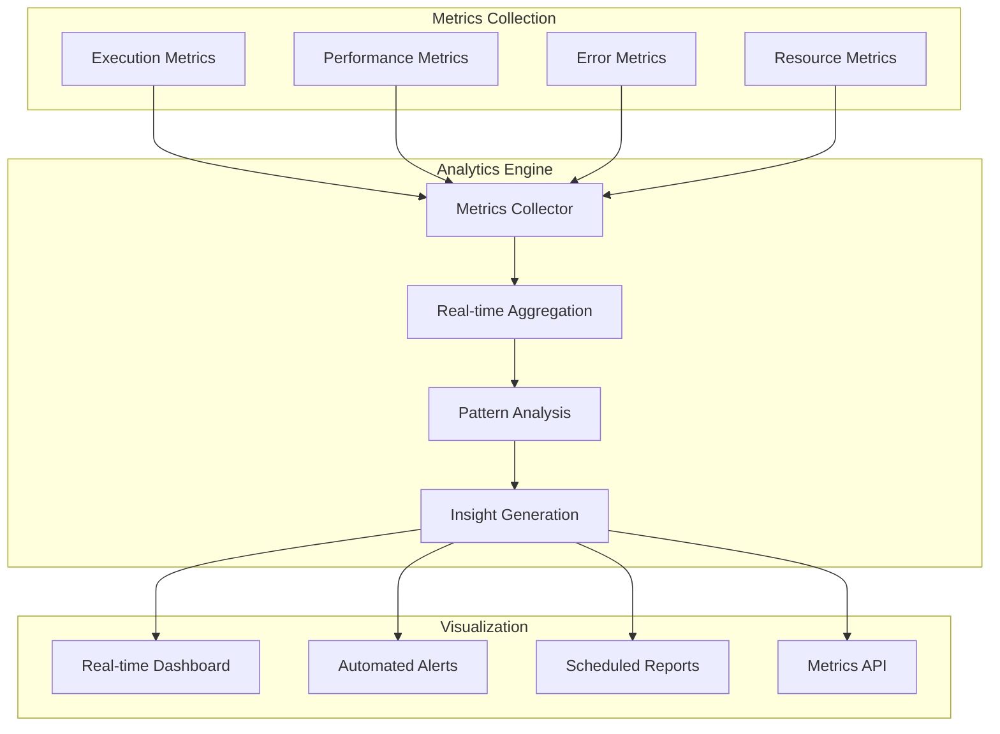

# User Guide

Comprehensive guide to using the Browser Automation Framework's advanced features and capabilities.

## 📚 Table of Contents

1. [Framework Overview](#framework-overview)
2. [Core Concepts](#core-concepts)
3. [Workflow Management](#workflow-management)
4. [AI-Powered Features](#ai-powered-features)
5. [Multi-Modal Processing](#multi-modal-processing)
6. [Error Handling & Recovery](#error-handling--recovery)
7. [Performance & Analytics](#performance--analytics)
8. [Best Practices](#best-practices)

## 🎯 Framework Overview

The Browser Automation Framework is an enterprise-grade platform that combines traditional browser automation with cutting-edge AI capabilities to deliver intelligent, self-healing, and continuously optimizing automation solutions.

### Key Capabilities



## 🧠 Core Concepts

### Workflows
A workflow is a collection of tasks with defined dependencies and execution parameters. Workflows can be simple linear sequences or complex parallel execution graphs.

### Tasks
Individual units of work that perform specific actions like navigation, data extraction, form filling, or screenshot capture.

### Dependencies
Relationships between tasks that determine execution order. Types include:
- **Hard Dependencies**: Task B cannot start until Task A completes
- **Soft Dependencies**: Task B prefers to wait for Task A but can proceed if needed
- **Resource Dependencies**: Tasks that require the same resource execute sequentially

### Intelligent Configuration
Settings that enable AI-powered features like conversation management, error recovery, and performance optimization.

## 🔄 Workflow Management

### Workflow Structure



### Creating Workflows

#### Basic Workflow Structure
```python
workflow = {
    "type": "web_automation",
    "name": "User Registration Flow",
    "description": "Automated user registration with validation",
    "version": "1.0",
    "metadata": {
        "author": "automation_team",
        "created": "2024-12-19",
        "tags": ["registration", "forms", "validation"]
    },
    "tasks": [
        # Task definitions
    ],
    "dependencies": [
        # Dependency definitions
    ],
    "configuration": {
        "execution_mode": "hybrid",
        "max_parallel": 3,
        "timeout": 300,
        "retry_policy": "exponential_backoff"
    }
}
```

#### Task Types and Examples

**Navigation Tasks**
```python
{
    "id": "navigate_home",
    "name": "Navigate to Homepage",
    "type": "navigate",
    "priority": "high",
    "definition": {
        "url": "https://example.com",
        "wait_for": "body",
        "timeout": 30,
        "user_agent": "custom-agent"
    }
}
```

**Data Extraction Tasks**
```python
{
    "id": "extract_products",
    "name": "Extract Product Information",
    "type": "extract_data",
    "priority": "normal",
    "definition": {
        "selectors": {
            "title": "h1.product-title",
            "price": ".price-current",
            "description": ".product-description"
        },
        "multiple": True,
        "wait_for_elements": True
    }
}
```

**Form Interaction Tasks**
```python
{
    "id": "fill_registration",
    "name": "Fill Registration Form",
    "type": "form_interaction",
    "priority": "high",
    "definition": {
        "form_selector": "#registration-form",
        "fields": {
            "email": "user@example.com",
            "password": "secure_password",
            "confirm_password": "secure_password"
        },
        "submit": True,
        "wait_for_response": True
    }
}
```

**Screenshot Tasks**
```python
{
    "id": "capture_result",
    "name": "Capture Result Page",
    "type": "screenshot",
    "priority": "low",
    "definition": {
        "element": "body",
        "full_page": True,
        "format": "png",
        "quality": 90
    }
}
```

### Dependency Management



#### Dependency Examples
```python
"dependencies": [
    # Hard dependency - B waits for A
    {"from": "login", "to": "navigate_dashboard", "type": "hard"},
    
    # Soft dependency - C prefers A but can proceed
    {"from": "load_config", "to": "start_process", "type": "soft"},
    
    # Resource dependency - shared browser session
    {"from": "task1", "to": "task2", "type": "resource", "resource": "browser_session"},
    
    # Conditional dependency - only if A succeeds
    {"from": "validate_user", "to": "grant_access", "type": "conditional", "condition": "success"}
]
```

## 🤖 AI-Powered Features

### Conversational Workflows

The framework includes advanced conversation management that allows natural language interaction during workflow execution.



#### Enabling Conversation Features
```python
config = IntelligentWorkflowConfig(
    enable_llm_assistance=True,
    conversation_context={
        "user_role": "automation_engineer",
        "experience_level": "intermediate",
        "focus_areas": ["performance", "reliability", "maintainability"],
        "preferred_communication": "technical_detailed"
    }
)
```

#### Conversation Capabilities
- **Workflow Analysis**: AI reviews workflow structure and suggests improvements
- **Error Diagnosis**: Intelligent analysis of failures with recovery suggestions
- **Performance Insights**: AI-powered performance analysis and optimization recommendations
- **Best Practice Guidance**: Contextual advice based on workflow patterns

### Function and Tool Calling

The LLM can call functions and use tools during workflow execution:

```python
# Add custom functions for LLM to use
conversation_manager.add_function(
    "get_page_performance",
    get_page_performance_metrics,
    description="Get detailed performance metrics for the current page"
)

conversation_manager.add_tool(
    "screenshot_analyzer",
    analyze_screenshot_tool,
    description="Analyze screenshots for UI elements and accessibility"
)
```

## 🎨 Multi-Modal Processing

### Supported Content Types



### Image Processing Examples

#### Screenshot Analysis
```python
# Workflow task for screenshot analysis
{
    "id": "analyze_ui",
    "name": "Analyze UI Screenshot",
    "type": "image_analysis",
    "definition": {
        "analysis_type": "ui",
        "extract_text": True,
        "identify_elements": True,
        "accessibility_check": True,
        "llm_analysis": True
    }
}
```

#### Document Processing
```python
# Extract text from uploaded documents
{
    "id": "process_document",
    "name": "Process Uploaded Document",
    "type": "document_processing",
    "definition": {
        "document_type": "auto",
        "extract_text": True,
        "extract_metadata": True,
        "summarize": True
    }
}
```

### Audio Processing
```python
# Transcribe audio content
{
    "id": "transcribe_audio",
    "name": "Transcribe Audio Content",
    "type": "audio_processing",
    "definition": {
        "language": "auto",
        "include_timestamps": True,
        "speaker_identification": True,
        "sentiment_analysis": True
    }
}
```

## 🛡️ Error Handling & Recovery

### Intelligent Error Recovery System



### Error Categories and Strategies

| Error Category | Common Causes | Recovery Strategies |
|----------------|---------------|-------------------|
| **Network** | Timeouts, DNS issues, SSL errors | Retry with backoff, Fallback endpoints |
| **Browser** | Crashes, navigation failures | Restart browser, Repair session |
| **Element** | Missing elements, stale references | Retry with different selectors, Repair DOM |
| **Authentication** | Login failures, session expiry | Repair credentials, Re-authenticate |
| **Resource** | Memory limits, disk space | Restart services, Scale resources |
| **Validation** | Data format errors, constraint violations | Repair data, Fallback validation |

### Configuring Error Recovery
```python
config = IntelligentWorkflowConfig(
    enable_error_recovery=True,
    recovery_strategies=["retry", "fallback", "repair"],
    max_recovery_attempts=3,
    learning_mode=True,
    escalation_threshold=5  # Escalate after 5 consecutive failures
)
```

## 📊 Performance & Analytics

### Real-Time Monitoring



### Key Performance Indicators

| Metric | Description | Target |
|--------|-------------|--------|
| **Throughput** | Operations per second | >50 ops/sec |
| **Response Time** | P95 task completion time | <5 seconds |
| **Success Rate** | Percentage of successful executions | >99% |
| **Error Recovery Rate** | Automatic recovery success rate | >90% |
| **Resource Utilization** | CPU/Memory efficiency | <80% |
| **Availability** | System uptime percentage | >99.9% |

### Analytics Configuration
```python
# Enable comprehensive analytics
config = IntelligentWorkflowConfig(
    enable_analytics=True,
    performance_targets={
        "max_execution_time": 30.0,
        "min_success_rate": 0.99,
        "max_error_rate": 0.01
    },
    auto_optimize=True,
    learning_mode=True
)
```

## 🎯 Best Practices

### Workflow Design
1. **Keep tasks atomic** - Each task should have a single responsibility
2. **Use meaningful names** - Clear, descriptive task and workflow names
3. **Define proper dependencies** - Ensure correct execution order
4. **Set appropriate timeouts** - Prevent hanging operations
5. **Include error handling** - Plan for failure scenarios

### Performance Optimization
1. **Leverage parallelism** - Use parallel execution where possible
2. **Optimize selectors** - Use efficient, stable element selectors
3. **Minimize wait times** - Use smart waiting strategies
4. **Resource pooling** - Reuse browser instances and connections
5. **Monitor metrics** - Track performance and optimize bottlenecks

### Error Handling
1. **Enable intelligent recovery** - Use AI-powered error recovery
2. **Implement graceful degradation** - Provide fallback options
3. **Log comprehensively** - Capture detailed error information
4. **Test failure scenarios** - Validate error handling paths
5. **Monitor error patterns** - Learn from recurring issues

### Security
1. **Secure credentials** - Use environment variables and secrets management
2. **Validate inputs** - Sanitize all user inputs and data
3. **Limit permissions** - Use principle of least privilege
4. **Monitor access** - Track and audit system access
5. **Regular updates** - Keep dependencies and systems updated

### Maintenance
1. **Regular health checks** - Monitor system health continuously
2. **Performance reviews** - Regularly review and optimize performance
3. **Update workflows** - Keep workflows current with application changes
4. **Backup data** - Implement comprehensive backup strategies
5. **Documentation** - Maintain up-to-date documentation

## 🔗 Next Steps

- **[Workflow Creation Guide](workflow-creation.md)** - Advanced workflow patterns and techniques
- **[LLM Integration Guide](llm-integration.md)** - Deep dive into AI-powered features
- **[Multi-Modal Processing](multimodal.md)** - Working with images, audio, and documents
- **[Dashboard & Monitoring](dashboard.md)** - Setting up monitoring and alerts
- **[Troubleshooting Guide](troubleshooting.md)** - Common issues and solutions

## 🆘 Support

Need help? Check out our support resources:
- **[GitHub Issues](https://github.com/your-org/browser-automation-framework/issues)** - Report bugs and request features
- **[Discussions](https://github.com/your-org/browser-automation-framework/discussions)** - Community Q&A
- **[Examples](https://github.com/your-org/browser-automation-framework/tree/main/examples)** - Sample workflows and use cases
