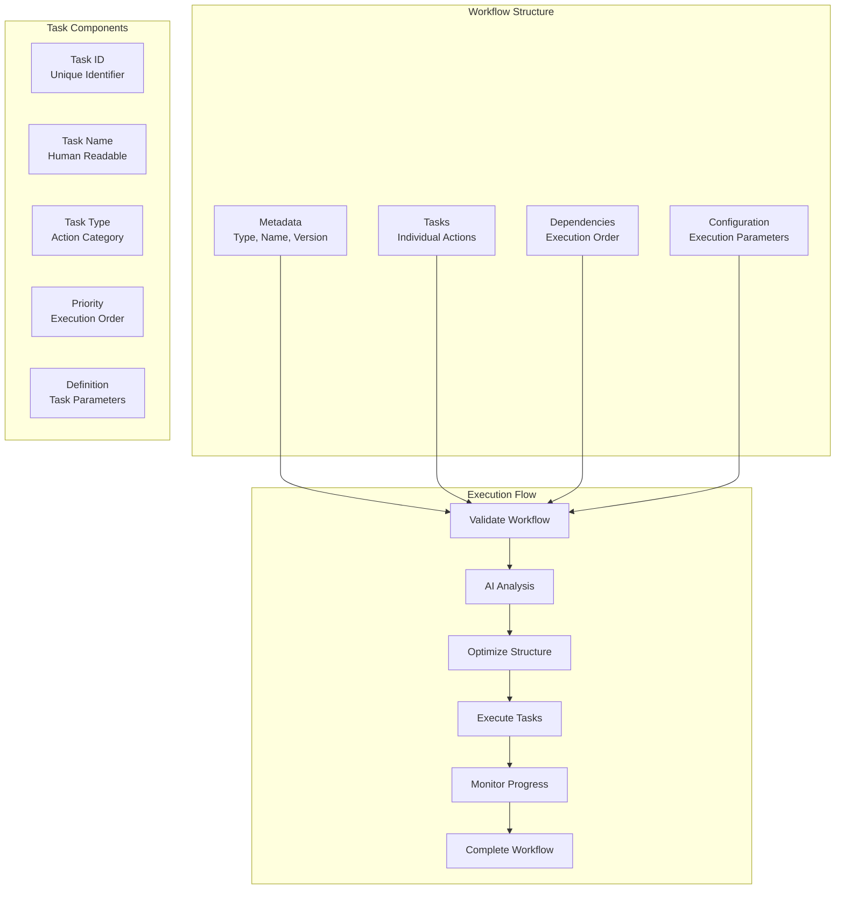
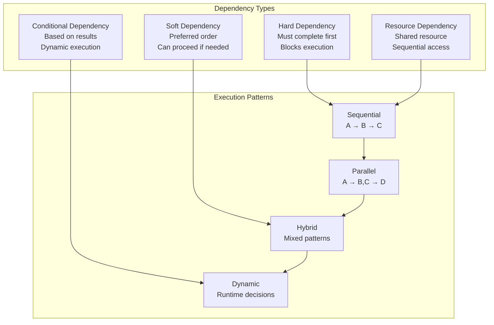
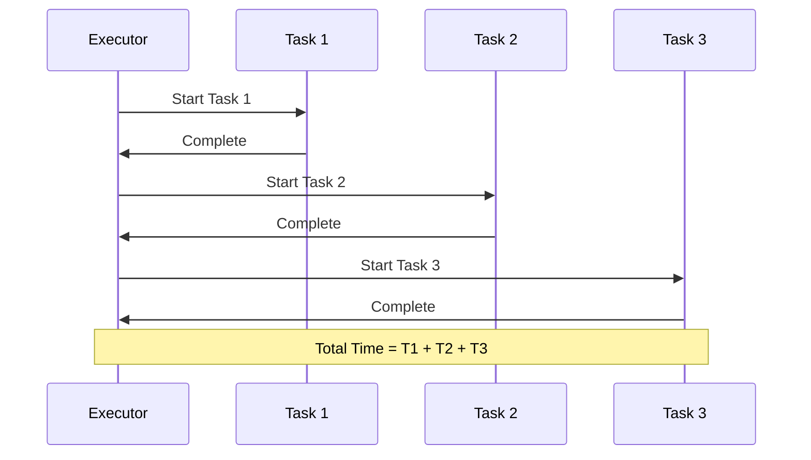
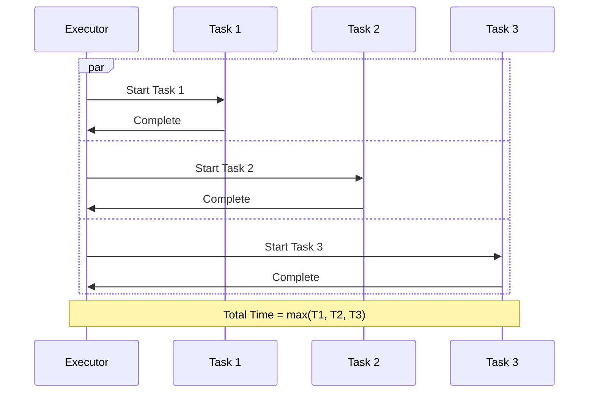
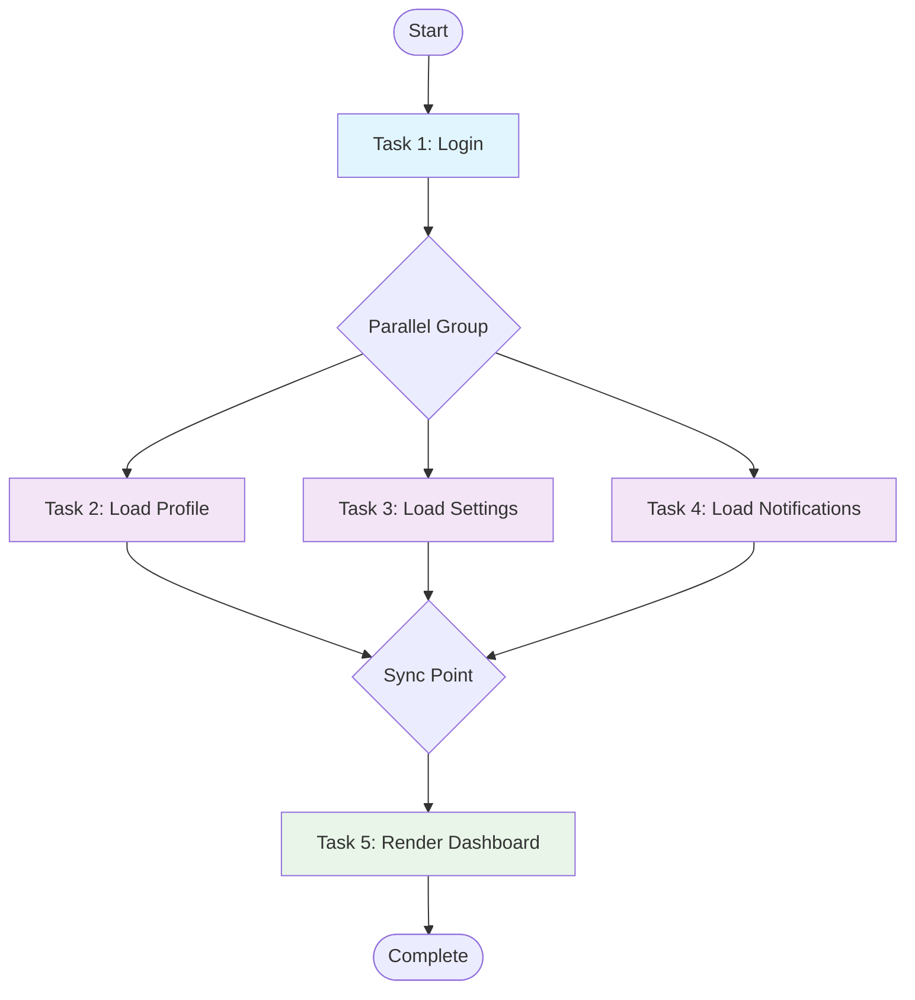
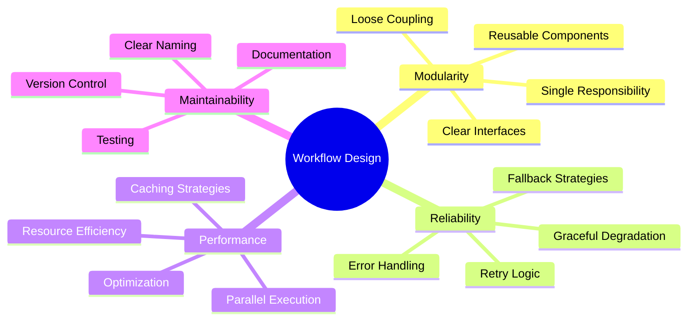

# Workflow Creation Guide

Comprehensive guide to creating, designing, and optimizing workflows in the Browser Automation Framework.

## 📚 Table of Contents

1. [Workflow Fundamentals](#workflow-fundamentals)
2. [Task Types & Definitions](#task-types--definitions)
3. [Dependency Management](#dependency-management)
4. [Execution Patterns](#execution-patterns)
5. [Advanced Features](#advanced-features)
6. [Best Practices](#best-practices)
7. [Common Patterns](#common-patterns)

## 🎯 Workflow Fundamentals

### Workflow Anatomy



### Basic Workflow Template

```python
workflow_template = {
    # Metadata
    "type": "workflow_category",           # e.g., "web_scraping", "form_automation"
    "name": "Descriptive Workflow Name",
    "description": "What this workflow accomplishes",
    "version": "1.0",
    "metadata": {
        "author": "your_name",
        "created": "2024-12-19",
        "tags": ["tag1", "tag2"],
        "category": "automation_type"
    },
    
    # Tasks
    "tasks": [
        # Task definitions go here
    ],
    
    # Dependencies
    "dependencies": [
        # Dependency definitions go here
    ],
    
    # Configuration
    "configuration": {
        "execution_mode": "hybrid",        # sequential, parallel, hybrid
        "max_parallel": 3,                 # Maximum parallel tasks
        "timeout": 300,                    # Overall timeout in seconds
        "retry_policy": "exponential_backoff",
        "error_handling": "continue_on_error"
    }
}
```

## 🔧 Task Types & Definitions

### Navigation Tasks

Navigate to web pages and handle page loading.

```python
navigation_task = {
    "id": "navigate_to_homepage",
    "name": "Navigate to Homepage",
    "type": "navigate",
    "priority": "high",
    "definition": {
        "url": "https://example.com",
        "wait_for": "body",                # Element to wait for
        "timeout": 30,                     # Navigation timeout
        "user_agent": "custom-agent",      # Optional custom user agent
        "headers": {                       # Optional custom headers
            "Accept-Language": "en-US"
        },
        "viewport": {                      # Optional viewport settings
            "width": 1920,
            "height": 1080
        }
    }
}
```

### Data Extraction Tasks

Extract data from web pages using various strategies.

```python
extraction_task = {
    "id": "extract_product_info",
    "name": "Extract Product Information",
    "type": "extract_data",
    "priority": "normal",
    "definition": {
        "selectors": {
            "title": "h1.product-title",
            "price": ".price-current",
            "description": ".product-description",
            "images": "img.product-image"
        },
        "multiple": True,                  # Extract multiple items
        "wait_for_elements": True,         # Wait for elements to appear
        "fallback_selectors": {            # Fallback if primary fails
            "title": ["h1", ".title", "[data-title]"],
            "price": [".price", ".cost", "[data-price]"]
        },
        "extraction_rules": {
            "price": {
                "regex": r"\$(\d+\.?\d*)",  # Extract price with regex
                "type": "float"
            },
            "title": {
                "trim": True,              # Trim whitespace
                "max_length": 100
            }
        }
    }
}
```

### Form Interaction Tasks

Interact with forms, fill fields, and submit data.

```python
form_task = {
    "id": "fill_contact_form",
    "name": "Fill Contact Form",
    "type": "form_interaction",
    "priority": "high",
    "definition": {
        "form_selector": "#contact-form",
        "fields": {
            "name": "John Doe",
            "email": "john@example.com",
            "message": "Hello from automation!"
        },
        "field_strategies": {              # Custom strategies per field
            "email": {
                "clear_first": True,
                "type_delay": 100          # Delay between keystrokes
            },
            "message": {
                "method": "paste"          # Use paste instead of typing
            }
        },
        "submit": {
            "button": "#submit-btn",
            "wait_for_response": True,
            "success_indicators": [".success-message"],
            "error_indicators": [".error-message"]
        }
    }
}
```

### Screenshot Tasks

Capture screenshots for documentation or analysis.

```python
screenshot_task = {
    "id": "capture_page_screenshot",
    "name": "Capture Page Screenshot",
    "type": "screenshot",
    "priority": "low",
    "definition": {
        "element": "body",                 # Element to screenshot
        "full_page": True,                 # Full page or viewport only
        "format": "png",                   # png, jpeg, webp
        "quality": 90,                     # JPEG quality (1-100)
        "annotations": {                   # Add annotations
            "highlight_elements": [".important"],
            "add_timestamp": True,
            "add_url": True
        },
        "filename_template": "screenshot_{timestamp}_{task_id}.{format}"
    }
}
```

### Wait Tasks

Add delays or wait for specific conditions.

```python
wait_task = {
    "id": "wait_for_content",
    "name": "Wait for Dynamic Content",
    "type": "wait",
    "priority": "normal",
    "definition": {
        "type": "element",                 # element, time, condition
        "selector": ".dynamic-content",
        "timeout": 30,
        "condition": "visible",            # visible, hidden, enabled, disabled
        "polling_interval": 500            # Check every 500ms
    }
}
```

## 🔗 Dependency Management

### Dependency Types



### Dependency Examples

```python
dependencies = [
    # Hard dependency - B must wait for A to complete
    {
        "from": "login_user",
        "to": "navigate_dashboard",
        "type": "hard",
        "description": "Must login before accessing dashboard"
    },
    
    # Soft dependency - C prefers A but can proceed without it
    {
        "from": "load_user_preferences",
        "to": "customize_interface",
        "type": "soft",
        "description": "Customize interface if preferences available"
    },
    
    # Resource dependency - shared browser session
    {
        "from": "task_1",
        "to": "task_2",
        "type": "resource",
        "resource": "browser_session",
        "description": "Tasks share the same browser session"
    },
    
    # Conditional dependency - only if A succeeds
    {
        "from": "validate_user",
        "to": "grant_admin_access",
        "type": "conditional",
        "condition": {
            "result": "success",
            "data_contains": {"role": "admin"}
        },
        "description": "Grant admin access only for admin users"
    },
    
    # Time-based dependency - wait for specific time
    {
        "from": "schedule_task",
        "to": "execute_scheduled_task",
        "type": "temporal",
        "delay": 3600,  # 1 hour delay
        "description": "Execute task after 1 hour delay"
    }
]
```

## ⚡ Execution Patterns

### Sequential Execution



### Parallel Execution



### Hybrid Execution



### Configuration Examples

```python
# Sequential execution
sequential_config = {
    "execution_mode": "sequential",
    "timeout": 300,
    "stop_on_error": True
}

# Parallel execution
parallel_config = {
    "execution_mode": "parallel",
    "max_parallel": 5,
    "timeout": 180,
    "continue_on_error": True
}

# Hybrid execution (recommended)
hybrid_config = {
    "execution_mode": "hybrid",
    "max_parallel": 3,
    "timeout": 300,
    "parallel_groups": [
        ["task_2", "task_3", "task_4"],  # These can run in parallel
        ["task_6", "task_7"]             # These can run in parallel
    ]
}
```

## 🚀 Advanced Features

### AI-Powered Workflow Enhancement

```python
intelligent_config = {
    "enable_llm_assistance": True,
    "enable_multimodal": True,
    "enable_error_recovery": True,
    "enable_analytics": True,
    "auto_optimize": True,
    "learning_mode": True,
    "conversation_context": {
        "user_role": "data_analyst",
        "experience_level": "intermediate",
        "focus_areas": ["accuracy", "performance"],
        "communication_style": "detailed"
    }
}
```

### Dynamic Task Generation

```python
dynamic_workflow = {
    "type": "dynamic_scraping",
    "name": "Dynamic Product Scraping",
    "tasks": [
        {
            "id": "discover_categories",
            "name": "Discover Product Categories",
            "type": "extract_data",
            "definition": {
                "selectors": {"categories": ".category-link"},
                "generate_tasks": True,  # Generate tasks from results
                "task_template": {
                    "type": "extract_data",
                    "name": "Scrape Category: {category_name}",
                    "definition": {
                        "url": "{category_url}",
                        "selectors": {"products": ".product-item"}
                    }
                }
            }
        }
    ]
}
```

### Conditional Execution

```python
conditional_workflow = {
    "tasks": [
        {
            "id": "check_user_type",
            "name": "Check User Type",
            "type": "extract_data",
            "definition": {
                "selector": ".user-badge",
                "attribute": "data-user-type"
            }
        },
        {
            "id": "admin_tasks",
            "name": "Admin-specific Tasks",
            "type": "composite",
            "condition": {
                "depends_on": "check_user_type",
                "expression": "result.data.user_type == 'admin'"
            },
            "tasks": [
                # Admin-specific subtasks
            ]
        },
        {
            "id": "regular_user_tasks",
            "name": "Regular User Tasks",
            "type": "composite",
            "condition": {
                "depends_on": "check_user_type",
                "expression": "result.data.user_type == 'regular'"
            },
            "tasks": [
                # Regular user subtasks
            ]
        }
    ]
}
```

## 🎯 Best Practices

### Workflow Design Principles



### Task Design Guidelines

1. **Keep Tasks Atomic**
   ```python
   # Good: Single responsibility
   {
       "id": "extract_product_title",
       "name": "Extract Product Title",
       "type": "extract_data",
       "definition": {"selector": "h1.product-title"}
   }
   
   # Avoid: Multiple responsibilities
   {
       "id": "extract_everything",
       "name": "Extract All Product Data",
       "type": "extract_data",
       "definition": {
           "selectors": {
               "title": "h1",
               "price": ".price",
               "description": ".desc",
               "reviews": ".reviews"
           }
       }
   }
   ```

2. **Use Descriptive Names**
   ```python
   # Good: Clear and descriptive
   "navigate_to_product_listing_page"
   "extract_product_prices_from_search_results"
   "fill_shipping_address_form"
   
   # Avoid: Vague or cryptic
   "nav1"
   "get_data"
   "form_stuff"
   ```

3. **Set Appropriate Timeouts**
   ```python
   # Different timeouts for different operations
   navigation_timeout = 30      # Page loads
   extraction_timeout = 10      # Data extraction
   form_timeout = 15           # Form interactions
   api_timeout = 5             # API calls
   ```

### Error Handling Strategies

```python
error_handling_config = {
    "retry_policy": {
        "max_attempts": 3,
        "backoff_strategy": "exponential",
        "base_delay": 1.0,
        "max_delay": 30.0,
        "jitter": True
    },
    "fallback_strategies": [
        "alternative_selectors",
        "simplified_extraction",
        "manual_intervention"
    ],
    "error_categories": {
        "network_errors": {
            "strategy": "retry_with_backoff",
            "max_attempts": 5
        },
        "element_not_found": {
            "strategy": "try_fallback_selectors",
            "escalate_after": 3
        },
        "timeout_errors": {
            "strategy": "increase_timeout_and_retry",
            "max_timeout": 60
        }
    }
}
```

## 📋 Common Patterns

### E-commerce Scraping Pattern

```python
ecommerce_workflow = {
    "type": "ecommerce_scraping",
    "name": "E-commerce Product Scraping",
    "tasks": [
        {
            "id": "navigate_to_search",
            "name": "Navigate to Search Page",
            "type": "navigate",
            "definition": {"url": "https://store.com/search?q=laptops"}
        },
        {
            "id": "handle_pagination",
            "name": "Handle Pagination",
            "type": "pagination",
            "definition": {
                "next_button": ".pagination-next",
                "max_pages": 10,
                "page_load_wait": 2
            }
        },
        {
            "id": "extract_products",
            "name": "Extract Product Data",
            "type": "extract_data",
            "definition": {
                "selectors": {
                    "name": ".product-name",
                    "price": ".price",
                    "rating": ".rating",
                    "url": ".product-link@href"
                },
                "multiple": True
            }
        }
    ],
    "dependencies": [
        {"from": "navigate_to_search", "to": "handle_pagination", "type": "hard"},
        {"from": "handle_pagination", "to": "extract_products", "type": "hard"}
    ]
}
```

### Form Automation Pattern

```python
form_automation_workflow = {
    "type": "form_automation",
    "name": "User Registration Automation",
    "tasks": [
        {
            "id": "navigate_to_registration",
            "name": "Navigate to Registration Page",
            "type": "navigate",
            "definition": {"url": "https://app.com/register"}
        },
        {
            "id": "fill_personal_info",
            "name": "Fill Personal Information",
            "type": "form_interaction",
            "definition": {
                "fields": {
                    "first_name": "John",
                    "last_name": "Doe",
                    "email": "john.doe@example.com"
                }
            }
        },
        {
            "id": "fill_address_info",
            "name": "Fill Address Information",
            "type": "form_interaction",
            "definition": {
                "fields": {
                    "street": "123 Main St",
                    "city": "Anytown",
                    "zip": "12345"
                }
            }
        },
        {
            "id": "submit_registration",
            "name": "Submit Registration Form",
            "type": "form_interaction",
            "definition": {
                "submit": {"button": "#register-btn"},
                "wait_for_response": True
            }
        },
        {
            "id": "verify_registration",
            "name": "Verify Registration Success",
            "type": "extract_data",
            "definition": {
                "selectors": {"success_message": ".success-alert"},
                "required": True
            }
        }
    ],
    "dependencies": [
        {"from": "navigate_to_registration", "to": "fill_personal_info", "type": "hard"},
        {"from": "navigate_to_registration", "to": "fill_address_info", "type": "hard"},
        {"from": "fill_personal_info", "to": "submit_registration", "type": "hard"},
        {"from": "fill_address_info", "to": "submit_registration", "type": "hard"},
        {"from": "submit_registration", "to": "verify_registration", "type": "hard"}
    ]
}
```

### Testing Workflow Pattern

```python
testing_workflow = {
    "type": "ui_testing",
    "name": "Login Flow Testing",
    "tasks": [
        {
            "id": "test_valid_login",
            "name": "Test Valid Login",
            "type": "test_case",
            "definition": {
                "steps": [
                    {"action": "navigate", "url": "/login"},
                    {"action": "fill_field", "selector": "#username", "value": "valid_user"},
                    {"action": "fill_field", "selector": "#password", "value": "valid_pass"},
                    {"action": "click", "selector": "#login-btn"},
                    {"action": "assert_element", "selector": ".dashboard", "should": "exist"}
                ]
            }
        },
        {
            "id": "test_invalid_login",
            "name": "Test Invalid Login",
            "type": "test_case",
            "definition": {
                "steps": [
                    {"action": "navigate", "url": "/login"},
                    {"action": "fill_field", "selector": "#username", "value": "invalid_user"},
                    {"action": "fill_field", "selector": "#password", "value": "invalid_pass"},
                    {"action": "click", "selector": "#login-btn"},
                    {"action": "assert_element", "selector": ".error-message", "should": "exist"}
                ]
            }
        }
    ]
}
```

## 🔗 Next Steps

- **[LLM Integration Guide](llm-integration.md)** - Add AI-powered features to your workflows
- **[Multi-Modal Processing](multimodal.md)** - Work with images, audio, and documents
- **[Dashboard & Monitoring](dashboard.md)** - Monitor workflow execution and performance
- **[Troubleshooting Guide](troubleshooting.md)** - Solve common workflow issues

## 📚 Additional Resources

- **[Workflow Examples Repository](https://github.com/your-org/browser-automation-framework/tree/main/examples)**
- **[Community Workflows](https://github.com/your-org/browser-automation-framework/discussions/categories/workflows)**
- **[Best Practices Guide](https://docs.automation-framework.com/best-practices)**
